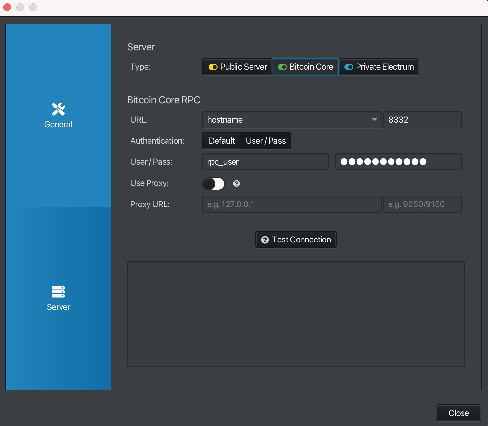
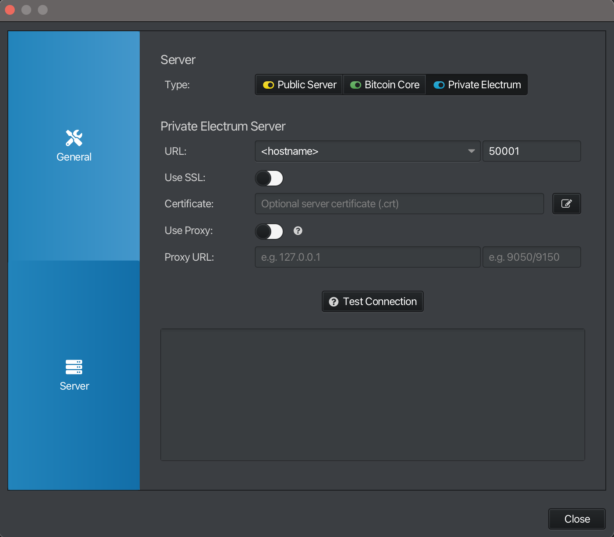
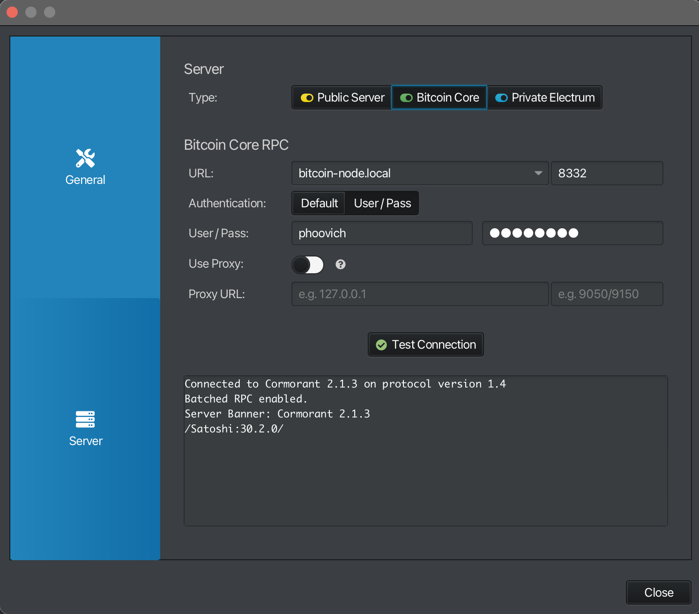

# runing your own node course

original course by Rightshift

last update: 15/10/2025

---
# Day 1 session 1

# Bitcoin node for Raspberry Pi

## อัปเดตระบบและติดตั้งเครื่องมือพื้นฐาน

```bash
sudo apt update && sudo apt upgrade -y
```
```bash
sudo apt install wget curl gnupg tar ufw -y
```

## ตั้งค่า Firewall
เปิด Port เท่าที่จำเป็นต้องใช้
```bash
sudo ufw allow 22/tcp comment 'ssh'
```
```bash
sudo ufw allow 9051/tcp comment 'tor'
```
```bash
sudo ufw allow 9050/tcp comment 'tor'
```
```bash
sudo ufw allow 8333/tcp comment 'Bitcoin core peer'
```
```bash
sudo ufw allow 8332/tcp comment 'Bitcoin core RPC'
```
เปิด Firewall
```bash
sudo ufw enable
```
ตรวจสอบ Port Firewall
```bash
sudo ufw status
```

### วิธีจัดการ Firewall
หากต้องการเปิด Port ใช้คำสั่งนี้
```bash
sudo ufw allow xx comment 'xx'
```
ตรวจสอบ Port Firewall ว่าเราเปิดใช้อะไรบ้าง
```bash
sudo ufw status
```
หากต้องการการลบ Port ที่ไม่ต้องการใช้ควรเริ่มตามนี้
ดูหมายเลข Port ก่อน
```bash
sudo ufw status numbered
```
แล้วลบตามหมายเลข เช่น:
```bash
sudo ufw delete 3
```

## ติดตั้งและตั้งค่า Tor สำหรับ Bitcoin RPC

ติดตั้ง tor
```bash
sudo apt install tor -y
```
แก้ไข Tor configuration
```bash
sudo nano /etc/tor/torrc
```
เพิ่มค่า Tor configuration
```bash
# ControlPort & Authentication
ControlPort 9051
CookieAuthentication 1
CookieAuthFileGroupReadable 1

# Bitcoin RPC
HiddenServiceDir /var/lib/tor/bitcoin/bitcoinrpc
HiddenServiceVersion 3
HiddenServicePort 8332 127.0.0.1:8332
HiddenServiceEnableIntroDoSDefense 1
HiddenServicePoWDefensesEnabled 1
```
สร้าง Directory สำหรับ Hidden Service
```bash
sudo mkdir -p /var/lib/tor/bitcoin/bitcoinrpc
```
เปลี่ยน Ownership และ Permissions ของ Directory
```bash
sudo chown -R debian-tor:debian-tor /var/lib/tor/bitcoin/bitcoinrpc
sudo chmod 700 /var/lib/tor/bitcoin/bitcoinrpc
```
เพิ่ม User ให้กับ Group debian-tor
```bash
sudo usermod -a -G debian-tor username
```

> อย่าลืมเปลี่ยน USERNAME ให้ตรงกับ user ของคุณ\
> restart tor

```bash
sudo systemctl restart tor
```

## ดาวน์โหลดและตรวจสอบ Bitcoin Core

ดาวน์โหลด Bitcoin core ลงเครื่อง
```bash
wget https://bitcoincore.org/bin/bitcoin-core-29.0/bitcoin-29.0-aarch64-linux-gnu.tar.gz
```

> [github](https://github.com/bitcoin/bitcoin/releases/tag/v29.0)

ดาวน์โหลด signatures ล่าสุด
```bash
wget https://bitcoincore.org/bin/bitcoin-core-29.0/SHA256SUMS
```
```bash
wget https://bitcoincore.org/bin/bitcoin-core-29.0/SHA256SUMS.asc
```

### นำเข้าคีย์ของผู้พัฒนาและตรวจสอบลายเซ็น

นำเข้าคีย์ของผู้พัฒนา
```bash
curl -s "https://api.github.com/repositories/355107265/contents/builder-keys" | grep download_url | grep -oE "https://[a-zA-Z0-9./-]+" | while read url; do curl -s "$url" | gpg --import; done
```
output
```
gpg: key 17565732E08E5E41: 29 signatures not checked due to missing keys
gpg: /home/admin/.gnupg/trustdb.gpg: trustdb created
gpg: key 17565732E08E5E41: public key "Andrew Chow <andrew@achow101.com>" imported
gpg: Total number processed: 1
gpg:               imported: 1
gpg: no ultimately trusted keys found
[...]
```
ตรวจสอบ Signature
```bash
gpg --verify SHA256SUMS.asc SHA256SUMS
```
output
```
gpg: Good signature from...
Primary key fingerprint:...
```
ตรวจสอบซอฟต์แวร์ว่าถูกต้องไหม
```bash
sha256sum --ignore-missing --check SHA256SUMS
```
output
```
bitcoin-29.0-aarch64-linux-gnu.tar.gz: OK
```

## ติดตั้ง Bitcoin Core

แตกไฟล์ Bitcoin core
```bash
tar -xzvf bitcoin-29.0-aarch64-linux-gnu.tar.gz
```
ติดตั้ง Bitcoin core
```bash
sudo install -m 0755 -o root -g root -t /usr/local/bin bitcoin-29.0/bin/bitcoin-cli bitcoin-29.0/bin/bitcoind
```
ตรวจสอบเวอร์ชั่น
```bash
bitcoind --version
```
ทดสอบ Bitcoin core โดยสั่งให้ทำงาน
```bash
bitcoind -daemon
```
ตรวจสอบไฟล์ log 
```bash
tail -f ~/.bitcoin/debug.log
```
ตรวจสอบการซิงค์ของ Bitcoin core
```bash
bitcoin-cli getblockchaininfo
```
ตรวจสอบการเชื่อมต่อ Peers
```bash
bitcoin-cli getconnectioncount
```
ตรวจสอบ Bitcoin core เขื่อมต่อกับ network ไหนบ้าง
```bash
bitcoin-cli -netinfo
```
สั่ง Bitcoin core หยุดทำงาน
```bash
bitcoin-cli stop
```

## ลบไฟล์ติดตั้งที่ไม่ใช้แล้ว
```bash
sudo rm -r bitcoin-29.0 bitcoin-29.0-aarch64-linux-gnu.tar.gz SHA256SUMS SHA256SUMS.asc
```

## ตั้งค่า bitcoin.conf

สร้างไฟล์ bitcoin.conf
```bash
nano ~/.bitcoin/bitcoin.conf
```
ตัวอย่างไฟล์ bitcoin.conf
```
# Bitcoin Core
daemon=1
txindex=1

[main]
# RPC
server=1
rpcport=8332
rpcbind=0.0.0.0
rpcallowip=127.0.0.1
rpcallowip=10.0.0.0/8
rpcallowip=172.0.0.0/8
rpcallowip=192.0.0.0/8

# Network (Tor-only)
listen=1
onlynet=onion
onion=127.0.0.1:9050
proxy=127.0.0.1:9050
bind=127.0.0.1

# Performance
dbcache=2048

[regtest]
rpcport=18443
r0cbind=127.0.0.1
tisten=1
server=1
onlynet=ipv4
rpcallowip=127.0.0.1
```

> คุณสามรถตั้งค่า bitcoin.conf ด้วยตัวเองได้ไปที่
> https://jlopp.github.io/bitcoin-core-config-generator


## สร้าง system service

> การสร้าง System Service เพื่อให้ระบบสามารถเรียกใช้ bitcoin daemon โดยอัตโนมัติในพื้นหลังได้

```bash
sudo nano /etc/systemd/system/bitcoind.service
```
configuration
```
[Unit]
Description=Bitcoin daemon
After=network.target

[Service]
ExecStart=/usr/local/bin/bitcoind -daemon \
                                  -pid=/run/bitcoind/bitcoind.pid \
                                  -conf=/home/username/.bitcoin/bitcoin.conf \
                                  -datadir=/home/username/.bitcoin 

ExecStop=/usr/local/bin/bitcoin-cli stop

# Make sure the config directory is readable by the service user
PermissionsStartOnly=true

# Process management
####################
Type=forking
PIDFile=/run/bitcoind/bitcoind.pid
Restart=on-failure
TimeoutStartSec=infinity
TimeoutStopSec=600


# Directory creation and permissions
####################################

User=uesermane
Group=uesermane

# /run/bitcoind
RuntimeDirectory=bitcoind
RuntimeDirectoryMode=0710

# /etc/bitcoin
ConfigurationDirectory=bitcoin
ConfigurationDirectoryMode=0710

# /var/lib/bitcoind
StateDirectory=bitcoind
StateDirectoryMode=0710

# Hardening measures
####################

# Provide a private /tmp and /var/tmp.
PrivateTmp=true

# Mount /usr, /boot/ and /etc read-only for the process.
ProtectSystem=full

# Disallow the process and all of its children to gain
# new privileges through execve().
NoNewPrivileges=true

# Use a new /dev namespace only populated with API pseudo devices
# such as /dev/null, /dev/zero and /dev/random.
PrivateDevices=true

# Deny the creation of writable and executable memory mappings.
MemoryDenyWriteExecute=true

[Install]
WantedBy=multi-user.target
```
> [!NOTE]
> แหล่งอ้างอิง https://raw.githubusercontent.com/bitcoin/bitcoin/663f6cd9ddadeec30b27ec12f0f5ed49f3146cc9/contrib/init/bitcoind.service

> อย่าลืมเปลี่ยน USERNAME ให้ตรงกับ user ของคุณ

เปิดใช้งาน Bitcoind
```bash
sudo systemctl enable bitcoind
```
```bash
sudo systemctl start bitcoind
```
ตรวจสอบว่า Bitcoind ทำงานไหม
```bash
sudo systemctl status bitcoind
```
output
```
● bitcoind.service - Bitcoin daemon
     Loaded: loaded (/etc/systemd/system/bitcoind.service; enabled; preset: enabled)
     Active: active (running) since Sat 2025-04-19 14:10:16 UTC; 23min ago
    Process: 812 ExecStart=/usr/local/bin/bitcoind -daemon -conf=/home/node/.bitcoin/bitcoin.conf -datadir=/home/node/.bitcoin (code=exited, >
   Main PID: 876 (bitcoind)
      Tasks: 26 (limit: 4552)
     Memory: 3.2G (peak: 3.2G swap: 252.0K swap peak: 252.0K)
        CPU: 12min 55.480s
     CGroup: /system.slice/bitcoind.service
             └─876 /usr/local/bin/bitcoind -daemon -conf=/home/node/.bitcoin/bitcoin.conf -datadir=/home/node/.bitcoin

Apr 19 14:10:14 node systemd[1]: Starting bitcoind.service - Bitcoin daemon...
Apr 19 14:10:16 node bitcoind[812]: Bitcoin Core starting
Apr 19 14:10:16 node systemd[1]: Started bitcoind.service - Bitcoin daemon.
```

### ทุกครั้งเมื่อมีการแก้ไขไฟล์ bitcoin.conf ควร restart bitcoind.service ทุกครั้ง

ใช้คำสั่ง restart
```bash
sudo systemctl restart bitcoind
```
หลังจาก restart เสร็จควรตรวจสอบสถานะทุกครั้ง
```bash
sudo systemctl status bitcoind
```

## หลังจากการซิงค์ blockheaders ถึง block ปัจจุบันแล้วเราจะนำเข้า UTXO snapshot
ตรวจสอบ blockheaders
```bash
bitcoin-cli getblockchaininfo
```
```bash
{
  "chain": "main",
  "blocks": 70185,
  "headers": 918316,  << ##เช็คจุดนี้
  "bestblockhash": "000000000149a911463409fada467aa6de45d6ec01ad5a89329777dd23f8fe09",
  "bits": "1c0168fd",
  "target": "000000000168fd00000000000000000000000000000000000000000000000000",
  "difficulty": 181.5432893640505,
  "time": 1280059453,
  "mediantime": 1280057059,
  "verificationprogress": 7.374078779552194e-05,
  "initialblockdownload": true,
  "chainwork": "000000000000000000000000000000000000000000000000000afd9a91ac8bc2",
  "size_on_disk": 28795004,
  "pruned": false,
  "warnings": [
  ]
}
```
เพิ่ม utxo-snapshot เข้าไป
```bash
bitcoin-cli -rpcclienttimeout=0 loadtxoutset /path/to/utxo-snapshot-height-840000.dat
```
> Download a UTXO Snapshot file https://blog.lopp.net/bitcoin-node-sync-with-utxo-snapbashots/


## หากต้องการ Upgrade VERSION

วิธีอัปเกรดจะคล้ายกันการติดตั้งในข้างต้นเราแค่เปลี่ยน "VERSION=x.xx" ตามที่เราต้องการได้เลย
ตรวจสอบ release ล่าสุดได้ที่ [GitHub](https://github.com/bitcoin/bitcoin/releases) ของ Bitcoin core 
> เมื่อมีการอัปเกรดอาจมีการเปลี่ยนโครงสร้างของ Bitcoin core โปรดอ่านรายละเอียดใน Notes please ทุกครั้งเมื่อเราต้องอัปเกรด

ดาวน์โหลด Bitcoin core เวอร์ชั่นใหม่
```bash
wget https://bitcoincore.org/bin/bitcoin-core-$VERSION/bitcoin-$VERSION-aarch64-linux-gnu.tar.gz
```
ตรวจสอบลายเซ็นของผู้พัฒนาตามขั้นตอนข้างต้น
แตกไฟล์ Bitcoin core 
```bash
tar -xzvf bitcoin-$VERSION-aarch64-linux-gnu.tar.gz
```
ติดตั้ง Bitcoin core
```bash
sudo install -m 0755 -o root -g root -t /usr/local/bin bitcoin-$VERSION/bin/bitcoin-cli bitcoin-$VERSION/bin/bitcoind
```
ตรวจสอบเวอร์ชั่นใหม่
```bash
bitcoind-cli --version
```
สั่ง restart Bitcoin core เพื่อใช้เวอร์ชั่นใหม่
```bash
sudo systemctl restart bitcoind
```

# Day 1 session 2
# Consensus & Relay policy

เครือข่ายบิตคอยน์ดำเนินการภายใต้ชุดกฎเกณฑ์ที่ทำหน้าที่กำกับพฤติกรรมของโหนดและนักขุด เพื่อรักษาความปลอดภัย ความน่าเชื่อถือ และความเป็นเอกภาพของระบบ โดยกฎเหล่านี้สามารถแบ่งออกเป็นสองระดับสำคัญ ได้แก่ Consensus Rules และ Relay Policy แม้ว่าทั้งสองจะเกี่ยวข้องกับการทำงานของโหนดในเครือข่าย แต่มีจุดมุ่งหมายและผลลัพธ์ที่แตกต่างกันอย่างชัดเจน

Consensus rules คือกฎพื้นฐานซึ่งทำหน้าที่เป็นกติกากลางของเครือข่ายที่ทุกโหนดและนักขุดต้องปฏิบัติตามอย่างเคร่งครัด กฎเหล่านี้กำหนดมาตรฐานที่ใช้ในการตรวจสอบและยืนยันความถูกต้องของธุรกรรมและบล็อก ตัวอย่างที่ชัดเจนได้แก่ การตรวจสอบความถูกต้องของลายเซ็นธุรกรรม การใช้ UTXO ที่มีอยู่จริง และการจำกัดขนาดของบล็อก หากโหนดใดฝ่าฝืนหรือไม่ปฏิบัติตาม consensus rules ผลที่เกิดขึ้นคือโหนดนั้นจะไม่สามารถซิงโครไนซ์หรือเข้าร่วมกับเครือข่ายหลักได้ และจะถูกแยกออกไปกลายเป็นเครือข่ายใหม่หรือที่เรียกว่า fork โดยอัตโนมัติ

ในทางตรงกันข้าม relay policy ไม่ได้มีสถานะเป็นกติกากลางของเครือข่าย แต่เป็นนโยบายภายในที่โหนดแต่ละเครื่องสามารถกำหนดได้เอง เพื่อใช้ตัดสินใจว่าจะรับ เก็บ หรือส่งต่อธุรกรรมในรูปแบบใด ตัวอย่างของ relay policy ได้แก่ การกำหนดค่าธรรมเนียมขั้นต่ำที่ธุรกรรมต้องมี การกำหนดขนาดสูงสุดของ mempool หรือการพิจารณาว่าจะอนุญาตธุรกรรมที่อยู่ในรูปแบบ non-standard หรือไม่ การเปลี่ยนแปลง relay policy จึงไม่มีผลต่อความต่อเนื่องหรือความถูกต้องของเครือข่ายโดยรวม แต่จะมีผลเฉพาะต่อการจัดการธุรกรรมที่ผ่านโหนดนั้นเท่านั้น

กล่าวโดยสรุป consensus rules เป็นกลไกหลักที่รับประกันความสอดคล้องและความปลอดภัยของเครือข่ายบิตคอยน์ หากโหนดไม่ปฏิบัติตามก็จะถูกตัดออกจากเครือข่าย ในขณะที่ relay policy เป็นเพียงนโยบายย่อยที่แต่ละโหนดสามารถปรับเปลี่ยนได้ตามความเหมาะสมโดยไม่ทำให้เกิดการแยกเครือข่าย ทั้งสองระดับจึงมีบทบาทที่แตกต่างกัน แต่ล้วนมีความสำคัญในการทำให้เครือข่ายบิตคอยน์ดำเนินการได้อย่างมีประสิทธิภาพและยืดหยุ่น

## Consensus
อย่างที่ได้กล่าวไปข้างต้นแล้วว่า consensus rules ทั้งหมดจะเป็นข้อกำหนดมาตรฐานที่ใช้ในการตรวจสอบและยืนยันความถูกต้องของธุรกรรมและบล็อก ทีนี้เราลองมาดูกันดีกว่าว่ามันมีอะไรบ้าง (ทุกคนสามารถเช็คกฎได้ใน [Githubของบิตคอยน์](https://github.com/bitcoin/bitcoin/tree/29.x/src/consensus))

1. amount.h

งั้นเรามาเริ่มกันที่ `bitcoin/src/consensus/amount.h` ในไฟล์นี้จะเป็นกฎที่พวกเราคุ้นเคยกันอยู่แล้วว่าบิตคอยน์มีได้ไม่เกิน `21,000,000 เหรียญ` โดย code ส่วนที่อธิบายจุดนั้นไว้ผมได้ยกมาไว้ให้ด้านล่างนี้นะครับ
```
15 static constexpr CAmount COIN = 100000000;
26 static constexpr CAmount MAX_MONEY = 21000000 * COIN;
27 inline bool MoneyRange(const CAmount& nValue) { return (nValue >= 0 && nValue <= MAX_MONEY); }

```
> เลขด้านหน้าจะเป็นบรรทัดนะครับกลัวว่าถ้าเอามาทั้งหมดจะยาวเกินไป

อย่างที่หลายท่านอาจจะทราบกันอยู่แล้วว่าหน่วยในโปรโตคอลของบิตคอยน์คือ COIN (satoshi ที่เรารู้จักนั้นแหละ) ถ้าดูจากในบรรทัดที่ 26 MAX_MONEY = 21000000 * COIN หมายความว่า ค่า MAX_MONEY เนี่ย มีค่าได้ไม่เกิน 21,000,000 * COIN (ซึ่ง COIN ถูกกำหนดไว้ในบรรทัดที่ 15 ว่าเท่ากับ 100,000,000) แปลว่าในระบบของบิตคอยน์นั้นมีได้ไม่เกิน 2,100,000,000,000,000 COIN(satohsi) และในบรรทัด 27 ใช้ในการยืนยันว่าจำนวนบิตคอยน์ในระบบตอนนี้เนี่ยมีเหรียญอยู่ในช่วง 0 - 2,100,000,000,000,000 รึเปล่า

กฎตรงส่วนนี้เองที่ทำให้ผู้ใช้งานทุกคนมั่นใจได้ว่าบิตคอยน์มีไม่เกิน 21,000,000 BTC แน่นอน

2. consensus.h
สามารถหาไฟล์นี้ได้ที่ `bitcoin/src/consensus/consensus.h` ในไฟล์นี้จะมีชุดกฎที่เกี่ยวกับขนาดบล๊อก, จำนวนลายเซ็นในบล๊อก, ตัวคูณ witness, การใช้เงินจาก coinbase transaction, ค่าขั้นต่ำของธุรกรรม, timelock, ค่าบน flag และ sequene, และ ข้อจำกัดของเวลาระหว่างช่วง difficulty adjustment โดย code ต่อไปนี้คือจุดที่อธิบายเรื่องพวกนี้ไว้
```
13 static const unsigned int MAX_BLOCK_SERIALIZED_SIZE = 4000000;
15 static const unsigned int MAX_BLOCK_WEIGHT = 4000000;
17 static const int64_t MAX_BLOCK_SIGOPS_COST = 80000;
19 static const int COINBASE_MATURITY = 100;
21 static const int WITNESS_SCALE_FACTOR = 4;
23 static const size_t MIN_TRANSACTION_WEIGHT = WITNESS_SCALE_FACTOR * 60; 
24 static const size_t MIN_SERIALIZABLE_TRANSACTION_WEIGHT = WITNESS_SCALE_FACTOR * 10;
28 static constexpr unsigned int LOCKTIME_VERIFY_SEQUENCE = (1 << 0);
35 static constexpr int64_t MAX_TIMEWARP = 600;
```
ในไฟล์นี้มีการกำหนดค่าอยู่ทั้งหมด 9 อย่าง: 
- MAX_BLOCK_SERIALIZED_SIZE: จำกัดขนาดสูงสุดของข้อมูลบล็อกเมื่อ serialize แล้ว (4 MB) ใช้เป็น buffer limit ในหน่วย byte
- MAX_BLOCK_WEIGHT: เป็น “น้ำหนักบล็อก” ตามนิยามใน BIP141 (SegWit) ใช้คำนวณโดยนำ witness data มาคิดลดสัดส่วน (weight = base_size * 3 + total_size) ดังนั้นบล็อกที่ใหญ่สุดจะมี weight ไม่เกิน 4,000,000 หน่วย
- MAX_BLOCK_SIGOPS_COST: จำกัดจำนวน signature verification operations ต่อ block → เพื่อป้องกันการโจมตีแบบ CPU exhaustion (ผู้โจมตีใส่ธุรกรรมที่ต้องตรวจลายเซ็นจำนวนมากให้โหนดคำนวณช้า)
- COINBASE_MATURITY: จำนวนบล๊อกที่ต้องรอก่อนจะสามารถนำเงินจาก coinbase transaction มาใช้ได้
- WITNESS_SCALE_FACTOR: ค่าคงที่ที่ใช้ในการคำนวณน้ำหนักบล็อก (block weight) และน้ำหนักธุรกรรม (transaction weight) กำหนดว่าส่วนข้อมูลที่ไม่ใช่ witness จะถูกคูณด้วย 4
- MIN_TRANSACTION_WEIGHT, MIN_SERIALIZABLE_TRANSACTION_WEIGHT: กำหนดขนาดเล็กสุดของธุรกรรมที่ถูกต้อง (เพื่อกัน invalid tx ที่มีโครงสร้างไม่ครบ)
- LOCKTIME_VERIFY_SEQUENCE: ธง (flag) ที่ระบุให้ระบบตีความ nSequence เป็น relative lock-time → ใช้ในฟีเจอร์เช่น CheckSequenceVerify (CSV)
- MAX_TIMEWARP: ข้อจำกัดของเวลาระหว่างช่วง difficulty adjustment  ตาม BIP94, timestamp ของบล็อกในรอบปรับความยาก (2016 blocks) สามารถย้อนหลังได้มากที่สุด 600 วินาที (10 นาที) จากบล็อกสุดท้ายของรอบก่อนหน้า

3. validation.h
คุณสามารถหาไฟล์นี้ได้ที่ `bitcoin\src\consensus\validation.h` โดยไฟล์นี้ทำหน้าที่นิยามโครงสร้างและฟังก์ชันที่ใช้ระบุสถานะของการตรวจสอบบล็อกและธุรกรรม
ใช้ได้ทั้งในระดับ:
- Transaction validation — ตรวจสอบว่า TX ถูกตามกฎ consensus และ policy หรือไม่
- Block validation — ตรวจสอบว่า block ถูกตามกฎ consensus เช่น PoW, timestamp, หรือ SegWit หรือไม่
โดย code ต่อไปนี้คือจุดที่อธิบายเรื่องพวกนี้ไว้
```
15 static constexpr int NO_WITNESS_COMMITMENT{-1};
18 static constexpr size_t MINIMUM_WITNESS_COMMITMENT{38};
```
โค้ดในส่วนนี้อธิบายค่าคงที่เกี่ยวกับ Witness Commitment แบบสั้น ๆ คือ coinbase transaction ของบล็อกที่รองรับ SegWit จะต้องมี “witness commitment” หรือก็คือค่า hash ของ witness root (อ่านเรื่องนี้เพิ่มเติมได้ใน BIP141) โดยมีค่าคงที่กำหนดไว้ 2 ตัว คือ NO_WITNESS_COMMITMENT ที่ = -1 ซึ่งแปลว่าไม่มี witness commitment และ MINIMUM_WITNESS_COMMITMENT คือขนาดขั้นต่ำของ witness commitment (ป้องกันการกำหนดค่าผิดโครงสร้าง)
```
enum class TxValidationResult { ... };
```
ในส่วนของคลาส TxValidationResult มีเพื่อใช้ระบุว่าทำไมธุรกรรม (transaction) ถึงไม่ผ่านการตรวจสอบ เพื่อให้โหนดรู้ว่าควร “แค่ปฏิเสธ” หรือ “ลงโทษ (ban)” โหนดที่ส่งมาหรือไม่ โดยมี ทั้งหมด 12 กรณี ดังนี้
| ค่าคงที่                 | ความหมาย                                                            |
| ------------------------ | ------------------------------------------------------------------- |
| `TX_CONSENSUS`           | ผิดตาม **กฎฉันทามติ** (เช่น ใช้ UTXO ซ้ำ, ลายเซ็นไม่ถูกต้อง)        |
| `TX_INPUTS_NOT_STANDARD` | อินพุตไม่เป็นไปตาม **policy** (ไม่ใช่ consensus แต่ node ปฏิเสธเอง) |
| `TX_NOT_STANDARD`        | ไม่เป็นธุรกรรมที่ node ยอมรับไว้ใน mempool                          |
| `TX_MISSING_INPUTS`      | ขาดอินพุตที่จำเป็น (อาจยังไม่ได้รับ UTXO)                           |
| `TX_PREMATURE_SPEND`     | พยายามใช้ coinbase ก่อนครบ 100 blocks หรือผิด locktime/sequence     |
| `TX_WITNESS_MUTATED`     | witness ถูกดัดแปลงผิดรูปแบบ (ผิดตาม BIP141)                         |
| `TX_WITNESS_STRIPPED`    | ขาดข้อมูล witness ทั้งที่ควรมี                                      |
| `TX_CONFLICT`            | ธุรกรรมขัดแย้งกับที่อยู่ใน chain หรือ mempool แล้ว                  |
| `TX_MEMPOOL_POLICY`      | ละเมิดข้อจำกัด mempool (เช่น ขนาดใหญ่เกิน หรือค่าธรรมเนียมต่ำเกิน)  |
| `TX_NO_MEMPOOL`          | โหนดนี้ไม่มี mempool (เช่น โหมด prune หรือ block-only)              |
| `TX_RECONSIDERABLE`      | ล้มเหลวจาก policy แต่สามารถพิจารณาใหม่ได้ในแพ็กเกจใหญ่              |
| `TX_UNKNOWN`             | ไม่สามารถตรวจสอบเพราะ package ล้มเหลว                               |

เราทำความรู้จักกับคลาสที่ไว้ตรวจสอบธุรกรรมไปแล้ว ต่อไปเรามาดูคลาสที่ใช้ตรวจสอบ block กับต่อดีกว่ากับคลาสที่ชื่อว่า
```
enum class BlockValidationResult { ... };
```
หน้าที่ของคลาส BlockValidationResult มีเพื่อใช้ระบุว่าทำไมบล๊อก (Block) ถึงไม่ผ่านการตรวจสอบ เพื่อให้โหนดรู้ว่าควร “แค่ปฏิเสธ” หรือ “ลงโทษ (ban)” โหนดที่ส่งมาหรือไม่ โดยมี ทั้งหมด 8 กรณี ดังนี้
| ค่าคงที่                | ความหมาย                                        |
| ----------------------- | ----------------------------------------------- |
| `BLOCK_CONSENSUS`       | ผิดกฎฉันทามติ (เช่น ลายเซ็น, ขนาด, PoW)         |
| `BLOCK_INVALID_HEADER`  | header ผิด (เช่น hash < target ไม่ผ่าน)         |
| `BLOCK_MUTATED`         | ข้อมูลบล็อกไม่ตรงกับที่ PoW ระบุ                |
| `BLOCK_MISSING_PREV`    | ไม่มีบล็อกก่อนหน้า (chain ขาด)                  |
| `BLOCK_INVALID_PREV`    | บล็อกก่อนหน้านั้นไม่ถูกต้อง                     |
| `BLOCK_TIME_FUTURE`     | timestamp เดินหน้าเกิน 2 ชั่วโมงจากเวลาปัจจุบัน |
| `BLOCK_CHECKPOINT`      | ไม่ตรงกับ checkpoint ที่กำหนดไว้                |
| `BLOCK_HEADER_LOW_WORK` | header อยู่บน chain ที่มี work น้อยเกินไป       |

และทั้งสองคลาสนี้จะถูกรวมกันเพื่อแสดงผลในคลาส `ValidationState<Result>` ซึ่งเป็น template class ที่ใช้ร่วมกันได้ทั้งกับ Transaction และ Block ใช้เก็บข้อมูลสถานะของการตรวจสอบ เช่น
- ผ่านหรือไม่ (M_VALID, M_INVALID, M_ERROR)
- เหตุผลที่ถูกปฏิเสธ (reject_reason)
- ข้อความดีบัก (debug_message)
- ประเภทของผล (Result)
โดยมี method สำคัญ ๆ ดังนี้

| metthod                                     | หน้าที่                                                          |
| ----------------------------------------- | ---------------------------------------------------------------- |
| `Invalid(result, reason, debug)`          | ตั้งสถานะเป็น invalid และบันทึกเหตุผล                            |
| `Error(reason)`                           | เกิด error ภายใน (runtime error)                                 |
| `IsValid()` / `IsInvalid()` / `IsError()` | ตรวจสถานะปัจจุบัน                                                |
| `ToString()`                              | แปลงเป็นข้อความสรุป เช่น `"TX_CONSENSUS, bad-txns-inputs-spent"` |

สุดท้ายของไฟล์นี้จะเป็น function ที่เกี่ยวข้องกับการคำนวนน้ำหนักของ block ที่มีการใช้ witness และ การตรวจว่าบล๊อกน้ัน ๆ มี witness หรือไม่
```
133 static inline int32_t GetTransactionWeight(const CTransaction& tx)
{
    return ::GetSerializeSize(TX_NO_WITNESS(tx)) * (WITNESS_SCALE_FACTOR - 1)
         + ::GetSerializeSize(TX_WITH_WITNESS(tx));
}
```
ฟังก์ชั่นนี้ใช้ในการคำนวนน้ำหนักของธุรกรรม โดยจะนำธุรกรรมในส่วนที่ไม่ใช่ witness คูณด้วย 3 และบวกด้วยน้ำหนักในส่วนของ witness โดยนอกจากจะใช้เพื่อเช็คน้ำหนักของธุรกรรมแล้วยังใช้เช็คในเรื่องของค่าธรรมเนียมได้อีกด้วย และนอกจากนี้แล้วยังมี function ที่คล้าย ๆ กันอีกจำนวนหนึ่ง คือ

- GetTransactionWeight(tx)
- GetBlockWeight(block)
- GetTransactionInputWeight(txin)

```
148 inline int GetWitnessCommitmentIndex(const CBlock& block)
```
ฟังก์ชันนี้ ใช้หา “ตำแหน่งของ output” ใน coinbase ที่มี witness commitment ตาม BIP141 โดยจะเช็กว่ามี OP_RETURN ตามด้วย signature 0x24 aa21a9ed หรือไม่และแบ่งออกเป็น 2 กรณี ดังนี้
- ถ้าเจอ → ให้คืนค่าตำแหน่ง index ของ output นั้น
- ถ้าไม่เจอ → ให้คืนค่า -1 (คือ NO_WITNESS_COMMITMENT)

เนื่องจากไฟล์นี้ค่อนข้างยาว ผมมีสรุปมาให้หวังว่าจะช่วยให้เข้าใจมากขึ้นนะครับ
| หมวด                          | หน้าที่                                         | ตัวอย่าง                                                    |
| ----------------------------- | ----------------------------------------------- | ----------------------------------------------------------- |
| **Validation Result Enums**   | แบ่งประเภทความผิดพลาดของ tx/block               | `TX_CONSENSUS`, `BLOCK_MUTATED`                             |
| **ValidationState Class**     | เก็บสถานะผลตรวจสอบ                              | ใช้โดยฟังก์ชัน `CheckTransaction()` และ `ProcessNewBlock()` |
| **Weight Calculation**        | คำนวณน้ำหนักจริงของบล็อกตาม BIP141              | จำกัดบล็อก 4,000,000 weight units                           |
| **Witness Commitment Helper** | หา output witness commitment                    | ใช้ตรวจสอบ SegWit coinbase                                  |
| **Integration**               | ใช้โดยไฟล์ `validation.cpp` และ `tx_verify.cpp` | ตอบว่า “valid หรือ invalid และเพราะอะไร”                    |

  
นอกจากนี้ใน consensus ยังมีอีกหลายไฟล์ไม่ว่าจะเป็น `markle.cpp`, `markle.h` ที่เป็นวิธีในการคำนวณ merkle root, `tx_check.cpp`, `tx_check.h`, `tx_verify.cpp`,`tx_verify.h` ที่ใช้ check เกี่ยวกับ transaction เช่นส่วนไหนขนาดเท่าไหร่ มีการใช้ input ที่มีอยู่จริงมั้ย
`params.h` ที่คอยเก็บพารามิเตอร์ที่อาจต่างกันระหว่างเครือข่าย ไม่ว่าจะเป็น mainnet, testnet, regtest

## relay policy
อย่างที่ได้กล่าวไว้ในช่วงต้นของเอกสารนี้แล้วว่า relay policy ใช้ในการกำหนดนโยบายภายในโหนดของเราเท่านั้น น่าที่หลัก ๆ คือการเลือกว่าจะให้โหนดของเราจะรับธุรกรรมไหนบ้างเข้ามาในเมมพูลของเรา 
> ไม่รับเข้าเมมพูลเท่านั้น หากธุรกรรมนั้นไปอยู่ในบล๊อกและบล๊อกนั้นถูกตรวจสอบแล้วว่าถูกต้องตามกฏภายใน consensus ธุรกรรมเหล่านั้นก็ถูกบรรจุลงบล๊อคแล้วเข้ามาภายในโหนดของคุณอยู่ดี

โดยไฟล์ต่าง ๆ ในเรื่องพวกนี้นั้นสามารถอ่านได้ที่ githubของบิตคอยน์เช่นกัน `bitcoin/src/policy` โดยแยกเป็นประเภทดังนี้
- ธุรกรรมที่สร้างหรือใช้จ่าย UTXO ขนาดเล็ก (dust): `sephemeral_policy.h`, `ephemeral_policy.cpp`
- เกี่ยวกับค่าธรรมเนียมในการใช้งานระบบ: `feerate.h`, `feerate.cpp`, `fees.h`, `fees.cpp`, `fee_args.h`, `fee_args.cpp`, `rbf.h`, `rbf.cpp`
- อื่น ๆ: `settings.h`, `settings.cpp`, `packages.h`, `packages.cpp`, `truc_policy.h`, `truc_policy.cpp`
- ตัวกำหนดค่า policy หลัก ๆ: `policy.h`, `policy.cpp`

โดยในการเรียนครั้งนี้เนื่องจากเวลาที่เรามีค่อนข้างจำกัด ฉะนั้นผมจะขอพูดถึงแค่ไฟล์ `policy.h` เป็นหลัก (แต่ไม่ต้องห่วงนะครับรับรองได้ว่าเนื้อหาครอบคลุมทุกส่วนแน่นอน) ซึ่งในไฟล์นี้เนี่ยแบ่งส่วนสำคัญออกเป็น 7 ส่วนหลัก ๆ 
1. Block/Transaction Limits
   ```
    static constexpr unsigned int DEFAULT_BLOCK_MAX_WEIGHT{MAX_BLOCK_WEIGHT};
    static constexpr unsigned int DEFAULT_BLOCK_RESERVED_WEIGHT{8000};
    static constexpr int32_t MAX_STANDARD_TX_WEIGHT{400000};
    static constexpr unsigned int MIN_STANDARD_TX_NONWITNESS_SIZE{65};
   ```
   ในส่วนนี้เป็นการกำหนดถึงค่าต่าง ๆ เริ่มจากขนาดของบล๊อก `DEFAULT_BLOCK_MAX_WEIGHT` ให้เท่ากับขนาดของ `MAX_BLOCK_WEIGHT` ที่ถูกกำหนดไว้ใน consensus เป็น 4,000,000 Byte `DEFAULT_BLOCK_RESERVED_WEIGHT` หรือก็คือส่วนของ block header ให้มีขนาด 8,000 Byte `MAX_STANDARD_TX_WEIGHT` หรือก็คือขนาดสูงสุดที่เป็นไปได้ใน 1 ธุรกรรม ซึ่งเดิมจะถูกตั้งค่าไว้เป็น 400,000 B หรือ 1/10 ของขนาดบล๊อก ส่วนตัวสุดท้ายจะเป็น `MIN_STANDARD_TX_NONWITNESS_SIZE` หรือก็คือขนาดต่ำสุดของธุรกรรมที่ไม่ใช่ประเภท segwit (เพื่อป้องกันไม่ให้มีการประกาศธุรกรรมที่ไม่สมบูรณ์)

2. Fee Policy & Dust Rules
   ```
    static constexpr unsigned int DUST_RELAY_TX_FEE{3000};
    static constexpr unsigned int DEFAULT_MIN_RELAY_TX_FEE{100};
    static constexpr unsigned int DEFAULT_BLOCK_MIN_TX_FEE{1};
   ```
   ```
    CAmount GetDustThreshold(const CTxOut& txout, const CFeeRate& dustRelayFee);
    bool IsDust(const CTxOut& txout, const CFeeRate& dustRelayFee);
    std::vector<uint32_t> GetDust(const CTransaction& tx, CFeeRate dust_relay_rate);

   ```
   ในส่วนนี้จะเป็นนโยบายที่เกี่ยวกับค่าธรรมเนียมในการทำธุรกรรม และการกำหนดว่าธุรกรรมแบบไหนที่จะถูกมองว่าเป็น dust โดยเริ่มจาก `DUST_RELAY_TX_FEE` ซึ่งมีค่าเริ่มต้นเป็น 3,000 ตัวนี้เป็น “อัตรา feerate” (sat/kVB) ที่ใช้คำนวณ threshold ใน `GetDustThreshold` เช่น ถ้าต้องใช้ 148 bytes เพื่อใช้จ่าย → 148 * 3 sat = 444 sat ดังนั้น output ที่น้อยกว่า 444 sat จะถือเป็น “dust” ตัวต่อมาคือ `DEFAULT_MIN_RELAY_TX_FEE` หรือก็คือค่าธรรมเนียมต่ำสุดที่ยอมให้ relay (sat/kvB) ซึ่งมีค่าเริ่มต้นเป็น 100 หรือ 0.1 sat/vb ค่าคงตัวอีกตัวหนึ่งคือ `DEFAULT_BLOCK_MIN_TX_FEE` ค่าธรรมเนียมต่ำสุดที่นักขุดจะใส่ในบล็อก ซึ่งมีค่าเริ่มต้นมาเป็น 1 ส่วนฟังก์ชันที่เหลือใช้ตรวจว่า output ไหน “ต่ำเกินไป” (dust) และควรถูกกรองออกจาก mempool

3. Standard Script Verification Flags
    ```
    static constexpr script_verify_flags MANDATORY_SCRIPT_VERIFY_FLAGS{...};
    static constexpr script_verify_flags STANDARD_SCRIPT_VERIFY_FLAGS{MANDATORY_SCRIPT_VERIFY_FLAGS | ...};
    ```
    ในส่วนนี้แบ่งออกเป็นสองส่วนตามตารางนี้

| ประเภท                     | ใช้ที่ไหน                            | เป้าหมาย                                                      |
| -------------------------- | ------------------------------------ | ------------------------------------------------------------- |
| **MANDATORY SCRIPT FLAGS** | ใช้ตอน *ตรวจสอบ block*               | ต้องเหมือนกันทุกโหนด                                          |
| **Standard Script Flags**  | ใช้ตอน *ตรวจสอบ tx ก่อนเข้า mempool* | ป้องกัน spam, เพิ่มความเข้ากันได้, ป้องกันการใช้ฟีเจอร์แปลก ๆ |

แปลว่าหากธุรกรรมใดไม่ผ่าน flag เหล่านี้ จะ invalid ทันทีในทุกโหนด และยังเป็น “พื้นฐาน” ของ standardness ด้วย

| Flag                                | รายละเอียด                               |
| ----------------------------------- | -------------------------------------------- |
| `SCRIPT_VERIFY_P2SH`                | เปิดใช้การตรวจสอบ Pay-to-Script-Hash (BIP16) |
| `SCRIPT_VERIFY_DERSIG`              | บังคับใช้รูปแบบลายเซ็น DER (BIP66)           |
| `SCRIPT_VERIFY_NULLDUMMY`           | ต้องมี byte 0 ใน dummy element (BIP147)      |
| `SCRIPT_VERIFY_CHECKLOCKTIMEVERIFY` | เปิดใช้ OP_CHECKLOCKTIMEVERIFY (BIP65)       |
| `SCRIPT_VERIFY_CHECKSEQUENCEVERIFY` | เปิดใช้ OP_CHECKSEQUENCEVERIFY (BIP112)      |
| `SCRIPT_VERIFY_WITNESS`             | เปิดใช้ SegWit (BIP141)                      |
| `SCRIPT_VERIFY_TAPROOT`             | เปิดใช้ Taproot (BIP341)                     |

และ Standard Script Flags เปรียบเสมือน “กฎเพิ่มพิเศษ” สำหรับธุรกรรมใน mempool ไม่ทำให้ invalid ตาม consensus  เพียงแต่จะไม่ถูก relay ต่อเท่านั้น โดยมีรายละเอียดตามตารางต่อไปนี้

| Flag                                                  | ความหมาย                                                  | เหตุผล                                                   |
| ----------------------------------------------------- | --------------------------------------------------------- | -------------------------------------------------------- |
| `SCRIPT_VERIFY_STRICTENC`                             | ต้องเข้ารหัส pubkey และ signature ให้ถูกต้องตามรูปแบบ     | ป้องกันลายเซ็นแปลก ๆ ที่อาจก่อช่องโหว่                   |
| `SCRIPT_VERIFY_MINIMALDATA`                           | ต้องใช้จำนวน byte น้อยที่สุดในการ push ข้อมูล             | ป้องกัน script ที่ “ยุ่งเหยิง” และกินพื้นที่โดยไม่จำเป็น |
| `SCRIPT_VERIFY_DISCOURAGE_UPGRADABLE_NOPS`            | ห้ามใช้ OP_NOP ที่อาจถูกใช้ในอนาคต                        | ป้องกันการรัน opcodes ที่อาจเปลี่ยนความหมายภายหลัง       |
| `SCRIPT_VERIFY_CLEANSTACK`                            | หลังประมวลผล script ต้องเหลือค่าบน stack แค่ 1 ค่า        | เพื่อให้ script มีผลชัดเจน (true/false เดียว)            |
| `SCRIPT_VERIFY_MINIMALIF`                             | ค่าที่ใช้กับ OP_IF ต้องเป็น 0 หรือ 1 เท่านั้น             | ทำให้ script มีรูปแบบที่คาดเดาได้                        |
| `SCRIPT_VERIFY_NULLFAIL`                              | การตรวจสอบ signature ที่ล้มเหลว ต้องให้ลายเซ็นเป็นค่าว่าง | ลดโอกาสใช้ข้อมูลผิดพลาดในการทำ side-channel attack       |
| `SCRIPT_VERIFY_LOW_S`                                 | Signature ต้องอยู่ใน canonical form (low-S)               | ลดความเสี่ยงจาก transaction malleability                 |
| `SCRIPT_VERIFY_DISCOURAGE_UPGRADABLE_WITNESS_PROGRAM` | ป้องกัน witness program ที่ใช้ version ยังไม่รองรับ       | ป้องกันการ relay ของฟีเจอร์อนาคต                         |
| `SCRIPT_VERIFY_WITNESS_PUBKEYTYPE`                    | จำกัดให้ pubkey ใน witness เป็นประเภทที่รองรับเท่านั้น    | รักษาความสม่ำเสมอของ SegWit                              |
| `SCRIPT_VERIFY_CONST_SCRIPTCODE`                      | ห้ามแก้ไข script code ขณะประมวลผล                         | เพิ่มความปลอดภัยของ Taproot                              |
| `SCRIPT_VERIFY_DISCOURAGE_UPGRADABLE_TAPROOT_VERSION` | ป้องกันการใช้ Taproot version ที่ยังไม่รองรับ             | ป้องกันการ relay ของ tx ที่อาจไม่ถูกต้องในอนาคต          |
| `SCRIPT_VERIFY_DISCOURAGE_OP_SUCCESS`                 | ปิดการใช้งาน OP_SUCCESS จนกว่าจะถูกกำหนดอย่างเป็นทางการ   | ป้องกันการใช้ฟังก์ชันอนาคตผิดวัตถุประสงค์                |
| `SCRIPT_VERIFY_DISCOURAGE_UPGRADABLE_PUBKEYTYPE`      | จำกัดชนิดของ pubkey ที่อนุญาต                             | ป้องกัน pubkey แปลกที่อาจไม่เข้ากับ Taproot              |

เหตุผลที่ต้องตรวจ `เข้มกว่า` consensus เพราะ Bitcoin Core ตั้งใจให้ ธุรกรรมที่อยู่ใน mempool ต้องปลอดภัย และเข้ากันได้ในอนาคต แม้บางอย่างจะ ยังไม่ผิดตาม consensus ก็ตาม เช่น ธุรกรรมที่ใช้ OP_SUCCESS ในตอนนี้ยังไม่มีความหมาย ใน consensusแต่ในอนาคต อาจถูกนิยามใหม่ ทำให้เกิดปัญหาความเข้ากันได้ ดังนั้น Bitcoin Core จึงเลือก `ไม่ relay` ธุรกรรมแบบนี้

4. การตรวจสอบธุรกรรมมาตรฐาน
```
bool IsStandardTx(const CTransaction& tx, const std::optional<unsigned>& max_datacarrier_bytes, bool permit_bare_multisig, const CFeeRate& dust_relay_fee, std::string& reason);
bool AreInputsStandard(const CTransaction& tx, const CCoinsViewCache& mapInputs);
bool IsWitnessStandard(const CTransaction& tx, const CCoinsViewCache& mapInputs);
```
ฟังก์ชันเหล่านี้ใช้ในการตรวจสอบว่าแต่ละส่วนภายในธุรกรรมนั้นเป็นไปตาม standard หรือไม่ 
- `IsStandardTx`: ตรวจสอบว่า outputs ใช้ scriptPubKey รูปแบบมาตรฐานหรือไม่ เช่น p2pkh, p2tr, p2sh ไหม ถ้าไม่ใช่ธุรกรรมเหล่านั้นจะไม่ถูกนำเข้า mempool และส่งต่ออกไป
- `AreInputsStandard`: ตรวจสอบว่า scriptSig ที่ใช้ปลดล็อก inputs นั้นซับซ้อนเกินไปหรือไม่ เช่น ใช้ P2SH ที่มี sigops เกิน 15 จะถูกนับว่าเป็น non-standard และไม่ relay ธุรกรรมต่อ
- `IsWitnessStandard`: ตรวจสอบว่า witness data (SegWit/Taproot) ถูกต้องตามมาตรฐานหรือไม่
    - จำกัดขนาด witness script ≤ 3600 bytes
    - จำกัดจำนวน stack items ≤ 100
    - จำกัดขนาดต่อ item ≤ 80 bytes
    - ปฏิเสธ annexes ใน Tapscript (เพราะยังไม่ใช้ใน consensus)    
5. Virtual Transaction Size
```
int64_t GetVirtualTransactionSize(int64_t nWeight, int64_t nSigOpCost, unsigned int bytes_per_sigop);
```
ใช้คำนวณ “ขนาดเสมือนจริง” (virtual size) ของธุรกรรม เอาไว้ใช้กับการคำนวณ fee rate (sat/vB) คำนวณจากทั้ง weight และจำนวน signature operations เพื่อให้สะท้อนค่าใช้จ่ายในการประมวลผล

6. Ephemeral Dust Policy Integration
```
static constexpr unsigned int MAX_DUST_OUTPUTS_PER_TX{1};
```
เชื่อมโยงกับไฟล์ `ephemeral_policy.h` ใช้เพื่อกำหนดว่าเราจะอนุญาตให้มี output ที่ถูกนับว่าเป็น dust มีได้สูงสุดกี่อันในหนึ่งธุรกรรม โดยค่าพื้นฐานถูกตั้งไว้ที่ 1

7. Locktime Policy
```
static constexpr unsigned int STANDARD_LOCKTIME_VERIFY_FLAGS{LOCKTIME_VERIFY_SEQUENCE};
```
ใช้กำหนดว่าเมื่อ node ตรวจสอบ locktime (เช่น nLockTime หรือ nSequence) จะต้องใช้การตีความตาม BIP68 (relative locktime) เพื่อให้พฤติกรรมสอดคล้องกับ consensus แต่ไม่ต้องบังคับ

---
# Bitcoin conf

ไฟล์ `bitcoin.conf` คือไฟล์คอนฟิกหลักของซอฟต์แวร์ Bitcoin Core ใช้สำหรับกำหนดพฤติกรรมของโหนด เช่นว่าจะเชื่อมต่อเครือข่ายแบบใด จะให้บริการ RPC แบบไหน จะเก็บข้อมูลเท่าไร และตั้งค่าฟีเจอร์ต่าง ๆ อย่างไร ไฟล์นี้อ่านเมื่อ bitcoind (หรือ bitcoin-qt) เริ่มทำงาน และค่าที่ระบุด้วย commandline จะมีความสำคัญมากกว่าค่าในไฟล์ ดังนั้นคุณสามารถใช้ทั้งสองวิธีแต่ต้องรู้ลำดับความสำคัญ: commandline > ค่าจาก bitcoin.conf > ค่าเริ่มต้นของโปรแกรม (ค่าที่อธิบายในช่วง consensus/relay policy)

ตำแหน่งไฟล์ขึ้นกับระบบปฏิบัติการ: บน linux และ macOS โดยปกติอยู่ที่ไดเรกทอรีของบิทคอยน์ (~/.bitcoin/bitcoin.conf) ส่วนบน Windows อยู่ที่ %APPDATA%\Bitcoin\bitcoin.conf หลังจากเราสร้างไฟล์ bitcoin.conf แล้วเราจำเป็นต้องอณุญาติอ่านเขียนด้วย (บนลินุกซ์มักใช้ chmod 600) เพราะไฟล์อาจมีข้อมูลสำคัญเช่นรหัสผ่าน RPC หรือการตั้งค่าอื่นที่ไม่ควรเปิดเผยให้คนอื่นเข้าถึงได้

รูปแบบของไฟล์เป็นแบบ key=value แต่สามารถใส่ comment โดยขึ้นบรรทัดด้วยเครื่องหมาย # ตัวอย่างพื้นฐานที่ทุกคนมักจะใส่ไว้เหมือนกันคือ server=1 หรือ rpcuser=user โดยจะไม่ต้องมีเครื่องหมายคำพูดและช่องว่างข้าง ๆ (คือใส่ได้แหละเพื่อความสวยงามแค่เวลาโปรแกรมอ่านมันมองข้ามเฉย ๆ ครับ)

ส่วนสำคัญที่ควรเข้าใจพร้อมคำอธิบายเชิงปฏิบัติประกอบด้วยการกำหนดเครือข่าย การตั้งค่า RPC ความปลอดภัย การจัดการข้อมูลบล็อกและกระเป๋าเงิน และการเพิ่มประสิทธิภาพ/การแสดงผลเพื่อเช็คปัญหา

- **การเลือกเครือข่ายและการเชื่อมต่อ:** ถ้าต้องการรันบนเครือข่ายหลักไม่ต้องระบุอะไรเพิ่มเติม แต่ถ้าต้องการทดสอบให้ใช้เครือข่ายอื่น ๆ เราจำเป็นต้องใส่ค่าดังต่อไปนี้ testnet=1 สำหรับเครือข่ายทดสอบสาธารณะ หรือ regtest=1 สำหรับเครือข่าย local แบบอิสระ การตั้งค่า listen=1 หรือ listen=0 ใช้ในการควบคุมว่ารับการเชื่อมต่อจากเพื่อนร่วมเครือข่ายหรือไม่ หากต้องการให้โหนดไม่เผยพอร์ตกับอินเทอร์เน็ตให้ใช้ listen=0 แต่จะยังสามารถเชื่อมออกไปหา peers ได้ด้วย connect/addnode หากต้องการผูกพอร์ตกับที่อยู่เฉพาะให้ใช้ bind=<ip>:<port> และถ้าต้องการประกาศที่อยู่ภายนอกให้ใช้ externalip=<your.ip.address> เมื่อใช้งาน behind NAT คุณอาจเปิดหรือปิด UPnP ด้วย upnp=1 หรือ upnp=0 ตามความเหมาะสม แต่บนเซิร์ฟเวอร์ที่ต้องการความปลอดภัยมักปิด UPnP และการใช้งานส่วนตัวมักไม่จำเป็นต้องหา public ip มา
- **การตั้งค่า RPC และความปลอดภัย**: หากต้องการให้โหนดเป็นเซิร์ฟเวอร์ RPC ให้ใส่ server=1 ไว้ โดยดีฟอลต์ Bitcoin Core จะใช้ระบบ cookie authentication — สร้างไฟล์ .cookie ที่ไดเรกทอรีซึ่งโปรเซสที่รันในเครื่องสามารถใช้เพื่อ authenticate แบบอัตโนมัติ ซึ่งปลอดภัยกว่าการวาง rpcuser และ rpcpassword แบบข้อความล้วนในไฟล์คอนฟิก อย่างไรก็ตาม หากจำเป็นต้องเปิดให้เรียก RPC จากเครื่องอื่น ให้ระมัดระวังอย่างมากเพราะ RPC ควบคุมกระเป๋าและการทำธุรกรรม การเปิด rpcallowip ควรระบุ CIDR ของเครือข่ายที่เชื่อถือได้เท่านั้น และควรใช้ร่วมกับ rpcbind=<ip> เพื่อผูกกับอินเตอร์เฟซที่ต้องการ ในเวอร์ชันปัจจุบันมีวิธีที่ปลอดภัยกว่าในการสร้างข้อมูลรับรอง RPC คือ rpcauth ซึ่งเป็น hash ของรหัสผ่านที่สามารถสร้างได้ด้วยเครื่องมือที่มาพร้อมในต้นน้ำหรือสคริปต์เสริม — วิธีนี้ช่วยหลีกเลี่ยงการเก็บรหัสผ่านเป็น plain text ในไฟล์
- **การจัดการพื้นที่เก็บข้อมูลและประสิทธิภาพ**: ถ้าพื้นที่ดิสก์จำกัด คุณสามารถรันเป็นโหนดแบบ prune ได้โดยใช้ prune=<size-in-MiB> ค่าเช่น prune=550 จะเก็บบล็อกเฉพาะส่วนหนึ่งเพื่อรักษาการทำงานของโหนดเป็น full node เชิงการตรวจสอบ แต่จะไม่สามารถให้บริการข้อมูลบล็อกย้อนหลังได้สำหรับแอพที่ต้องการข้อมูลเก่า หากคุณต้องการเก็บประวัติทั้งหมดและสามารถให้บริการข้อมูลบล็อกทั้งหมดได้ ให้ตั้งค่า txindex=1 เพื่อสร้างดัชนีธุรกรรม ซึ่งจะใช้พื้นที่ดิสก์เพิ่มขึ้นและทำให้การซิงก์นานขึ้น สำหรับการเพิ่มประสิทธิภาพหน่วยความจำของฐานข้อมูลให้ใช้ dbcache=<MB> เพื่อเพิ่มหน่วยความจำที่ใช้สำหรับการจัดการฐานข้อมูล ยิ่งตั้งค่าสูงก็จะช่วยให้การซิงก์เร็วขึ้น แต่ต้องตรวจสอบว่ามี RAM เพียงพอ
- **การใช้งานแบบไม่เก็บกระเป๋า (headless node) และ multiwallet**: หากต้องการให้โหนดทำงานเป็นเพียงตัวตรวจสอบเครือข่ายและไม่ต้องการฟังก์ชันกระเป๋า ให้ใส่ disablewallet=1 ในทางกลับกัน หากต้องการให้โหลดหลายกระเป๋าพร้อมกัน สามารถใส่หลายบรรทัด wallet=<walletname> เพื่อระบุไฟล์กระเป๋าที่ต้องการโหลด หลีกเลี่ยงการวางค่าสำคัญเช่น seed หรือ private key ในไฟล์คอนฟิก และอย่าลืมสำรองไฟล์กระเป๋า wallet.dat เสมอ
- **การเชื่อมต่อผ่าน Tor และการปกปิดตัวตน**: หากต้องการให้โหนดทำงานเป็น hidden service เพื่อให้โหนดเข้าถึงผ่าน Tor สามารถตั้ง proxy=127.0.0.1:9050 (หรือพอร์ตที่ Tor ใช้) และ onlynet=onion เพื่อจำกัดเครือข่ายไปยัง onion เท่านั้น หรือใช้ listen=1 ร่วมกับ bind และ externalip เพื่อประกาศที่อยู่ .onion ของคุณเมื่อคุณตั้งค่า hidden service ไว้แล้ว การใช้ Tor เพิ่มความเป็นส่วนตัวแต่ทำให้ประสิทธิภาพและการเชื่อมต่อแตกต่างจากการเชื่อมต่อแบบปกติ

```
# พื้นฐาน
server=1
rpcbind=127.0.0.1
# ใช้ cookie auth โดยไม่ระบุ rpcuser/rpcpassword หากต้องการ remote RPC ให้ระวัง
# เปิดใช้งานโหนดบน testnet หรือ regtest ให้ใส่ testnet=1 หรือ regtest=1

# เน็ตเวิร์ก
listen=1
maxconnections=40
# ปิด UPnP บนเซิร์ฟเวอร์
upnp=0

# พื้นที่ดิสก์และดัชนี
prune=550
txindex=0

# ประสิทธิภาพ
dbcache=2048

# ความปลอดภัย
# หากจะอนุญาต RPC ระยะไกล ให้ใช้ rpcbind + rpcallowip อย่างระมัดระวัง
# rpcallowip=192.168.1.0/24

# Tor (ถ้ามี Tor running บนเครื่อง)
# proxy=127.0.0.1:9050
# onlynet=onion

# Logging / debug
# debug=net
# debuglogfile=/var/log/bitcoin/debug.log
```

ก่อนแก้ไฟล์ให้หยุด `bitcoind` หรือ `bitcoin-qt` ด้วย `bitcoin-cli stop` หากคุณแก้ค่าแล้วต้องให้มีผลให้สตาร์ทบริการใหม่ หากเปลี่ยนแปลงใหญ่เช่นเปิด `txindex=1` หรือสลับระหว่าง prune กับ non-prune คุณอาจต้องรัน `bitcoind -reindex` หรือเริ่มต้นการซิงก์จากศูนย์อีกครั้ง ข้อควรระวังคือการสั่ง reindex จะใช้เวลานานและใช้ I/O สูง ตรวจสอบ debug.log สำหรับข้อผิดพลาดหรือสถานะการซิงก์ และใช้ `bitcoin-cli getblockchaininfo` เพื่อตรวจสอบความคืบหน้า

ข้อควรระวังด้านความปลอดภัยและการปฏิบัติที่แนะนำ: เก็บสิทธิ์ไฟล์ให้เหมาะสม สำรองไฟล์กระเป๋าเป็นประจำ หลีกเลี่ยงการเปิด RPC ให้สาธารณะโดยไม่มีการป้องกัน ถ้าจำเป็นให้ใช้วิธีการปลอดภัยเช่น SSH tunnel หรือ reverse proxy ที่จำกัดการเข้าถึงก่อนถึง RPC และพิจารณาใช้ rpcauth หรือ cookie auth แทนการเก็บรหัสผ่านเป็น plain text สำหรับเซิร์ฟเวอร์ผลิตจริงให้ตั้งค่าการล็อกและมอนิเตอร์สถานะโหนดอย่างต่อเนื่อง
---
# Day2: session 1

## 1. rpcuser and rpcpassword

### 1.1 Open your bitcoin.conf file

```bash
$ nano ~/.bitcoin/bitcoin.conf
```

### 1.2 Add rpcuser and rpcpassword to your bitcoin.conf file

```conf
rpcuser=your_rpc_username
rpcpassword=your_rpc_password
```

Then save and exit (Ctrl + X, Y, Enter)

### 1.3 Restart bitcoind

```bash
$ sudo systemctl restart bitcoind.service
```

### 1.4 Check the status of bitcoind

```bash
$ sudo systemctl status bitcoind.service
● bitcoind.service - Bitcoin daemon
     Loaded: loaded (/etc/systemd/system/bitcoind.service; enabled; preset: enabled)
     Active: active (running) since Mon 2025-10-06 00:27:54 +07; 7s ago
    Process: 52385 ExecStart=/usr/local/bin/bitcoind -daemon -conf=/home/pi/.bitcoin/bitcoin.conf -datadir=/home/pi/.bitcoin (code=exited, status=0/SUCCESS)
   Main PID: 52387 (bitcoind)
      Tasks: 25 (limit: 9572)
        CPU: 8.349s
     CGroup: /system.slice/bitcoind.service
             └─52387 /usr/local/bin/bitcoind -daemon -conf=/home/pi/.bitcoin/bitcoin.conf -datadir=/home/pi/.bitcoin

Oct 06 00:27:54 raspberrypi systemd[1]: Starting bitcoind.service - Bitcoin daemon...
Oct 06 00:27:54 raspberrypi bitcoind[52385]: Bitcoin Core starting
Oct 06 00:27:54 raspberrypi systemd[1]: Started bitcoind.service - Bitcoin daemon.
```

### 1.5 Check the log file for any error

```bash
$ tail -f ~/.bitcoin/debug.log

2025-10-05T17:28:02Z Progress loading mempool transactions from file: 80% (tried 765, 191 remaining)
2025-10-05T17:28:02Z Progress loading mempool transactions from file: 90% (tried 861, 95 remaining)
2025-10-05T17:28:02Z Imported mempool transactions from file: 956 succeeded, 0 failed, 0 expired, 0 already there, 0 waiting for initial broadcast
2025-10-05T17:28:02Z initload thread exit
2025-10-05T17:28:10Z New block-relay-only v1 peer connected: version: 70016, blocks=917790, peer=0
2025-10-05T17:28:14Z New block-relay-only v2 peer connected: version: 70016, blocks=917790, peer=1
2025-10-05T17:28:18Z New outbound-full-relay v1 peer connected: version: 70016, blocks=917790, peer=2
...
...

```

### 1.6 Test connection

#### 1.6.1 in raspberry pi5

```bash
$ bitcoin-cli help getblockchaininfo
getblockchaininfo

Returns an object containing various state info regarding blockchain processing.

Result:
{                                         (json object)
    ...
}

Examples:
> bitcoin-cli getblockchaininfo
> curl --user myusername --data-binary '{"jsonrpc": "2.0", "id": "curltest", "method": "getblockchaininfo", "params": []}' -H 'content-type: application/json' http://127.0.0.1:8332/
```

> [!NOTE]
> change myusername to your rpcuser

then use curl to test the connection

```bash
$ curl --user bitcoin --data-binary '{"jsonrpc": "2.0", "id": "curltest", "method": "getblockchaininfo", "params": []}' -H 'content-type: application/json' http://127.0.0.1:8332/
Enter host password for user 'bitcoin':
{"jsonrpc":"2.0","result":{"chain":"main","blocks":917790,"headers":917790,"bestblockhash":"000000000000000000006de1fc99f94542df01a6f763667d2579ea28c3e293ef","bits":"1701ddb4","target":"00000000000000000001ddb40000000000000000000000000000000000000000","difficulty":150839487445890.5,"time":1759685040,"mediantime":1759683880,"verificationprogress":0.9999995424657299,"initialblockdownload":false,"chainwork":"0000000000000000000000000000000000000000e8c87f09711580793a23c607","size_on_disk":786852089923,"pruned":false,"warnings":[]},"id":"curltest"}
```

#### 1.6.2 test from your computer (For MacOS or Linux)

> [!NOTE]
> Windows users can use WSL to run Bash commands. It’s out of scope for this course, but if you’d like to try it, there is documentation available in the repository.

find your raspberry pi ip address

```bash
$ ping raspberrypi.local
PING raspberrypi.local (192.168.0.112): 56 data bytes
64 bytes from 192.168.0.112: icmp_seq=0 ttl=64 time=190.722 ms
64 bytes from 192.168.0.112: icmp_seq=1 ttl=64 time=251.044 ms

--- raspberrypi.local ping statistics ---
2 packets transmitted, 2 packets received, 0.0% packet loss

```

then run curl command from your computer

```bash
$ curl --user <rpcuser> --data-binary '{"jsonrpc": "2.0", "id": "curltest", "method": "getblockchaininfo", "params": []}' -H 'content-type: application/json' http://<raspberry_pi_ip>:8332/
```

```bash
$ curl --user bitcoin --data-binary '{"jsonrpc": "2.0", "id": "curltest", "method": "getblockchaininfo", "params": []}' -H 'content-type: application/json' http://192.168.0.112:8332/
Enter host password for user 'bitcoin':
{"jsonrpc":"2.0","result":{"chain":"main","blocks":917792,"headers":917792,"bestblockhash":"000000000000000000019a51df6099ceee18c44eaa36a2bd6a538192e29b1c2d","bits":"1701ddb4","target":"00000000000000000001ddb40000000000000000000000000000000000000000","difficulty":150839487445890.5,"time":1759685417,"mediantime":1759684830,"verificationprogress":0.9999975536979354,"initialblockdownload":false,"chainwork":"0000000000000000000000000000000000000000e8c9916a9f992601df65ae39","size_on_disk":786855725137,"pruned":false,"warnings":[]},"id":"curltest"}
```

#### 1.6.3 test from sparrow wallet

open sparrow wallet and go to settings (mac `Cmd + ,` , windows `Ctrl + ,`)

in settings click on "Server" tab

in settings you set

```
Type: Bitcoin Core
Bitcoin CoreRPC
URL: `<ip_address>:<port>` # your raspberry pi ip address (use ping command to find your raspberry pi ip address)
Authentication: User/Pass
User/Password: `<rpcuser> <rpcpassword>` # your rpcuser and rpcpassword
UseProxy: False
Proxy URl:
```

then click "Test Connection" button you should see like this



## 2. rpcauth

rpcauth is more secure than rpcuser and rpcpassword because it use hashed password it looks like this

```conf
rpcauth=<username>:<hashed_password>
```

### 2.1 How to generate rpcauth

#### 2.1.1 Go to [https://github.com/bitcoin/bitcoin/blob/master/share/rpcauth/rpcauth.py](https://github.com/bitcoin/bitcoin/blob/master/share/rpcauth/rpcauth.py)

#### 2.1.2 Click "Raw" button to get the raw python script

#### 2.1.3 use `wget` to get the script to your raspberry pi

```bash
$ cd ~ # go to your home directory
$ wget https://raw.githubusercontent.com/bitcoin/bitcoin/refs/heads/master/share/rpcauth/rpcauth.py

# you should see rpcauth.py in your current directory
$ ls
Desktop  Documents  Downloads  rpcauth.py
```

#### 2.1.4 run the script with your desired username and password

```bash
python3 rpcauth.py <your_username> <your_password>
```

```bash
$ python3 rpcauth.py test test
String to be appended to bitcoin.conf:
rpcauth=test:d4951c8a7434864791b284f1ab418eba$8ad6f178fdfa62f926cde43966ec1eadf6f3f5bb0afb5baed0b1dcbafba7f9d7
Your password:
test
```

#### 2.1.5 Copy the output and paste it into your bitcoin.conf file

```conf
# --snip--

rpcauth=test:59404178f93dda796d92c472090a5262$e12eb787cf0eef56bc8589342cfdf428a361370403c031d51bf4c73fa6bb9bf3

# --snip--
```

### 2.3 After set rpcauth

#### 2.3.1 After set rpcauth in bitcoin.conf, restart bitcoind

```bash
systemctl restart bitcoind.service
```

#### 2.3.2 Check the status of bitcoind

```bash
systemctl status bitcoind.service
```

#### 2.3.3 Check the log file for any error

```bash
tail -f ~/.bitcoin/debug.log
```

### 2.4 Test connection after set rpcauth

#### 2.4.1 in raspberry pi5

```bash
$ bitcoin-cli help getblockchaininfo
getblockchaininfo

Returns an object containing various state info regarding blockchain processing.

Result:
{
....
}
Examples:
> bitcoin-cli getblockchaininfo
> curl --user myusername --data-binary '{"jsonrpc": "2.0", "id": "curltest", "method": "getblockchaininfo", "params": []}' -H 'content-type: application/json' http://127.0.0.1:8332/

```

> change myusername to your rpcauth username

then use curl to test the connection

```bash
$ curl --user bitcoin --data-binary '{"jsonrpc": "2.0", "id": "curltest", "method": "getblockchaininfo", "params": []}' -H 'content-type: application/json' http://127.0.0.1:8332/
Enter host password for user 'bitcoin':
{"jsonrpc":"2.0","result":{"chain":"main","blocks":915753,"headers":915753,"bestblockhash":"000000000000000000011aaa8e85e4831815b6f18340ef2d56ea3884a6301b30","bits":"1701fa38","target":"00000000000000000001fa380000000000000000000000000000000000000000","difficulty":142342602928674.9,"time":1758470427,"mediantime":1758466112,"verificationprogress":0.999993927355762,"initialblockdownload":false,"chainwork":"0000000000000000000000000000000000000000e4b2f04f4c9fb655ba731930","size_on_disk":783353282429,"pruned":false,"warnings":[]},"id":"curltest"}
```

#### 2.4.2 test from your computer (For MacOS or Linux)

> [!NOTE]
> Windows users can use WSL to run Bash commands. It’s out of scope for this course, but if you’d like to try it, there is documentation available in the repository.

find your raspberry pi ip address

```bash
$ ping raspberrypi.local
PING raspberrypi.local (192.168.0.112): 56 data bytes
64 bytes from 192.168.0.112: icmp_seq=0 ttl=64 time=61.313 ms # 192.168.0.112 is my raspberry pi ip address
64 bytes from 192.168.0.112: icmp_seq=1 ttl=64 time=13.027 ms

--- raspberrypi.local ping statistics ---
2 packets transmitted, 2 packets received, 0.0% packet loss
round-trip min/avg/max/stddev = 13.027/37.170/61.313/24.143 ms
```

> [!NOTE]
> use `ping` to find the ip address of your raspberry pi

run curl command from your computer

```bash
curl --user <username> --data-binary \
'{"jsonrpc": "2.0", "id": "curltest", "method": "getblockchaininfo", "params": []}' -H 'content-type: application/json' \
http://<raspberry_pi_ip>:8332/
```

```bash
$ curl --user test --data-binary '{"jsonrpc": "2.0", "id": "curltest", "method": "getblockchaininfo", "params": []}' -H 'content-type: application/json' http://192.168.0.112:8332/
{"jsonrpc":"2.0","result":{"chain":"main","blocks":915753,"headers":915753,"bestblockhash":"000000000000000000011aaa8e85e4831815b6f18340ef2d56ea3884a6301b30","bits":"1701fa38","target":"00000000000000000001fa380000000000000000000000000000000000000000","difficulty":142342602928674.9,"time":1758470427,"mediantime":1758466112,"verificationprogress":0.9999928627030699,"initialblockdownload":false,"chainwork":"0000000000000000000000000000000000000000e4b2f04f4c9fb655ba731930","size_on_disk":783353282429,"pruned":false,"warnings":[]},"id":"curltest"}
```

#### 2.4.3 test from sparrow wallet

Open sparrow wallet and go to settings then Click on "Server" tab and set like this

```
Server
Type: Bitcoin Core

Bitcoin CoreRPC
url: <ip_address>:<port> # your raspberry pi ip address
Authentication: User/Pass
User/Password: <username> <password> # your rpcuser and rpcpassword or rpcauth username and password
UseProxy: False
Proxy URl:
```

Click test connection you should see like this (same as rpcuser and rpcpassword)

```
Connected to Cormorant 2.1.3 on protocol version 1.4
Batched RPC enabled.
Server Banner: Cormorant 2.1.3
/Satoshi:29.0.0/
```
---
## 1. Install Cago and Rust to build Electrs

### 1.2 uninstall rust and cargo if you have old version

```bash
$ dpkg -l | grep rust
# should not have any rust version below 1.63
$ sudo apt remove --purge libstd-rust-1.63 libstd-rust-dev
$ sudo apt autoremove
```

> [!NOTE] > `dpkg -l` : Lists all installed packages on the system (from APT) <br> > `sudo apt remove vlc` : ลบ VLC ออก แพ็กเกจเสริมของ program VLC จะ ยังคงอยู่ในเครื่อง<br> > `sudo apt autoremove` : ลบแพ็กเกจเสริมที่ไม่ได้ใช้งานแล้วออก<br>

### 1.3 install rust and cargo from [https://www.rust-lang.org/tools/install](https://www.rust-lang.org/tools/install)

```bash
curl --proto '=https' --tlsv1.2 -sSf https://sh.rustup.rs | sh
```

### 1.4 check rust and cargo version

```bash
$ which rustc
/home/pi/.cargo/bin/rustc
$ which cargo
/home/pi/.cargo/bin/cargo
$ rustc --version
rustc 1.89.0 (29483883e 2025-08-04)
$ cargo --version
cargo 1.89.0 (c24e10642 2025-06-23)
```

---

## 2. Install Electrs

### 2.1. go to [github electrs](https://github.com/romanz/electrs) click doc then click install.md

```bash
$ sudo apt update
$ sudo apt install -y build-essential libclang-dev git # not install cargo
$ git clone https://github.com/romanz/electrs
$ cd electrs
$ cargo build --locked --release
$ ./target/release/electrs --version  # should print the latest version
```

### 2.2 Configure Firewall to allow Electrs

```bash
$ sudo ufw allow 50001/tcp comment 'allow electrs TCP from anywhere'
$ sudo ufw allow 50002/tcp comment 'allow electrs SSL from anywhere'
$ sudo ufw reload
Firewall reloaded
$ sudo ufw status
To                         Action      From
--                         ------      ----
...
50002/tcp                  ALLOW       Anywhere                   # allow electrs SSL from anywhere
50001/tcp                  ALLOW       Anywhere                   # allow electrs TCP from anywhere
...
50001/tcp (v6)             ALLOW       Anywhere (v6)              # allow electrs TCP from anywhere
50002/tcp (v6)             ALLOW       Anywhere (v6)              # allow electrs SSL from anywhere
...

```

### 2.3 Configure Bitcoin Core

```conf
zmqpubrawblock=tcp://0.0.0.0:28332  # Enable publishing of raw block notifications
zmqpubrawtx=tcp://0.0.0.0:28333     # Enable publishing of raw transaction notifications
zmqpubhashblock=tcp://0.0.0.0:28334 # Enable publishing of block hash notifications
whitelist=127.0.0.1                 # trust all connections from localhost” (your own machine)
```

> [!NOTE]
> zmq is Zero Message Queue เป็นโปรโตคอลที่ใช้ส่ง “ข้อความแบบเรียลไทม์” ระหว่างโปรแกรมต่าง ๆ โดยไม่ต้อง polling (ไม่ต้องคอยถามซ้ำ ๆ)<br>
> Bitcoin Core ใช้ ZMQ เพื่อ “กระจายข้อมูล” เช่น:<br>
>
> - block ใหม่ที่เพิ่งขุดได้<br>
> - transaction ใหม่ที่เพิ่งเข้ามาใน mempool<br>
>
> ไปยัง โปรแกรมภายนอก (เช่น block explorer, Electrum server, indexer, ฯลฯ)<br>

### 2.4 Configure Electrum Server

#### 2.4.1 copy example config file to electrs directory

```bash
$ cp ~/electrs/doc/config_example.toml ~/electrs/electrs.toml
```

then edit config file

```bash
$ nano ~/electrs/electrs.toml
```

change

```toml
# File where bitcoind stores the cookie, usually file .cookie in its datadir
cookie_file = "/var/run/bitcoin-mainnet/cookie"

# Directory where the index should be stored. It should have at least 70GB of free space.
db_dir = "/some/fast/storage/with/big/size"

# The address on which electrs should listen. Warning: 0.0.0.0 is probably a bad idea!
# Tunneling is the recommended way to access electrs remotely.
electrum_rpc_addr = "127.0.0.1:50001"
```

to

```toml
# File where bitcoind stores the cookie, usually file .cookie in its datadir
cookie_file = "/var/run/bitcoin-mainnet/cookie"

# Directory where the index should be stored. It should have at least 70GB of free space.
db_dir = "/some/fast/storage/with/big/size"

# The address on which electrs should listen. Warning: 0.0.0.0 is probably a bad idea!
# Tunneling is the recommended way to access electrs remotely.
electrum_rpc_addr = "127.0.0.1:50001"
```

#### 2.4.2 test run electrs with config file

```bash
$ ./target/release/electrs
Starting electrs 0.10.10 on aarch64 linux with Config { network: Bitcoin, db_path: "/home/pi/electrs/db/bitcoin", db_log_dir:
None, db_parallelism: 1, daemon_auth: CookieFile("/home/pi/.bitcoin/.cookie"), daemon_rpc_addr: 127.0.0.1:8332, daemon_p2p_addr: 127.0.0.1:8333,
electrum_rpc_addr: 0.0.0.0:50001, monitoring_addr: 127.0.0.1:4224, wait_duration: 10s, jsonrpc_timeout: 15s, index_batch_size: 10, index_lookup_limit: None,
reindex_last_blocks: 0, auto_reindex: true, ignore_mempool: false, sync_once: false, skip_block_download_wait: false,
disable_electrum_rpc: false, server_banner: "Welcome to electrs 0.10.10 (Electrum Rust Server)!", signet_magic: f9beb4d9 }
[2025-10-06T15:06:08.347Z INFO  electrs::metrics::metrics_impl] serving Prometheus metrics on 127.0.0.1:4224
[2025-10-06T15:06:08.347Z INFO  electrs::server] serving Electrum RPC on 0.0.0.0:50001
[2025-10-06T15:06:08.387Z INFO  electrs::db] "/home/pi/electrs/db/bitcoin": 2 SST files, 0.000002204 GB, 0.000000002 Grows
[2025-10-06T15:06:08.396Z INFO  electrs::index] indexing 2000 blocks: [1..2000]
[2025-10-06T15:06:08.521Z INFO  electrs::chain] chain updated: tip=00000000dfd5d65c9d8561b4b8f60a63018fe3933ecb131fb37f905f87da951a, height=2000
[2025-10-06T15:06:08.525Z INFO  electrs::index] indexing 2000 blocks: [2001..4000]
```

#### 2.4.3 terminate electrs and systemd unit file for run electrs after boot

```bash
$ sudo nano /etc/systemd/system/electrs.service
```

```.service
[Unit]
Description=Electrs
After=bitcoind.service # Ensures electrs starts only after bitcoind is running

[Service]
WorkingDirectory=/home/bitcoin/electrs # Path to electrs directory change bitcoin to your user
ExecStart=/home/bitcoin/electrs/target/release/electrs # path to execule electrs change bitcoin to your user
User=bitcoin # change bitcoin to your user
Group=bitcoin # change bitcoin to your user
Type=simple
KillMode=process
TimeoutSec=60
Restart=always
RestartSec=60

Environment="RUST_BACKTRACE=1"

# Hardening measures
PrivateTmp=true
ProtectSystem=full
NoNewPrivileges=true
MemoryDenyWriteExecute=true

[Install]
WantedBy=multi-user.target
```

then enable and start electrs service

```bash
$ sudo systemctl daemon-reload
$ sudo systemctl enable electrs.Service
$ sudo systemctl start electrs.service
$ sudo systemctl status electrs.service
```

#### 2.3.4 after sncyn electrs finish check electrs can connect

```bash
$ ping -c 2 raspberrypi.local
PING raspberrypi.local (192.168.0.112): 56 data bytes
64 bytes from 192.168.0.112: icmp_seq=0 ttl=64 time=50.795 ms
64 bytes from 192.168.0.112: icmp_seq=1 ttl=64 time=9.711 ms

--- raspberrypi.local ping statistics ---
2 packets transmitted, 2 packets received, 0.0% packet loss
round-trip min/avg/max/stddev = 9.711/30.253/50.795/20.542 ms
```

then open electrum wallet and go to server setting

```
Server:
    Type: Private Electrum

Privacy Electrs Server
    URL: <your_node_ip_address>:<port>
    Use SSL: false
    Certificate:
    Use Proxy: false
    Proxy URL:
```

then click test connection

```bash
Connected to electrs/0.10.10 on protocol version 1.4
Batched RPC enabled.
Server Banner: Welcome to electrs 0.10.10 (Electrum Rust Server)!
```



---

## 3. run electrs hidden tor service

### 3.1 add this config in torrs

```bash
$ sudo nano /etc/tor/torrc
```

### 3.2 then add this in bottom file

```
# Electrs
HiddenServiceDir /var/lib/tor/electrs
HiddenServiceVersion 3
HiddenServicePort 50001 127.0.0.1:50001
HiddenServiceEnableIntroDoSDefense 1
```

### 3.3 then create dir for electrs tor service

```bash
$ sudo mkdir -p /var/lib/tor/electrs

```

### 3.4 then change owner to debian-tor

```bash
$ sudo chown -R debian-tor:debian-tor /var/lib/tor/electrs
```

### 3.5 then change permission

```bash
$ sudo chmod -R 700 /var/lib/tor/electrs
```

### 3.6 then restart tor service

```bash
$ sudo systemctl restart tor
$ sudo systemctl status tor
```

### 3.6 Then check the Tor address

```bash
$sudo cat /var/lib/tor/electrs/hostname
m7to26uhcdyirm3whrym5a24r7qlzszjrzqbfurx2gemvwgcs6xt7gqd.onion
```

### 3.7 test connection with sparrow wallet

> [!NOTE]
> This step may take a while.


