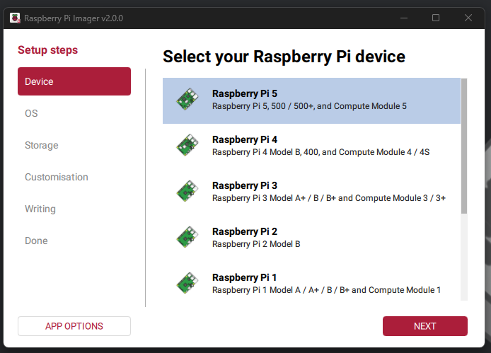
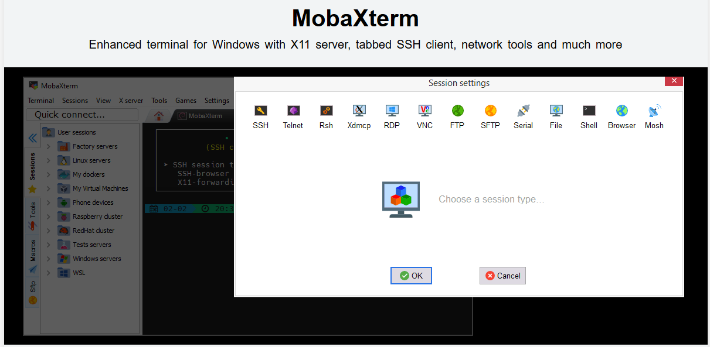
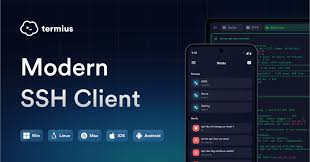
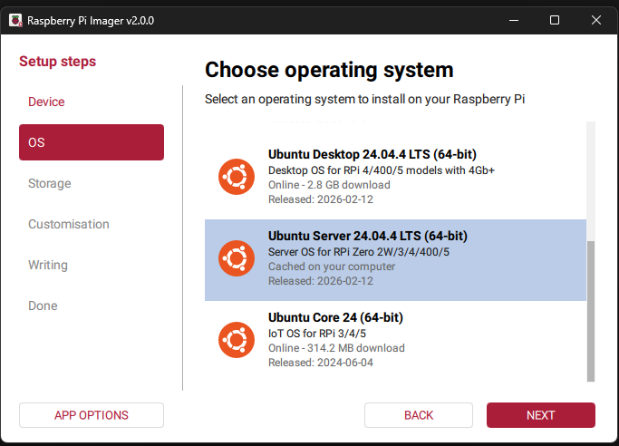

# บันได 5 ขั้นสู่โลกอธิปไตยทางการเงิน "Set up your Bitcoin Node"

## Course: Set up your Bitcoin Node 28-29 March 2026

## ซอฟต์แวร์ที่ต้องใช้

### ซอฟต์แวร์สำหรับติดตั้งระบบปฎิบัติการ (OS) ให้กับเครื่อง Raspberry Pi

[Raspberry Pi Imager](https://www.raspberrypi.com/software/)

----

### ซอฟต์แวร์สำหรับรีโมทเข้าไปควบคุมเครื่อง Raspberry Pi

สำหรับระบบปฏิบัติการ Windows: [Mobaxterm](https://mobaxterm.mobatek.net/)

----

สำหรับระบบปฏิบัติการ Mac: [Terminus](https://termius.com/download/macos)

----

### ประกอบ Raspberry Pi

### ติดตั้งระบบปฎิบัติการ (OS) Ubuntu Server 24.04 LTS

วิดีโอ: https://jumpshare.com/share/tVSc6HWIHVCWW5wlzvDZ

----

## Day 1: Session 1

- [1. Firewall](firewall.md)
- [2. Tor](tor.md)
- [3. I2P](i2p.md)
- [4. Bitcoin Core](bitcoin_node.md)

----

## Day 1: Session 2

- [5. Rust + Cargo](tools.md)
- [6. Docker](tools.md#ติดตั้ง-docker)
- [7. YAM](yam.md)