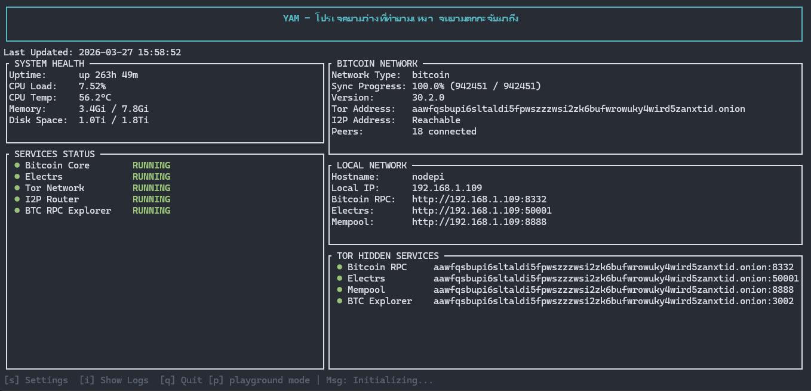

# 5. YAM - Yet Another Monitor for Bitcoin Node

yam is a terminal-based, fast, and lightweight monitor for your Bitcoin node and its surrounding services. Built with Rust and Ratatui, it provides a powerful dashboard and playground directly in your terminal.

- 📊 Real-time Bitcoin node monitoring
- 💻 System health tracking (CPU, RAM, Disk)
- 🛠️ In-app Bitcoin.conf editor
- ✨ RPC Playground with autocompletion



## ติดตั้ง YAM

```bash
git clone https://github.com/RightTechLab/yam.git
```

```bash
cd yam
```

แก้ config.toml 
```bash
nano config.toml
```

Build
```bash
cargo build --release
```

```bash
./target/release/yam
```

```bash
sudo cp target/release/yam /usr/local/bin/
```

```bash
yam
```

----

[Back to info >>](README.md)