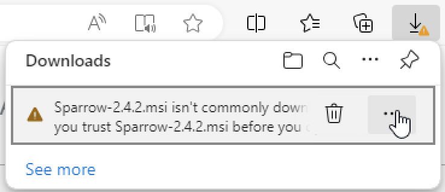
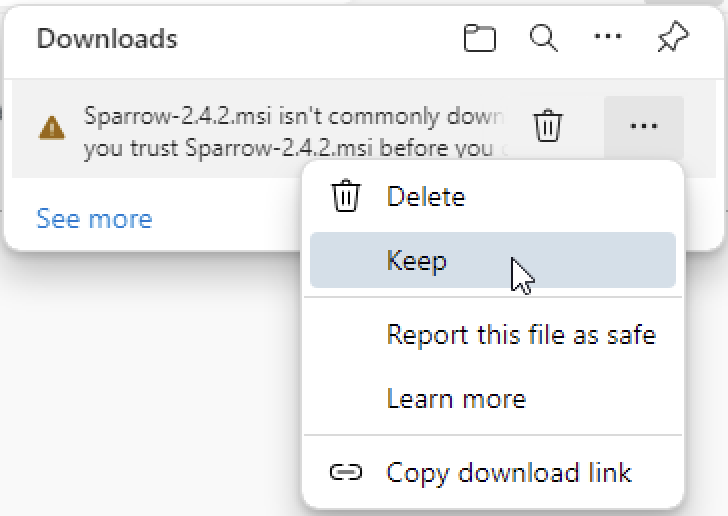
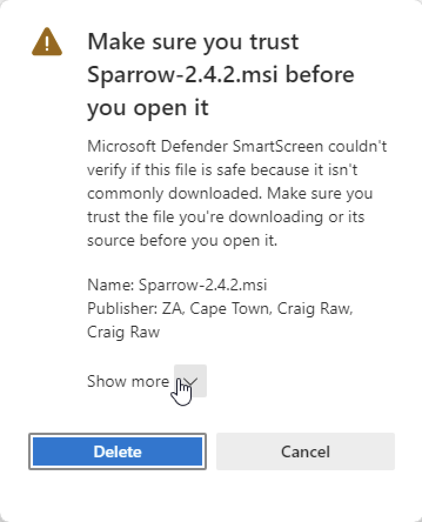
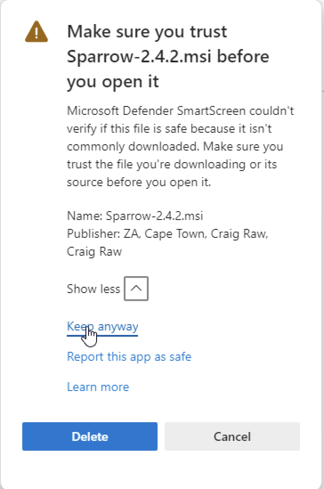
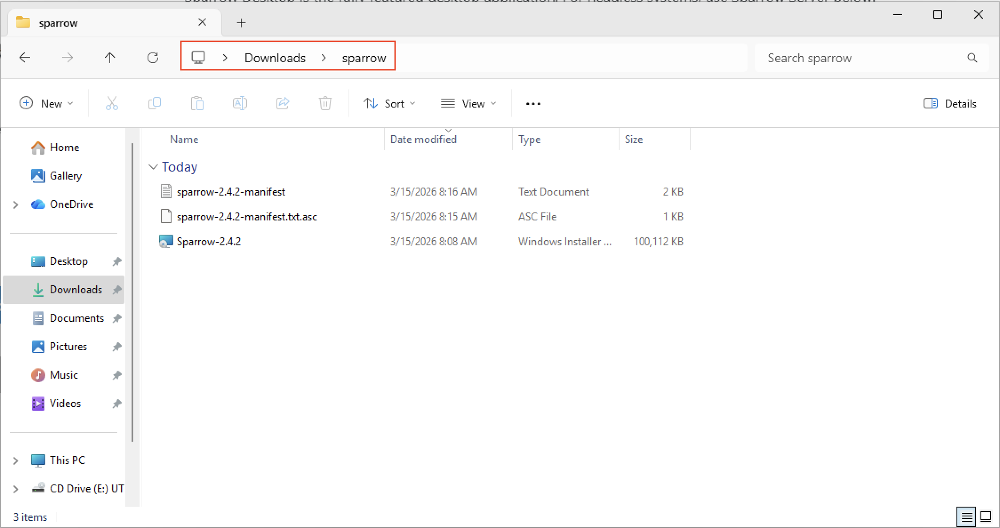
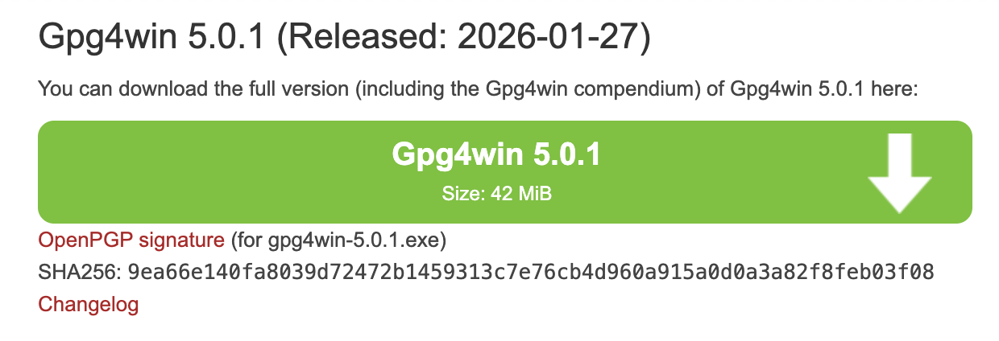
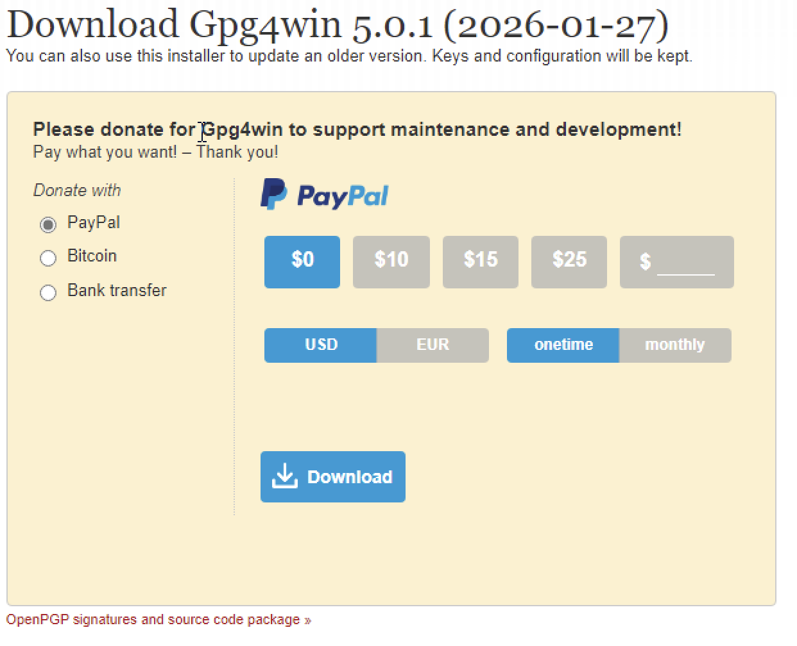
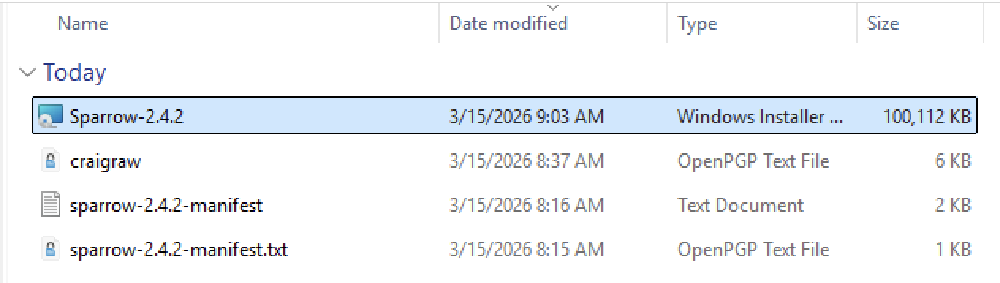
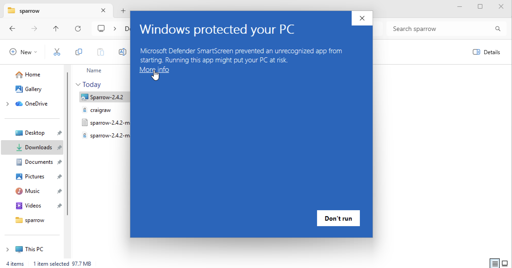
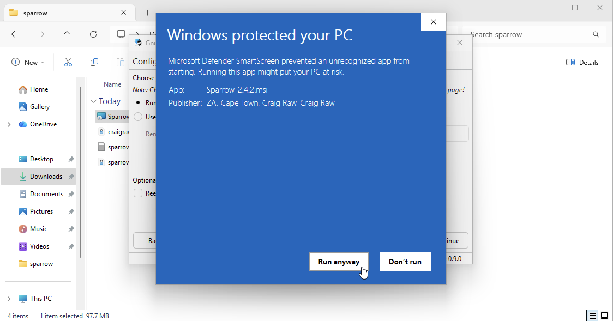

# Download & Verify Sparrow Wallet

## 1. Download Sparrow Wallet

### 1.1 สร้างโฟลเดอร์ใน **Downloads** และตั้งชื่อว่า

```
sparrow
```

### 1.2 ไปที่เว็บไซต์ดาวน์โหลดของ https://sparrowwallet.com/download/

### 1.3 ดาวน์โหลดไฟล์ต่อไปนี้ **ลงในโฟลเดอร์ `sparrow` ที่สร้างไว้**

- `.msi`
- `Manifest Signature (.txt.asc)`
- `Manifest (.txt)`

> [!Note]
> ตอน download sparrow-XXX.msi อาจจะมีาการขึ้นเตือนให้ click ตามรูปต่อไปนี้ได้เลย









### อธิบายไฟล์ที่ดาวน์โหลด

#### 1.3.1 ไฟล์ `.msi`

- ไฟล์ `.msi` คือไฟล์ที่เก็บโปรแกรม **Sparrow Wallet** ที่เราจะใช้ติดตั้ง สำหรับ Windows
- สามารถเปรียบได้เหมือน **"กล่องพัสดุที่มีของอยู่ข้างใน"**
- เมื่อเปิดไฟล์ `.msi` ระบบ Windows จะเริ่มขั้นตอนติดตั้งโปรแกรมในเครื่อง

> [!warning]
> ปัญหาคือ เรา **ไม่สามารถรู้ได้ทันทีว่าไฟล์นี้ถูกแก้ไข ปลอม หรือฝัง malware หรือไม่**  
> ดังนั้นจึงต้องมีขั้นตอนตรวจสอบความถูกต้องของไฟล์ก่อนติดตั้ง

- ย้าย 3 ไฟล์เข้าไปในโฟลเดอร์ sparrow



#### 1.3.2 Manifest (`.txt`)

- ไฟล์ **Manifest** คือ **รายการตรวจสอบไฟล์**
- สามารถเปรียบได้เหมือน **"ใบรายการสินค้าในกล่องพัสดุ"**

ภายในไฟล์นี้จะเก็บ **hash ของไฟล์โปรแกรม** ที่ผู้พัฒนาสร้างไว้ เช่น

```txt
35360010de9c... *Sparrow-2.4.2-aarch64.dmg
74f92ed95ae2... *Sparrow-2.4.2-x86_64.dmg
089d56b62a15... *Sparrow-2.4.2.msi
ff02994b6e83... *Sparrow-2.4.2.zip
...
```

#### 1.3.3 Hash คืออะไร

- **Hash** เปรียบเหมือน "ลายนิ้วมือของไฟล์”
- ถ้าไฟล์ถูกแก้ไขแม้เพียง **1 bit** ค่า **hash จะเปลี่ยนทันที**

ดังนั้นเราจึงสามารถใช้ **Manifest** เพื่อตรวจสอบว่า

- ไฟล์ที่เราดาวน์โหลด ตรงกับไฟล์ต้นฉบับจากผู้พัฒนาหรือไม่

#### 1.3.4 Manifest Signature (`.txt.asc`)

- ไฟล์นี้คือ **"ลายเซ็นของผู้พัฒนา"**
- ผู้พัฒนา Sparrow ใช้ระบบ **PGP / GPG** เพื่อเซ็นไฟล์ Manifest

เพื่อยืนยันว่า

- ไฟล์ Manifest ถูกสร้างโดยผู้พัฒนา Sparrow จริง และไม่ถูกปลอมแปลง

> [!Note]
> **PGP (Pretty Good Privacy)** เป็นระบบ **การเข้ารหัสและการยืนยันตัวตน** (encryption + digital signature)
>
> **GPG (GNU Privacy Guard)** เป็นโปรแกรม open-source ที่ใช้มาตรฐานเดียวกับ PGP

### 1.4 กระบวนการตรวจสอบไฟล์

ขั้นตอนการตรวจสอบจะเป็นดังนี้

1. ตรวจสอบลายเซ็นของ
    - manifest.txt.asc
2. หากลายเซ็นถูกต้อง
    - manifest.txt สามารถเชื่อถือได้
3. ใช้ `manifest.txt`
    - เพื่อตรวจสอบ **hash ของไฟล์** Sparrow.dmg

ถ้าค่าทุกอย่างตรงกัน แสดงว่า

- ไฟล์มาจากผู้พัฒนาจริง
- ไฟล์ไม่ถูกแก้ไข
- สามารถติดตั้งได้อย่างปลอดภัย

---

## 2. Download GPG (GPG4Win)

### 2.1 ไปที่ https://www.gpg4win.org/download.html

### 2.2 click Download Gpg4win



### 2.3 set donate or not (set 0$) and click Download



### 2.4 กดแตกไฟล์ .exe

### 2.5 เปิด terminal และพิมพ์ตามนี้

```powershell
gpg --version
```

ตัวอย่าง

```powershell
PS C:\Users\phoovich> gpg --version
gpg (GnuPG) 2.5.17
libgcrypt 1.11.2
Copyright (C) 2025 g10 Code GmbH
License GNU GPL-3.0-or-later <https://gnu.org/licenses/gpl.html>
This is free software: you are free to change and redistribute it.
There is NO WARRANTY, to the extent permitted by law.

Home: C:\Users\phoovich\AppData\Roaming\gnupg
Supported algorithms:
Pubkey: RSA, Kyber, ELG, DSA, ECDH, ECDSA, EDDSA
Cipher: IDEA, 3DES, CAST5, BLOWFISH, AES, AES192, AES256, TWOFISH,
        CAMELLIA128, CAMELLIA192, CAMELLIA256
Hash: SHA1, RIPEMD160, SHA256, SHA384, SHA512, SHA224
Compression: Uncompressed, ZIP, ZLIB, BZIP2
```

ถ้าขึ้น version แสดงว่า gpg ติดตั้งแล้ว

---

## 3. Verify Sparrow Wallet

หลังจากดาวน์โหลดไฟล์ทั้งหมดแล้ว ขั้นตอนต่อไปคือ **ตรวจสอบความถูกต้องของไฟล์** เพื่อให้แน่ใจว่าไฟล์มาจากผู้พัฒนาจริงและไม่ได้ถูกแก้ไข

### 3.1 Import Public Key ของผู้พัฒนา

#### 3.1.1 ทำการ **import public key ของผู้พัฒนา** ที่ใช้ลงลายเซ็นสำหรับ release นี้

#### 3.1.2 ไปยังโฟลเดอร์ที่เก็บไฟล์

```powershell
cd .\Downloads\sparrow\
```

ตัวอย่าง

```powershell
PS C:\Users\phoovich> cd .\Downloads\sparrow\
```

#### 3.1.3 ดาวน์โหลด Public Key ของผู้พัฒนา

```bash
curl -o craigraw.asc https://keybase.io/craigraw/pgp_keys.asc
```

ตัวอย่าง

```powershell
PS C:\Users\phoovich\Downloads\sparrow> curl -o craigraw.asc https://keybase.io/craigraw/pgp_keys.asc
```

#### 3.1.4 ตรวจสอบว่าไฟล์ถูกดาวน์โหลดแล้ว

```powershell
ls
```

ตัวอย่าง ผลลัพธ์

```powershell
PS C:\Users\phoovich\Downloads\sparrow> ls
Mode                 LastWriteTime         Length Name
----                 -------------         ------ ----
-a----         3/15/2026   8:37 AM           5588 craigraw.asc
-a----         3/15/2026   8:16 AM           1543 sparrow-2.4.2-manifest.txt
-a----         3/15/2026   8:15 AM            873 sparrow-2.4.2-manifest.txt.asc
-a----         3/15/2026   8:08 AM      102514688 Sparrow-2.4.2.msi
```

#### 3.1.5 Import Public Key เข้า GPG

```powershell
gpg --import .\craigraw.asc
```

ตัวอย่าง

```powershell
PS C:\Users\phoovich\Downloads\sparrow> gpg --import .\craigraw.asc
```

คำสั่งนี้จะนำ **PGP public key ของ Craig Raw (ผู้พัฒนา Sparrow Wallet)**  
เข้าไปยังระบบ GPG ในเครื่องของเรา เพื่อใช้ตรวจสอบลายเซ็นของไฟล์ในขั้นตอนถัดไป

### 3.2 ตรวจสอบลายเซ็นของ Manifest

#### 3.2.1 จากนั้นตรวจสอบลายเซ็นของ **manifest**

```powershell
gpg --verify .\sparrow-2.4.2-manifest.txt.asc
```

ตัวอย่างผลลัพธ์

```powershell
PS C:\Users\phoovich\Downloads\sparrow> gpg --verify .\sparrow-2.4.2-manifest.txt.asc

gpg: assuming signed data in '.\\sparrow-2.4.2-manifest.txt'
gpg: Signature made 03/10/26 00:38:39 Pacific Daylight Time
gpg:                using RSA key D4D0D3202FC06849A257B38DE94618334C674B40
gpg: Good signature from "Craig Raw <craig@sparrowwallet.com>" [unknown]
```

ข้อความ **Good signature** หมายความว่า

- ไฟล์ manifest ถูกเซ็นโดยผู้พัฒนาจริง
- ไฟล์ manifest ไม่ถูกแก้ไข

> [!Note]
> คุณอาจเห็นข้อความเตือนลักษณะนี้

```powershell
gpg: WARNING: This key is not certified with a trusted signature!
gpg:          There is no indication that the signature belongs to the owner.
      D4D0D3202FC06849A257B38DE94618334C674B40
```

ข้อความนี้ **ไม่ใช่ข้อผิดพลาด**

- เพียงหมายความว่า
- คุณยังไม่ได้กำหนดให้ public key นี้เป็น trusted key ในระบบ GPG ของคุณ

### 3.3 ตรวจสอบ Hash ของไฟล์โปรแกรม

หลังจากตรวจสอบ manifest แล้ว ขั้นตอนต่อไปคือ **ตรวจสอบค่า SHA256 ของไฟล์โปรแกรม**

#### 3.3.1 รันคำสั่ง

```powershell
CertUtil -hashfile Sparrow-2.4.2.msi SHA256 | findstr /v "hash"
```

ตัวอย่าง

```powershell
PS C:\Users\phoovich\Downloads\sparrow> CertUtil -hashfile Sparrow-2.4.2.msi SHA256 | findstr /v "hash"
089d56b62a15bebd473f122d21d8a605ce533ddd8e739fa4f1e58b6f9a1a8fcb
```

#### 3.3.2 และนำไปเปรียบเทียบกับในไฟล์ `sparrow-2.4.2-manifest.txt`

```powershell
cat .\sparrow-2.4.2-manifest.txt
```

ตัวอย่าง

```powershell
PS C:\Users\phoovich\Downloads\sparrow> cat .\sparrow-2.4.2-manifest.txt
...
089d56b62a15bebd473f122d21d8a605ce533ddd8e739fa4f1e58b6f9a1a8fcb *Sparrow-2.4.2.msi
...
```

ซึ่งหมายความว่า

- ไฟล์โปรแกรมตรงกับค่า hash ใน manifest
- ไฟล์ไม่ได้ถูกแก้ไขระหว่างการดาวน์โหลด

### 3.4 double click เพื่อเปิด sparrow wallet







### สรุปสิ่งที่เรา Verify

| **สิ่งที่ Verify**            | **ใช้อะไร**                  | **ตรวจเพื่ออะไร**                |
| ----------------------------- | ---------------------------- | -------------------------------- |
| 1. Manifest                   | PGP Signature (gpg --verify) | ยืนยันว่า manifest มาจากผู้พัฒนา |
| 2. Program file (.dmg / .msi) | SHA256 hash                  | ยืนยันว่าไฟล์โปรแกรมไม่ถูกแก้ไข  |
