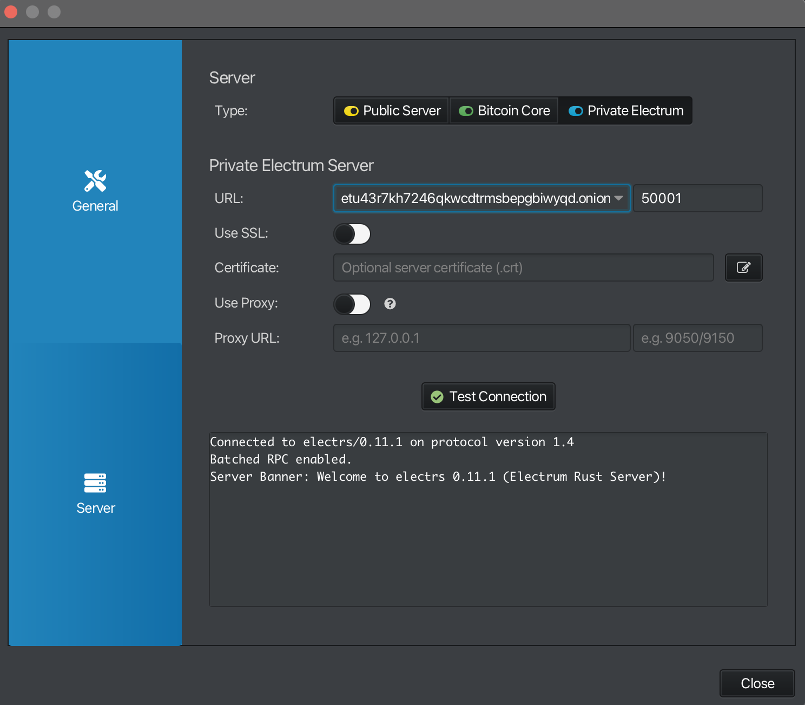

# Install Electrum Rust Server

## 1. Install Rust

### 1.1 ไปที่เว็บไซต์ https://rust-lang.org/tools/install/

```bash
curl --proto '=https' --tlsv1.2 -sSf https://sh.rustup.rs | sh
```

### 1.2 จากนั้นจะมี 3 ตัวเลือกให้เลือกอันที่ 1 (กด enter)

```bash
1) Proceed with standard installation (default - just press enter)
2) Customize installation
3) Cancel installation
```

### 1.3 โหลด environment ของ Rust เข้า shell

```bash
. "$HOME/.cargo/env"
```

### 1.4 ตรวจสอบว่าลง rustc แล้ว

```bash
rustc --version
```

ควรเห็น version แบบนี้

```bash
$ rustc --version
rustc 1.90.0 (1159e78c4 2025-09-14)
```

### 1.5 ตรวจสอบว่าลง cargo แล้ว

```bash
cargo --version
```

ควรเห็น version แบบนี้

```bash
$ cargo --version
cargo 1.90.0 (840b83a10 2025-07-30)
```

---

## 2. Build Electrum rs

### 2.1 ไปที่ https://github.com/romanz/electrs.git

```bash
git clone https://github.com/romanz/electrs.git
```

### 2.2 ตรวจสอบว่า clone ลงมาแล้ว

- ควรเห็นโฟเดอร์ `electrs`

```bash
ls
```

ตัวอย่าง

```bash
$ ls
electrs
```

### 2.3 install เครื่องมือที่จำเป็นในการ build electrs

```bash
sudo apt update
```

```bash
sudo apt install -y libbz2-1.0=1.0.8-5.1 bzip2=1.0.8-5.1
```

```bash
sudo apt install -y build-essential libclang-dev git
```

### 2.4 build electrs

- การ build electrs จะใช้เวลา ประมาณ 10 - 15 นาที

```bash
cd electrs
```

```bash
cargo build --locked --release
```

### 2.5 หลังจาก build เสร็จแล้วสามารถตรวจสอบได้โดย

- ควรเป็น version ของ electrs

```bash
./target/release/electrs --version  # should print the latest version
```

---

## 3. Firewall

### 3.1 กำหนดค่าการตั้งค่า Firewall เพื่ออนุญาตให้ electrs ทำงานหรือเชื่อมต่อได้

```bash
sudo ufw allow 50001/tcp comment 'allow electrs TCP from anywhere'
```

```bash
sudo ufw reload
```

```bash
sudo ufw status
```

ควรเป็นผลลัพธืแบบนี้

```text
To                         Action      From
--                         ------      ----
...
50001/tcp                  ALLOW       Anywhere                   # allow electrs TCP from anywhere
...
50001/tcp (v6)             ALLOW       Anywhere (v6)              # allow electrs TCP from anywhere
...
```

---

## 4. ตั้งค่า Bitcoin Core ให้ทำงานกับ electrs ได้

### 4.1 เปิดไฟล์ `bitcoin.conf`

```bash
nano ~/.bitcoin/bitcoin.conf
```

### 4.2 เพิ่มไว้ที่ หลัง main แต่ก่อน regtest

```conf
zmqpubrawblock=tcp://0.0.0.0:28332  # Enable publishing of raw block notifications
zmqpubrawtx=tcp://0.0.0.0:28333     # Enable publishing of raw transaction notifications
zmqpubhashblock=tcp://0.0.0.0:28334 # Enable publishing of block hash notifications
whitelist=127.0.0.1                 # trust all connections from localhost” (your own machine)
```

ตัวอย่าง

```
[main]
...
zmqpubrawblock=tcp://0.0.0.0:28332  # Enable publishing of raw block notifications
zmqpubrawtx=tcp://0.0.0.0:28333     # Enable publishing of raw transaction notifications
zmqpubhashblock=tcp://0.0.0.0:28334 # Enable publishing of block hash notifications
whitelist=127.0.0.1                 # trust all connections from localhost” (your own machine)

[regtest]
...
```

### 4.3 restart bitcoind service

```bash
sudo systemctl restart bitcoind
```

```bash
sudo systemctl status bitcoind
```

```bash
tail -f ~/.bitcoin/debug.log
```

> [!NOTE]
> zmq is Zero Message Queue เป็นโปรโตคอลที่ใช้ส่ง “ข้อความแบบเรียลไทม์” ระหว่างโปรแกรมต่าง ๆ โดยไม่ต้อง polling (ไม่ต้องคอยถามซ้ำ ๆ)<br>
> Bitcoin Core ใช้ ZMQ เพื่อ “กระจายข้อมูล” เช่น:<br>
>
> - block ใหม่ที่เพิ่งขุดได้<br>
> - transaction ใหม่ที่เพิ่งเข้ามาใน mempool<br>
>
> ไปยัง โปรแกรมภายนอก (เช่น block explorer, Electrum server, indexer, ฯลฯ)

---

## 5. ตั้งค่า electrs

### 5.1 copy ตัวอย่าง ที่ `electrs/doc/config_example.toml` config มาไว้ที่โฟลเดอร์ `electrs/electrs.toml`

```bash
cp ~/electrs/doc/config_example.toml ~/electrs/electrs.toml
```

### 5.2 ต่อมา config ไฟล์ `electrs.toml`

```bash
nano ~/electrs/electrs.toml
```

เปลี่ยนจาก

```bash
# File where bitcoind stores the cookie, usually file .cookie in its datadir
cookie_file = "/var/run/bitcoin-mainnet/cookie"

# Directory where the index should be stored. It should have at least 70GB of free space.
db_dir = "/some/fast/storage/with/big/size"

# The address on which electrs should listen. Warning: 0.0.0.0 is probably a bad idea!
# Tunneling is the recommended way to access electrs remotely.
electrum_rpc_addr = "127.0.0.1:50001"
```

เป็น

```bash
# File where bitcoind stores the cookie, usually file .cookie in its datadir
cookie_file = "/home/<username>/.bitcoin/.cookie"

# Directory where the index should be stored. It should have at least 70GB of free space.
db_dir = "/home/<username>/electrs/db"

# The address on which electrs should listen. Warning: 0.0.0.0 is probably a bad idea!
# Tunneling is the recommended way to access electrs remotely.
electrum_rpc_addr = "0.0.0.0:50001"
```

> [!Warning]
> อย่าลืมเปลี่ยน `<username>` เป็น `usernaem` ของตัวเอง

### 5.3 ต่อมาลองทดสอบว่า eletrs สามาถทำ index ได้

```bash
./target/release/electrs
```

ควรได้ผลลัพธ์แบบนี้

```bash
$ ./target/release/electrs
Starting electrs 0.10.10 on aarch64 linux with Config { network: Bitcoin, db_path: "/home/pi/electrs/db/bitcoin", db_log_dir:
None, db_parallelism: 1, daemon_auth: CookieFile("/home/pi/.bitcoin/.cookie"), daemon_rpc_addr: 127.0.0.1:8332, daemon_p2p_addr: 127.0.0.1:8333,
electrum_rpc_addr: 0.0.0.0:50001, monitoring_addr: 127.0.0.1:4224, wait_duration: 10s, jsonrpc_timeout: 15s, index_batch_size: 10, index_lookup_limit: None,
reindex_last_blocks: 0, auto_reindex: true, ignore_mempool: false, sync_once: false, skip_block_download_wait: false,
disable_electrum_rpc: false, server_banner: "Welcome to electrs 0.10.10 (Electrum Rust Server)!", signet_magic: f9beb4d9 }
[2025-10-06T15:06:08.347Z INFO  electrs::metrics::metrics_impl] serving Prometheus metrics on 127.0.0.1:4224
[2025-10-06T15:06:08.347Z INFO  electrs::server] serving Electrum RPC on 0.0.0.0:50001
[2025-10-06T15:06:08.387Z INFO  electrs::db] "/home/pi/electrs/db/bitcoin": 2 SST files, 0.000002204 GB, 0.000000002 Grows
[2025-10-06T15:06:08.396Z INFO  electrs::index] indexing 2000 blocks: [1..2000]
[2025-10-06T15:06:08.521Z INFO  electrs::chain] chain updated: tip=00000000dfd5d65c9d8561b4b8f60a63018fe3933ecb131fb37f905f87da951a, height=2000
[2025-10-06T15:06:08.525Z INFO  electrs::index] indexing 2000 blocks: [2001..4000]
```

### 5.4 ต่อมาหยุด electrs และตั้งค่า systemd เพื่อให้ electrs ทำงานอัตโนมัติหลังการบูตระบบ

```bash
sudo nano /etc/systemd/system/electrs.service
```

เพิ่ม

```bash
[Unit]
Description=Electrs
After=bitcoind.service

[Service]
WorkingDirectory=/home/<username>/electrs
ExecStart=/home/<username>/electrs/target/release/electrs --log-filters INFO
User=<username>
Group=<username>
Type=simple
KillMode=process
TimeoutSec=60
Restart=always
RestartSec=60

Environment="RUST_BACKTRACE=1"

# Hardening measures
PrivateTmp=true
ProtectSystem=full
NoNewPrivileges=true
MemoryDenyWriteExecute=true

[Install]
WantedBy=multi-user.target
```

> [!Warning]
> อย่าลืมเปลี่ยน `<username>` เป็น `username` ของคุณ

### 5.5 ต่อมา enable และ start electrs service

```bash
sudo systemctl daemon-reload
```

enable electrs service

```bash
sudo systemctl enable electrs.service
```

start electrs service

```bash
sudo systemctl start electrs.service
```

```bash
sudo systemctl status electrs.service
```

ควรได้แบบนี้

```bash
$ sudo systemctl status electrs.service
● electrs.service - Electrs
     Loaded: loaded (/etc/systemd/system/electrs.service; enabled; preset: enabled)
     Active: active (running) since Sun 2026-03-22 00:12:50 +07; 4min 28s ago
   Main PID: 8973 (electrs)
      Tasks: 21 (limit: 9064)
     Memory: 1.6G (peak: 1.6G)
        CPU: 6min 20.751s
     CGroup: /system.slice/electrs.service
             └─8973 /home/phoovich/electrs/target/release/electrs

Mar 22 00:16:34 bitcoin-node electrs[8973]: [2026-03-21T17:16:34.106Z INFO  electrs::chain] chain updated: tip=000000000000030c8448449500669700d>
Mar 22 00:16:34 bitcoin-node electrs[8973]: [2026-03-21T17:16:34.116Z INFO  electrs::index] indexing 2000 blocks: [221351..223350]
Mar 22 00:16:43 bitcoin-node electrs[8973]: [2026-03-21T17:16:43.235Z INFO  electrs::chain] chain updated: tip=00000000000003821c2b30ee4bf6919b2>
Mar 22 00:16:43 bitcoin-node electrs[8973]: [2026-03-21T17:16:43.239Z INFO  electrs::index] indexing 2000 blocks: [223351..225350]
Mar 22 00:16:54 bitcoin-node electrs[8973]: [2026-03-21T17:16:54.001Z INFO  electrs::chain] chain updated: tip=00000000000002b1244770a3435d2a232>
Mar 22 00:16:54 bitcoin-node electrs[8973]: [2026-03-21T17:16:54.005Z INFO  electrs::index] indexing 2000 blocks: [225351..227350]
Mar 22 00:17:02 bitcoin-node electrs[8973]: [2026-03-21T17:17:02.226Z INFO  electrs::chain] chain updated: tip=000000000000023756c4e56dd6f7f8721>
Mar 22 00:17:02 bitcoin-node electrs[8973]: [2026-03-21T17:17:02.231Z INFO  electrs::index] indexing 2000 blocks: [227351..229350]
Mar 22 00:17:11 bitcoin-node electrs[8973]: [2026-03-21T17:17:11.045Z INFO  electrs::chain] chain updated: tip=0000000000000075cd3c713afb4862201>
Mar 22 00:17:11 bitcoin-node electrs[8973]: [2026-03-21T17:17:11.049Z INFO  electrs::index] indexing 2000 blocks: [229351..231350]
```

ดู log

```bash
sudo journalctl -u electrs.service -f
```

#### 5.6 ลองเชื่อมต่อกับ Sparrow


> [!warning]
> เปลี่ยน `<hostname>` เป็น hostname ของคุณ

และ กด `Test Connection`

- ควรเห็นข้อความแบบนี้


---

## 6. รัน electrs หลัง tor service

### 6.1 เปิดไฟล์ torrc

```bash
sudo nano /etc/tor/torrc
```

### 6.2 เพิ่มส่วนนี้ที่ ท้ายไฟล์

```bash
# Electrs
HiddenServiceDir /var/lib/tor/electrs
HiddenServiceVersion 3
HiddenServicePort 50001 127.0.0.1:50001
HiddenServiceEnableIntroDoSDefense 1
```

### 6.3 สร้างโฟลเดอร์ สำหรับ electrs tor service

```bash
sudo mkdir -p /var/lib/tor/electrs
```

### 6.4 จากนั้นเปลี่ยนเจ้าของ (owner) ให้เป็น debian-tor

```bash
sudo chown -R debian-tor:debian-tor /var/lib/tor/electrs
```

### 6.5 จากนั้นเปลี่ยนสิทธิ์การเข้าถึง (permission)

```bash
sudo chmod -R 700 /var/lib/tor/electrs
```

### 6.6 และ restart tor service

```bash
sudo systemctl restart tor
```

```bash
sudo systemctl status tor
```

### 6.7 check Tor address

```bash
sudo cat /var/lib/tor/electrs/hostname
```

ผลลัพธ์ควรจะได้ `tor-address`

```bash
$ sudo cat /var/lib/tor/electrs/hostname
<tor-address>.onion
```

ตัวอย่าง

```bash
$sudo cat /var/lib/tor/electrs/hostname
zub7dk....gbiwyqd.onion
```

จะสามารถทดสอบการเชื่อต่อกับ sparrow โดยใช้ tor-address ได้ดังนี้


