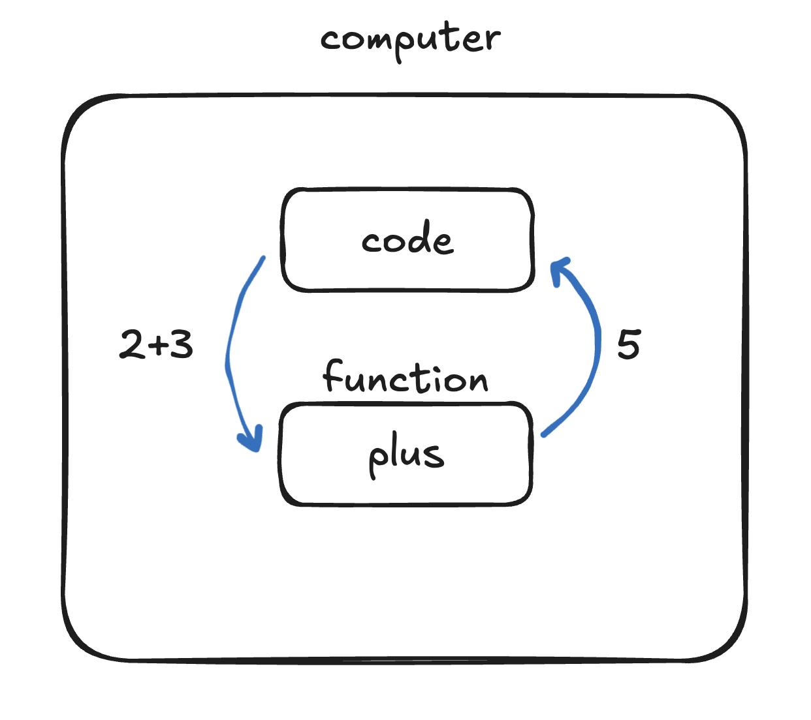
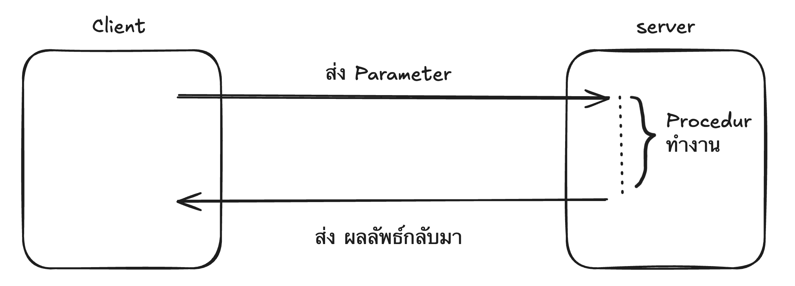
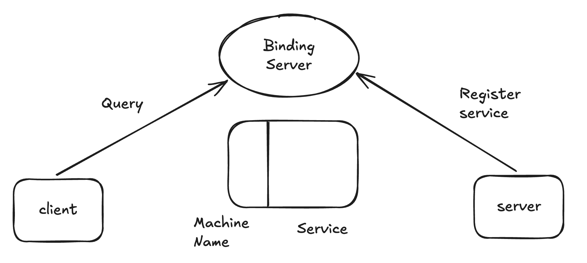
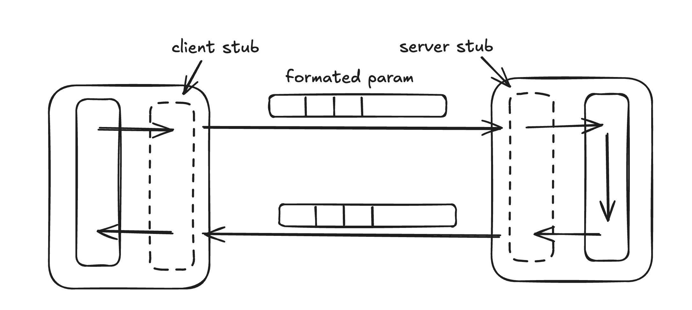
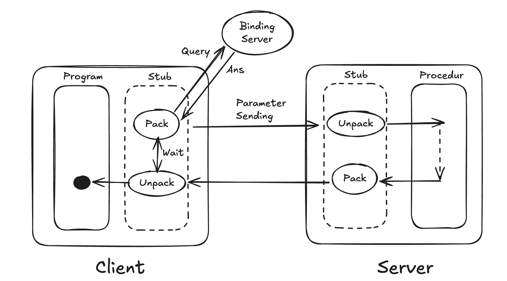

## What is RPC

- RPC ย่อมาจาก Remote Procedure Call ( การเรียกใช้ฟังก์ชันระยะไกล)
- เป็นโปรโตคอลการสื่อสารในระบบเครือข่าย
- อนุญาตให้โปรแกรมหนึ่ง (Client) สามารถเรียกใช้งานฟังก์ชันหรือโปรแกรมย่อยบนคอมพิวเตอร์อีกเครื่องหนึ่ง (Server) ได้
- โดยที่ผู้เรียกไม่จำเป็นต้องรู้รายละเอียดของการสื่อสารในเครือข่ายนั้นๆ

### Procedure Call

- การเรียก function ในเครื่องเดี่ยวกัน



- แล้วเราจะสามารถเรียก function ผ่าน network ได้มั้ยจึงเกิดเป็น แนวคิดของ Remote Procedure Call

---

### Basic RPC



เกิดปัญหาคือ

1. client เราจะรู้ได้ยังไงว่าจะต้องติดต่อ server ตัวไหน
    - จะต้องมีเครื่องที่ทำหน้าที่จดทะเบียนขึ้นมาเรียกว่า (Binding Server)

---

### Binding Server

- Client ก็จะทำการถาม (Query) ฟังก์ชั่นที่ต้องการ ใช้งานอยู่ server ไหน
- ในขณะเดียวกัน พวกเครื่อง server ที่ให้บริการต่างๆก็จะต้องไป ลงทะเบียน (Register) service (Procedure) ของตัวเองที่เครื่อง Binding Server
- แล้ว Binding service จะมีตาราง (table) ที่เก็บว่า
    - IP Address ไหนมี service อะไรอยู่



---

### stub

- คือตัวแทนหรือตัวจัดการ
- เวลา client ส่ง parameter stub จะช่วยรับ parameter แล้วจัดเป็นรูปแบบ patten กลางส่งที่ server สามารถเข้าใจได้ และ ส่งไปให้ server
- ส่วน server แล้วส่งกลับก็ส่งผ่าน stub และ stub จะรับ รูปแบบ คำผมที่ client สามารถรับได้
- stub ทำให้หน้าที่ให้ แปลง parameter ที่ทั้งสองฝั่นสามารถเข้าใจได้



---

### RPC



- client ก็จะถาม (query) ไปที่ binding server ว่า service ที่ต้องการอยู่ที่ไหน
- binding server ก็ตอบกลับมา
- เมื่อ client ได้รับคำตอบมาก็ทำหน้าที่ Pack Parameter และส่งไปให้ server ที่ทราบ
- server ก็จะทำการ Unpack Parameter และ ส่งให้ Procedur
- Procedur ก็จะทำงานเมื่อได้ผลลัพธืที่ต้องการแล้วก็ทำการ Pack คำตอบ ส่งไปให้ client
- เมื่อ client ได้รับคำตอบก็ unpack และนำคำตอบไปใช้งานต่อได้

---

### Bitcoin Core RPC

- ใน RPC ทั่วไป
    - คือการเรียก function ข้ามเครื่อง
- ใน Bitcoin Core RPC:
    - ก็เหมือนกัน คือ "เรียก function ของ Bitcoin node ผ่าน network"
- ใช้ JSON-RPC แทน stub
- วิ่งผ่าน HTTP
- ไม่มี binding server
- ไม่มี service discovery (กลไกที่ช่วยให้ Client หา Server อัตโนมัติ)
- หมายความว่า Client **ต้องรู้เองทั้งหมด** ว่า:
    - Server อยู่ที่ไหน (IP / host)
    - ใช้ port อะไร (default: 8332)
    - endpoint คืออะไร
- ตัวอย่าง

```bash
$ bitcoin-cli help getblockchaininfo
getblockchaininfo

Returns an object containing various state info regarding blockchain processing.

Result:
{                                         (json object)
    ...
}

Examples:
> bitcoin-cli getblockchaininfo
> curl --user myusername --data-binary '{"jsonrpc": "2.0", "id": "curltest", "method": "getblockchaininfo", "params": []}' -H 'content-type: application/json' http://127.0.0.1:8332/
```

- เวลาจะเชื่อมต่อ Bitcoin RPC ใช้:
    - rpcuser + rpcpassword (เก่า)
    - rpcauth (แนะนำ)

| **Feature**       | **RPC ทั่วไป** | **Bitcoin RPC**   |
| ----------------- | -------------- | ----------------- |
| Binding Server    | ✅ มี          | ❌ ไม่มี          |
| Service Discovery | ✅ มี          | ❌ ไม่มี          |
| Stub              | ✅ มี          | ❌ (ใช้ JSON แทน) |
| Protocol          | หลายแบบ        | JSON-RPC เท่านั้น |
> [!Note]
> rpcallowip = อนุญาตว่า IP ไหนเข้ามาใช้ RPC ของ node ได้ <br>
> rpcbind = กำหนดว่า RPC server เปิดฟังที่ IP ไหน (ไม่เกี่ยวกับ binding server) <br>
> bind = กำหนดว่า node จะรับการเชื่อมต่อจาก node อื่น (P2P) ที่ IP ไหน <br>
