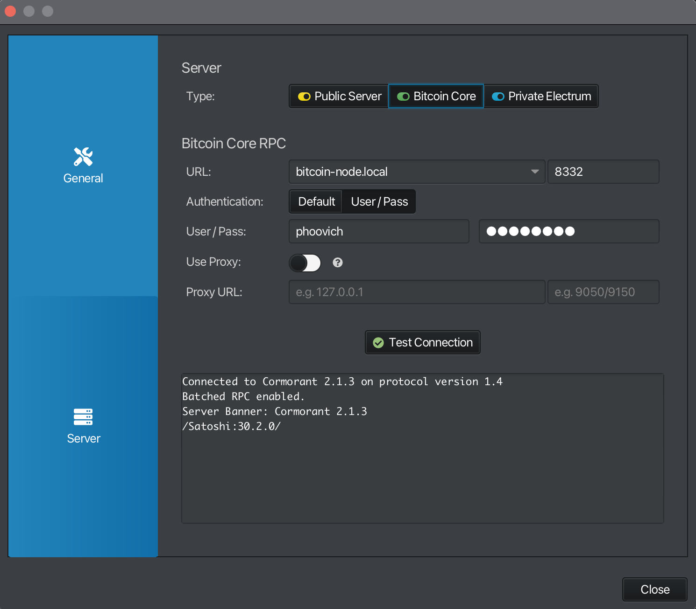
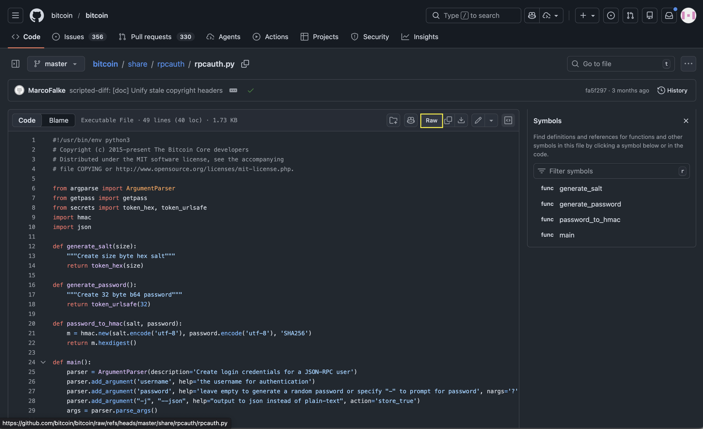

## 1. rpcuser and rpcpassword

### 1.1 เปิดไฟล์ `bitcoin.conf`

```bash
nano ~/.bitcoin/bitcoin.conf
```

### 1.2 เพิ่ม rpcuser and rpcpassword ลงในไฟล์ `bitcoin.conf`

```conf
rpcuser=<your_rpc_user>
rpcpassword=<your_rpc_password>
```

save and exit (Ctrl + S, X, Enter)

> [!warning]
> อย่าลืมเปลี่ยน `your_rpc_user` และ `<your_rpc_password>` เป็นของตัวเอง

### 1.3 Restart bitcoind.service

```bash
sudo systemctl restart bitcoind.service
```

### 1.4 ตรวจสอบ status ของ bitcoind.service

```bash
sudo systemctl status bitcoind.service
```

ควรได้ผมลัพธ์แบบนี้

```bash
$ sudo systemctl status bitcoind.service
● bitcoind.service - Bitcoin daemon
     Loaded: loaded (/etc/systemd/system/bitcoind.service; enabled; preset: enabled)
     Active: active (running) since Mon 2025-10-06 00:27:54 +07; 7s ago
    Process: 52385 ExecStart=/usr/local/bin/bitcoind -daemon -conf=/home/pi/.bitcoin/bitcoin.conf -datadir=/home/pi/.bitcoin (code=exited, status=0/SUCCESS)
   Main PID: 52387 (bitcoind)
      Tasks: 25 (limit: 9572)
        CPU: 8.349s
     CGroup: /system.slice/bitcoind.service
             └─52387 /usr/local/bin/bitcoind -daemon -conf=/home/pi/.bitcoin/bitcoin.conf -datadir=/home/pi/.bitcoin

Oct 06 00:27:54 raspberrypi systemd[1]: Starting bitcoind.service - Bitcoin daemon...
Oct 06 00:27:54 raspberrypi bitcoind[52385]: Bitcoin Core starting
Oct 06 00:27:54 raspberrypi systemd[1]: Started bitcoind.service - Bitcoin daemon.
```

### 1.5 ตรวจสอบ log ไฟล์ ดูว่ามี error เกิดขึ้นมั้ย

```bash
tail -f ~/.bitcoin/debug.log
```

ผลลัพธ์ที่ได้ไม่ควรมี error เกิดขึ้น

```bash
$ tail -f ~/.bitcoin/debug.log

2025-10-05T17:28:02Z Progress loading mempool transactions from file: 80% (tried 765, 191 remaining)
2025-10-05T17:28:02Z Progress loading mempool transactions from file: 90% (tried 861, 95 remaining)
2025-10-05T17:28:02Z Imported mempool transactions from file: 956 succeeded, 0 failed, 0 expired, 0 already there, 0 waiting for initial broadcast
2025-10-05T17:28:02Z initload thread exit
2025-10-05T17:28:10Z New block-relay-only v1 peer connected: version: 70016, blocks=917790, peer=0
2025-10-05T17:28:14Z New block-relay-only v2 peer connected: version: 70016, blocks=917790, peer=1
2025-10-05T17:28:18Z New outbound-full-relay v1 peer connected: version: 70016, blocks=917790, peer=2
...
...

```

### 1.6 ตรวจสอบ connection

#### 1.6.1 ใน raspberry pi

```bash
bitcoin-cli help getblockchaininfo
```

```bash
$ bitcoin-cli help getblockchaininfo
getblockchaininfo

Returns an object containing various state info regarding blockchain processing.

Result:
{                                         (json object)
    ...
}

Examples:
> bitcoin-cli getblockchaininfo
> curl --user myusername --data-binary '{"jsonrpc": "2.0", "id": "curltest", "method": "getblockchaininfo", "params": []}' -H 'content-type: application/json' http://127.0.0.1:8332/
```

> [!NOTE]
> อย่าลืมเปลี่ยน myusername เป็น rpc_user ของตัวเอง

ต่อมาลองใช้ `curl` เพื่อทดสอบ connection

```bash
curl --user bitcoin --data-binary '{"jsonrpc": "2.0", "id": "curltest", "method": "getblockchaininfo", "params": []}' -H 'content-type: application/json' http://127.0.0.1:8332/
```

> [!Note]
> rpcuser ของผมคือ `bitcoin` อย่าลืมเปลี่ยนเป็นของตัวเอง

```bash
$ curl --user bitcoin --data-binary '{"jsonrpc": "2.0", "id": "curltest", "method": "getblockchaininfo", "params": []}' -H 'content-type: application/json' http://127.0.0.1:8332/
Enter host password for user 'bitcoin':
{"jsonrpc":"2.0","result":{"chain":"main","blocks":917790,"headers":917790,"bestblockhash":"000000000000000000006de1fc99f94542df01a6f763667d2579ea28c3e293ef","bits":"1701ddb4","target":"00000000000000000001ddb40000000000000000000000000000000000000000","difficulty":150839487445890.5,"time":1759685040,"mediantime":1759683880,"verificationprogress":0.9999995424657299,"initialblockdownload":false,"chainwork":"0000000000000000000000000000000000000000e8c87f09711580793a23c607","size_on_disk":786852089923,"pruned":false,"warnings":[]},"id":"curltest"}
```

#### 1.6.2 ตรวจสอบ connection จาก sparrow wallet

- เปิด sparrow wallet และไปที่ settings (mac กด `Cmd + ,` และ windows กด `Ctrl + ,`)
- ใน settings กด "Server" tab
- และใส่
    - hostname
    - rpc_user
    - และ rpc_password


- กด `Test connection` ควรจะเชื่อมต่อได้แบบนี้



---

## 2. rpcauth

### 2.1 ปัญหาของ rpcuser + rpcpassword

Bitcoin Core ใช้แบบนี้ในไฟล์ `bitcoin.conf`

```conf
rpcuser=myuser
rpcpassword=mypassword
```

- ปัญหาคือ Password ถูกเก็บแบบ Plain Text
- ถ้าใครอ่านไฟล์ได้ก็รู้จะ password ทันทีใน
- จุดนี้เองที่ rpcauth เข้ามาแก้ปัญหาคือ rpcauth ใช้ hashed password แทนที่จะเก็บ password จริง

ตัวอย่าง

```conf
rpcauth=alice:2f7a1c...9b2e3f...
```

- จะเห็นว่า password ไม่ได้ปรากฏอยู่ในไฟล์ `bitcoin.conf`

### 2.1 วิธีการสร้าง rpcauth

#### 2.1.1 ไปที่[https://github.com/bitcoin/bitcoin/blob/master/share/rpcauth/rpcauth.py](https://github.com/bitcoin/bitcoin/blob/master/share/rpcauth/rpcauth.py)

#### 2.1.2 กด "Raw" button to get the raw python script



#### 2.1.3 ใช้ `wget` ในการ `download rpcauth.py`

copy url และ ใช้ wget ในการ download

```bash
cd
```

```bash
wget https://raw.githubusercontent.com/bitcoin/bitcoin/refs/heads/master/share/rpcauth/rpcauth.py
```

ควรเห็นไฟล์ `rpcauth.py` ที่ download มา

```bash
$ ls
rpcauth.py
```

#### 2.1.4 รันสคริปต์โดยใช้ username และ password ตามที่คุณต้องการ

```bash
python3 rpcauth.py <your_username> <your_password>
```

```bash
$ python3 rpcauth.py bitcoin bitcoin
String to be appended to bitcoin.conf:
rpcauth=bitcoin:4d1a690b6833f001841f3fa2d136d47f$1e3a61e235d5c9523e90e911c994c74450263e7b2a84ef014934a95505fc7068
Your password:
bitcoin
```

#### 2.1.5 Copy ผลลัพธ์ และนำไปวาวในไฟล์ `bitcoin.conf` แทน rpcuser และ rpcpasssord

เปลี่ยน

```conf
rpcuser=myuser
rpcpassword=mypassword
```

```conf
rpcauth=<username>:4d1a690b6833f001841f3fa2d136d47f$1e3a61e235d5c9523e90e911c994c74450263e7b2a84ef014934a95505fc7068
```

> [!Note]
> อย่างลืมเปลี่ยน `<username>` เป็น username ที่คุณใช้สร้าง rpcauth

### 2.3 หลังการที่ตั้งค่า rpcauth แล้ว

#### 2.3.1 หลังการที่ตั้งค่า rpcauth แล้ว ใน `bitcoin.conf` แล้ว ให้ restart bitcoind.service

```bash
sudo systemctl restart bitcoind.service
```

#### 2.3.2 Check status ของ bitcoind.service

```bash
sudo systemctl status bitcoind.service
```

#### 2.3.3 Check log ไฟล์ว่ามี error มั้ย

```bash
tail -f ~/.bitcoin/debug.log
```

### 2.4 ทดสอบการ connection หลังจาก ติดตั้ง rpcauth

#### 2.4.1 ใน raspberry pi5

```bash
$ bitcoin-cli help getblockchaininfo
getblockchaininfo

Returns an object containing various state info regarding blockchain processing.

Result:
{
....
}
Examples:
> bitcoin-cli getblockchaininfo
> curl --user myusername --data-binary '{"jsonrpc": "2.0", "id": "curltest", "method": "getblockchaininfo", "params": []}' -H 'content-type: application/json' http://127.0.0.1:8332/

```

> [!Note] 
> อย่าลืมเเป็นเป็น myusername เป็น rpcuser ของคุณ

#### 2.4.2 ลองใช้ curl เพื่อของข้อมูลการ node ของคุณ

```bash
$ curl --user bitcoin --data-binary '{"jsonrpc": "2.0", "id": "curltest", "method": "getblockchaininfo", "params": []}' -H 'content-type: application/json' http://127.0.0.1:8332/
Enter host password for user 'bitcoin':
{"jsonrpc":"2.0","result":{"chain":"main","blocks":915753,"headers":915753,"bestblockhash":"000000000000000000011aaa8e85e4831815b6f18340ef2d56ea3884a6301b30","bits":"1701fa38","target":"00000000000000000001fa380000000000000000000000000000000000000000","difficulty":142342602928674.9,"time":1758470427,"mediantime":1758466112,"verificationprogress":0.999993927355762,"initialblockdownload":false,"chainwork":"0000000000000000000000000000000000000000e4b2f04f4c9fb655ba731930","size_on_disk":783353282429,"pruned":false,"warnings":[]},"id":"curltest"}
```

> [!NOTE]
> ในตัวอย่างนี้ผมใช่ rpcuser คือ bitcoin อย่าลืมเปลี่ยน bitcoin เป็น rpcuser ของคุณ


#### 2.4.3 (Optional) Test  จากคอมพิวเตอร์ของคุณ (สำหรับ MacOS หรือ Linux)

> [!NOTE]  
> ผู้ใช้ Windows สามารถใช้ WSL เพื่อรันคำสั่ง Bash ได้ ซึ่งเนื้อหานี้อยู่นอกขอบเขตของคอร์สนี้ แต่หากคุณสนใจลองใช้งาน สามารถดูเอกสารเพิ่มเติมได้ใน repository

หา ip address raspberry pi ของคุณ

รันคำสั่งนี้ใน raspberrypi ของคุณ

```bash
hostname -I
```

ตัวอย่าง 

```bash
$ hostname -I
192.168.0.103 ...
```

เปิด terminal และรัสคำสั่งตามนี้

```bash
curl --user <username> --data-binary \
'{"jsonrpc": "2.0", "id": "curltest", "method": "getblockchaininfo", "params": []}' -H 'content-type: application/json' \
http://<raspberry_pi_ip>:8332/
```

> [!Note]
> อย่าลืมเปลี่ยน 
> - `<username>` เป็น rpcuser ของคุณ
> - `<raspberry_pi>` เป็น ip raspberry pi ของคุณ
> 

```bash
$ curl --user bitcoin --data-binary '{"jsonrpc": "2.0", "id": "curltest", "method": "getblockchaininfo", "params": []}' -H 'content-type: application/json' http://192.168.0.112:8332/
{"jsonrpc":"2.0","result":{"chain":"main","blocks":915753,"headers":915753,"bestblockhash":"000000000000000000011aaa8e85e4831815b6f18340ef2d56ea3884a6301b30","bits":"1701fa38","target":"00000000000000000001fa380000000000000000000000000000000000000000","difficulty":142342602928674.9,"time":1758470427,"mediantime":1758466112,"verificationprogress":0.9999928627030699,"initialblockdownload":false,"chainwork":"0000000000000000000000000000000000000000e4b2f04f4c9fb655ba731930","size_on_disk":783353282429,"pruned":false,"warnings":[]},"id":"curltest"}
```

> Note:
> ในตัวอย่างนี้ใช้ rpcuser = bitcoin อย่าลืมเปลี่ยน bitcoin เป็น rpcuser ของคุณ

#### 2.4.3 Test การเชื่อมต่อจาก sparrow wallet


