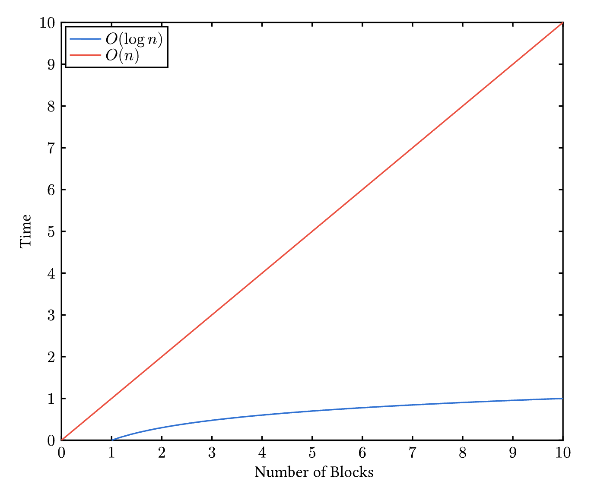

## What is Index?

สมมติว่าถ้าเราต้องการหาว่า **"คาถาที่ Harry Potter ใช้ในการให้แสงสว่าง อยู่หน้าไหนของหนังสือ"** เราจะหายังไง?

### วิธีที่ 1: กรณีไม่มี Index

- ค่อยๆ เปิดทีละหน้า
- อ่านทั้งเล่ม
- หาเองทั้งหมด
- **ผลลัพธ์:** ช้า ($O(n)$)

### วิธีที่ 2: กรณีมี Index

- เปิด **"สารบัญท้ายเล่ม"**
- หา Keyword: **Lumos**
- ได้เลขหน้า → ไปเปิดตรงนั้นเลย
- **ผลลัพธ์:** เร็วมาก ($O(1)$ หรือ $O(\log n)$)

> **สรุป:** Index = ตัวช่วยให้ **"หาเร็ว"** โดยไม่ต้องอ่านทั้งหมด

---

## แล้วใน Bitcoin ล่ะ?

ถ้าเราจะหาว่า **"Address นี้เคยมี Transaction อะไรบ้าง"** จะทำยังไง?

### กรณีไม่มี Index

- ต้องอ่าน Blockchain ทุก Block
- ไล่ทุก Transaction
- เช็คทุก Input/Output
- **ผลลัพธ์:** จะทำงานช้ามาก

### กรณีมี Index

จะมี Table ที่คอยบอกข้อมูลว่า:

- **Address/Script นี้** --> มี Transaction อะไรเกิดขึ้นบ้าง

---

## สรุป: แล้ว Electrs ที่ "รอนานๆ" คืออะไร?

ในขณะที่คุณกำลังรอนั้น สิ่งที่ระบบกำลังทำคือ **"การสร้าง Index ของทั้ง Blockchain"** เพื่อให้การเรียกดูข้อมูลในภายหลังทำได้รวดเร็วนั่นเอง

