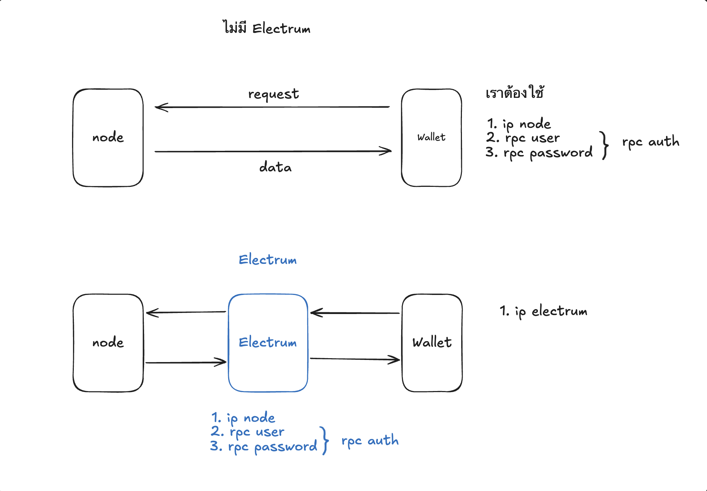

### Electrum Server คือโปรแกรมที่ทำหน้าที่เป็น "ตัวกลาง" ระหว่าง

• Bitcoin Core (Full Node)
• กับ Wallet เช่น Electrum

เพื่อให้ Wallet สามารถใช้งาน Bitcoin ได้ โดยไม่ต้องโหลด Blockchain ทั้งหมด

### โครงสร้างการทำงาน

```
Bitcoin Core (เก็บ Blockchain ทั้งหมด)
			↓
Electrum Server (ทำ index + ค้นหา)
			↓
Wallet (เช่น Electrum)
```

1. Bitcoin Core
   • เก็บ Blockchain ทั้งหมด (หลายร้อย GB)
   • ตรวจสอบความถูกต้องของธุรกรรม
2. Electrum Server (เช่น electrs)
   • สร้าง Index (ดัชนี) จาก Blockchain
   • ทำให้ค้นหาข้อมูลเร็วมาก
3. Wallet
   • ไม่ต้องโหลด blockchain
   • แค่ส่งคำถามไปที่ server แล้วรอคำตอบ

ถ้าไม่มี Electrum Server?

- Wallet ต้องโหลด blockchain เอง
- ต้อง scan ทั้งระบบ -> ช้ามาก

### Electrum Server ทำอะไรบ้าง?

#### 1. ทำ Index

- อ่านข้อมูลจาก Blockchain แล้วทำ index ขึ้นมาให้ค้นหาเร็วขึ้น

#### 2. ให้บริการ API (RPC)

- Wallet เรียกใช้ เช่น:
    - ดู balance
    - ดู history
    - ส่ง transaction


