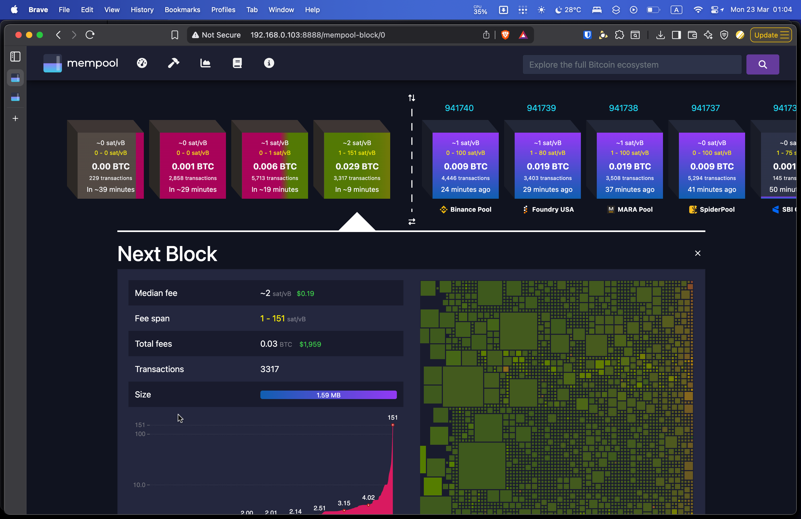
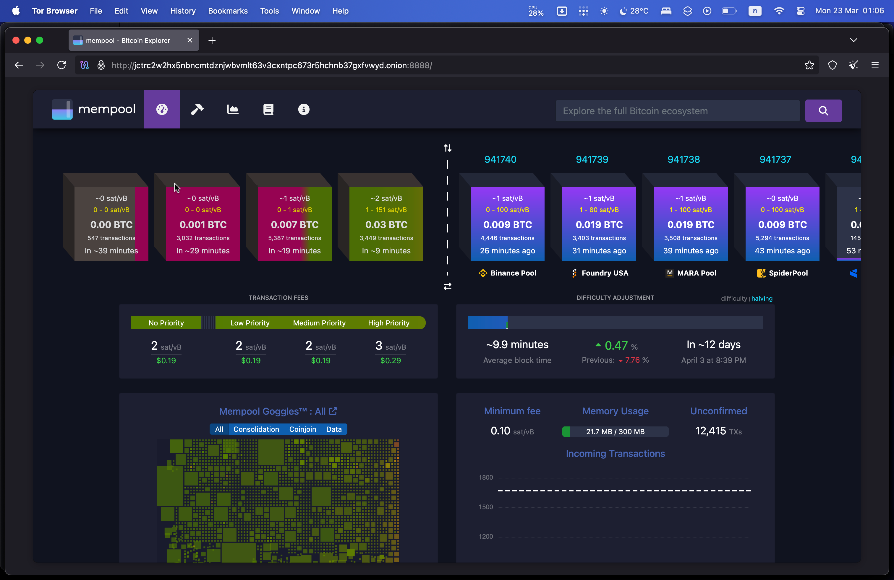

# Mempool.space

[Mempool.space](https://mempool.space) เป็นเว็บไซต์ Bitcoin Explorer ยอดนิยมที่ใช้สำหรับตรวจสอบ:
- ธุรกรรม Bitcoin (Transactions)
- ข้อมูลบล็อก (Block Information)
- สถานะของ Mempool
- ค่าธรรมเนียมที่แนะนำ (Fee Estimates)

ด้วยการออกแบบ UX/UI ที่เรียบง่าย สวยงาม และใช้งานสะดวก จึงได้รับความนิยมในกลุ่ม Bitcoinner


**สิ่งที่ต้องมีก่อนการติดตั้ง**
1. Docker (เนื่องจากเป็นวิธีที่ง่ายและแนะนำที่สุดในการติดตั้ง)
2. Bitcoin Core (ต้องซิงค์บล็อกเชนเรียบร้อยแล้ว)
3. Electrum Server (สำหรับค้นหาธุรกรรมได้อย่างรวดเร็ว)

> [!NOTE]
> หากยังไม่ได้ติดตั้ง Docker สามารถดูวิธีการติดตั้งได้ที่ [วิธีติดตั้ง Docker](https://docs.docker.com/engine/install/ubuntu/)

---

## ขั้นตอนติดตั้ง mempool.space

### 1. ตรวจสอบให้แน่ใจว่ามี Docker อยู่ในเครื่องโดยใช้คำสั่ง:

```bash
sudo docker ps
```

ตัวอย่าง

```
$ docker ps
CONTAINER ID   IMAGE     COMMAND   CREATED   STATUS    PORTS     NAMES
```

### 2. จัดการ Firewall

เปิด Port สำหรับ mempool.space :8888

```bash
sudo ufw allow 8888/tcp comment 'mempool.space'
```

```bash
sudo ufw reload
```

```bash
sudo status
```

 ผลลัพธ์

```bash
Status: active

To                         Action      From
--                         ------      ----
...
8888/tcp                   ALLOW       Anywhere                   # mempool.space
...
8888/tcp (v6)              ALLOW       Anywhere (v6)              # mempool.space
...

```

### 3. ตรวจสอบไฟล์ `bitcoin.conf`
 
ตรวจสอบว่าได้ใส่ค่า 3 อย่างนี้ไว้ไหม หาไม่มีเพิ่มเข้าไปในไฟล์ `bitcoin.conf`

```
txindex=1
blockfilterindex=1
coinstatsindex=1
```

### 4. ดาวน์โหลดซอร์สโค้ดโดยตรงจาก GitHub

[GitHub mempool.space](https://github.com/mempool/mempool)

```bash
git clone https://github.com/mempool/mempool.git
```

เข้าไปที่โฟลเดอร์ docker ใน mempool

```bash
cd mempool/docker
```

### 5. แก้ไขไฟล์ `docker-compose.yml`

### 5.1 ก่อนจะแก้ไขไฟล์ `docker-compose.yml` ต้องรู้ IP ของ Docker ก่อน

ใช้คำสั่ง:

```bash
ip a
```

ให้สังเกต inet ใน docker0

```
$ ip a
4: docker0: <NO-CARRIER,BROADCAST,MULTICAST,UP> mtu 1500 qdisc noqueue state DOWN group default
    link/ether 82:3a:64:20:a1:4d brd ff:ff:ff:ff:ff:ff
    inet 172.17.0.1/16 brd 172.17.255.255 scope global docker0
       valid_lft forever preferred_lft forever
```

- ในตัวอย่างจะเห็นเป็น `inet 172.17.0.1`

### 5.2 แก้ไขไฟล์ `docker-compose.yml`

```bash
nano docker-compose.yml
```

#### 5.2.1 แก้ไข port จาก 80 เป็น 8888

```conf
    ports:
      - 8888:8080
```

#### 5.2.2 เพิ่ม environment สำหรับ electrum

```conf
  api:
    environment:
      MEMPOOL_BACKEND: "electrum"
      ELECTRUM_HOST: "172.17.0.1"
      ELECTRUM_PORT: "50001"
      ELECTRUM_TLS_ENABLED: "false"
```

#### 5.2.3 แก้ไข environment สำหรับ Bitcoin Core และ RPC USER/PASS

```conf
  api:
    environment:
      CORE_RPC_HOST: "172.17.0.1"
      CORE_RPC_PORT: "8332"
      CORE_RPC_USERNAME: "<USER>"
      CORE_RPC_PASSWORD: "<PASS>"
```

#### 5.2.4 เปลี่ยน `restart:` จาก on-failure เป็น always

```conf
    restart: always
```

#### 5.2.5 กำหนด networks ในส่วนท้าย 

```conf
networks:
  default:
    driver: bridge
    ipam:
      config:
        - subnet: 172.16.57.0/24
```

ตัวอย่าง

```conf
version: "3.7"

services:
  web:
    environment:
      FRONTEND_HTTP_PORT: "8080"
      BACKEND_MAINNET_HTTP_HOST: "api"
    image: mempool/frontend:latest
    user: "1000:1000"
    restart: always
    stop_grace_period: 1m
    command: "./wait-for db:3306 --timeout=720 -- nginx -g 'daemon off;'"
    ports:
      - 8888:8080
    healthcheck:
      test: ["CMD-SHELL", "curl -f http://localhost:8080/ | grep -q '<html' || exit 1"]
      interval: 30s
      timeout: 10s
      retries: 3
      start_period: 20s
  api:
    environment:
      MEMPOOL_BACKEND: "electrum"
      CORE_RPC_HOST: "172.17.0.1"
      CORE_RPC_PORT: "8332"
      CORE_RPC_USERNAME: "phoovich"
      CORE_RPC_PASSWORD: "phoovich"
      ELECTRUM_HOST: "172.17.0.1"
      ELECTRUM_PORT: "50001"
      ELECTRUM_TLS_ENABLED: "false"
      DATABASE_ENABLED: "true"
      DATABASE_HOST: "db"
      DATABASE_DATABASE: "mempool"
      DATABASE_USERNAME: "mempool"
      DATABASE_PASSWORD: "mempool"
      STATISTICS_ENABLED: "true"
    image: mempool/backend:latest
    user: "1000:1000"
    restart: always
    stop_grace_period: 1m
    command: "./wait-for-it.sh db:3306 --timeout=720 --strict -- ./start.sh"
    volumes:
      - ./data:/backend/cache
    healthcheck:
      test: ["CMD-SHELL", "curl -f http://localhost:8999/api/v1/backend-info | grep -q . || exit 1"]
      interval: 30s
      timeout: 10s
      retries: 3
      start_period: 40s
  db:
    environment:
      MYSQL_DATABASE: "mempool"
      MYSQL_USER: "mempool"
      MYSQL_PASSWORD: "mempool"
      MYSQL_ROOT_PASSWORD: "admin"
      MARIADB_AUTO_UPGRADE: "1"
    image: mariadb:10.5.21
    user: "1000:1000"
    restart: always
    stop_grace_period: 1m
    volumes:
      - ./mysql/data:/var/lib/mysql
    healthcheck:
      test: ["CMD", "mysqladmin", "ping", "-h", "localhost", "-u", "mempool", "-pmempool"]
      interval: 5s
      timeout: 5s
      retries: 10
networks:
  default:
    driver: bridge
    ipam:
      config:
        - subnet: 172.16.57.0/24
```

###  6. รัน Container

หลังจากแก้ไขไฟล์ `docker-compose.yml` เสร็จสั่งรัน Container ได้เลย
โดยใช้คำสั่งนี้:

```bash
sudo docker compose up -d
```

> [!NOTE]
> หลังจาก Container ทำงานแล้ว ให้เข้าบราวเซอร์เพื่อตรวจสอบได้เลยที่ `<ip>:8888`

ตัวอย่าง การเข้าผ่านเบราว์เซอร์



### 7. สร้างไฟล์ `docker-compose.yml` ที่ปลอดภัยกว่า

`docker-compose.yml` อันเดิมสังเกตได้ว่าจะมีการใส่ UESR/PASS ด้วยหากใส่ในไฟล์ตรง ๆ เลยอาจปลอดภัยไม่มากพอ อีกหนึ่งตัวเลือกคือการใช้ไฟล์ `.env` ประกอบด้วยจะปลอดภัยมากขึ้น

### 7.1 หากรัน Container อยู่ให้ลบออกก่อน ใช้คำสั่งนี้:

```bash
sudo docker compose down
```

### 7.2 แก้ไข้ไฟล์ `docker-compose.yml`

```bash
nano docker-compose.yml
```

ลบค่าเดิมออกและใส่ค่าใหม่ตามนี้:

```conf
version: "3.7"

services:
  web:
    environment:
      FRONTEND_HTTP_PORT: "8080"
      BACKEND_MAINNET_HTTP_HOST: "api"
    image: mempool/frontend:latest
    user: "1000:1000"
    restart: always
    stop_grace_period: 1m
    command: "./wait-for db:3306 --timeout=720 -- nginx -g 'daemon off;'"
    ports:
      - 8888:8080
    healthcheck:
      test: ["CMD-SHELL", "curl -f http://localhost:8080/ | grep -q '<html' || exit 1"]
      interval: 30s
      timeout: 10s
      retries: 3
      start_period: 20s
  api:
    environment:
      MEMPOOL_BACKEND: "${MEMPOOL_BACKEND}"
      CORE_RPC_HOST: "${CORE_RPC_HOST}"
      CORE_RPC_PORT: "${CORE_RPC_PORT}"
      CORE_RPC_USERNAME: "${CORE_RPC_USERNAME}"
      CORE_RPC_PASSWORD: "${CORE_RPC_PASSWORD}"
      ELECTRUM_HOST: "${ELECTRUM_HOST}"
      ELECTRUM_PORT: "${ELECTRUM_PORT}"
      ELECTRUM_TLS_ENABLED: "${ELECTRUM_TLS_ENABLED}"
      DATABASE_ENABLED: "${DATABASE_ENABLED}"
      DATABASE_HOST: "${DATABASE_HOST}"
      DATABASE_DATABASE: "${DATABASE_DATABASE}"
      DATABASE_USERNAME: "${DATABASE_USERNAME}"
      DATABASE_PASSWORD: "${DATABASE_PASSWORD}"
      STATISTICS_ENABLED: "${STATISTICS_ENABLED}"
    image: mempool/backend:latest
    user: "1000:1000"
    restart: always
    stop_grace_period: 1m
    command: "./wait-for-it.sh db:3306 --timeout=720 --strict -- ./start.sh"
    volumes:
      - ./data:/backend/cache
    healthcheck:
      test: ["CMD-SHELL", "curl -f http://localhost:8999/api/v1/backend-info | grep -q . || exit 1"]
      interval: 30s
      timeout: 10s
      retries: 3
      start_period: 40s
  db:
    environment:
      MYSQL_DATABASE: "${MYSQL_DATABASE}"
      MYSQL_USER: "${MYSQL_USER}"
      MYSQL_PASSWORD: "${MYSQL_PASSWORD}"
      MYSQL_ROOT_PASSWORD: "${MYSQL_ROOT_PASSWORD}"
      MARIADB_AUTO_UPGRADE: "1"
    image: mariadb:10.5.21
    user: "1000:1000"
    restart: always
    stop_grace_period: 1m
    volumes:
      - ./mysql/data:/var/lib/mysql
    healthcheck:
      test: ["CMD", "mysqladmin", "ping", "-h", "localhost", "-u", "mempool", "-pmempool"]
      interval: 5s
      timeout: 5s
      retries: 10
networks:
  default:
    driver: bridge
    ipam:
      config:
        - subnet: 172.16.57.0/24
```

### 7.3 สร้างไฟล์ `.env`

```bash
nano .env
```

ใส่ค่าตามนี้:

```env
## mempool
MEMPOOL_PORT=8888
MEMPOOL_BACKEND=electrum

## Bitcoin Core
CORE_RPC_HOST=172.17.0.1
CORE_RPC_PORT=8332
CORE_RPC_USERNAME=<rpcuser>
CORE_RPC_PASSWORD=<rpcpassword>

## Electrum server
ELECTRUM_HOST=172.17.0.1
ELECTRUM_PORT=50001
ELECTRUM_TLS_ENABLED=false

## Database
DATABASE_ENABLED=true
DATABASE_HOST=db
DATABASE_DATABASE=mempool
DATABASE_USERNAME=mempool
DATABASE_PASSWORD=mempool
DATABASE_ROOT_PASSWORD=admin
STATISTICS_ENABLED=true

MYSQL_DATABASE=mempool
MYSQL_USER=mempool
MYSQL_PASSWORD=mempool
MYSQL_ROOT_PASSWORD=admin
```

> [!NOTE] 
> อย่าลืมเปลี่ยน `<rpcuser>`/`<rpcpassword>` ในส่วน CORE_RPC

เมื่อแก้ไขเสร็จสั่งรัน Container 

```bash
docker compose up -d
```

---

## 8. ตั้งค่า Hiddenservice Tor

เพิ่ม Hiddenservice เพื่อให้เข้าถึง Mempool.space ผ่าน Tor ได้


### 8.1 เพิ่มค่า Tor configuration

```bash
sudo nano /etc/tor/torrc
```

เพิ่ม configuration

```
# BTC RPC Explorer
HiddenServiceDir /var/lib/tor/mempool
HiddenServiceVersion 3
HiddenServicePort 8888 127.0.0.1:8888
HiddenServiceEnableIntroDoSDefense 1
```

### 8.2 สร้าง Directory สำหรับ Hidden Service

```bash
sudo mkdir -p /var/lib/tor/mempool
```

### 8.3 เปลี่ยน Ownership และ Permissions ของ Directory

```bash
sudo chown -R debian-tor:debian-tor /var/lib/tor/mempool
```

```bash
sudo chmod 700 /var/lib/tor/mempool
```

restart tor

```bash
sudo systemctl restart tor
```

### 8.4 วิธีตรวจสอบ Tor address

```bash
sudo cat /var/lib/tor/mempool/hostname
```

```
$ sudo cat /var/lib/tor/mempool/hostname
<tor-address>.onion
```

ตัวอย่าง การเข้าผ่าน Tor Browser


