# Nunchuk Wallet Desktop

ลอง connect Nunchuk Wallet กับ node ของเรากัน

## 1. click ที่โปรไฟล์ตรงซ้ายล่าง

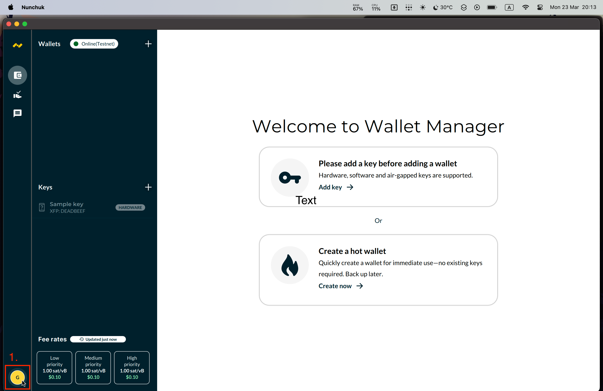

## 2. เลือก Setting

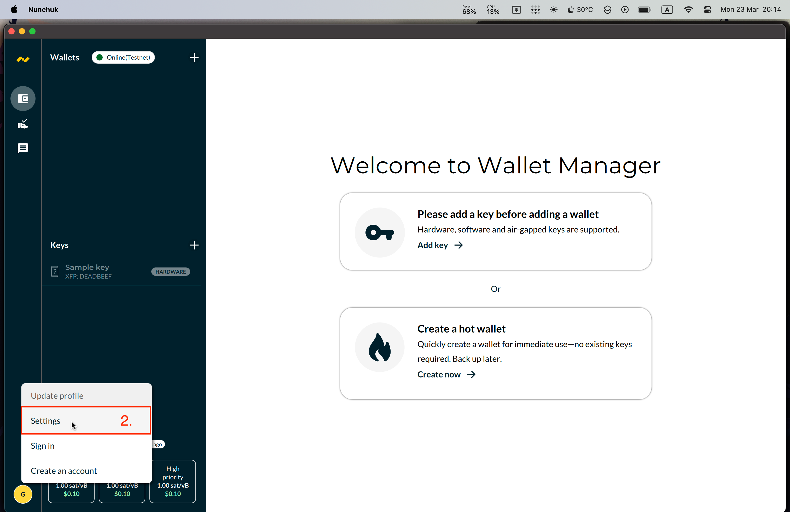

## 3. click ที่ Network setting

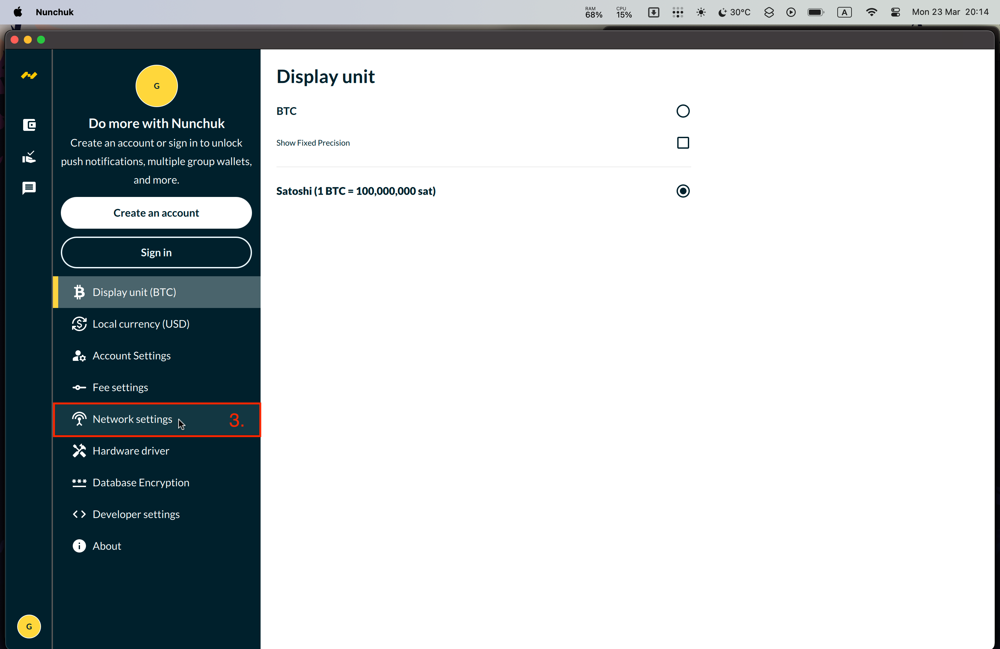

## 4. click ที่ MAINNET SERVER

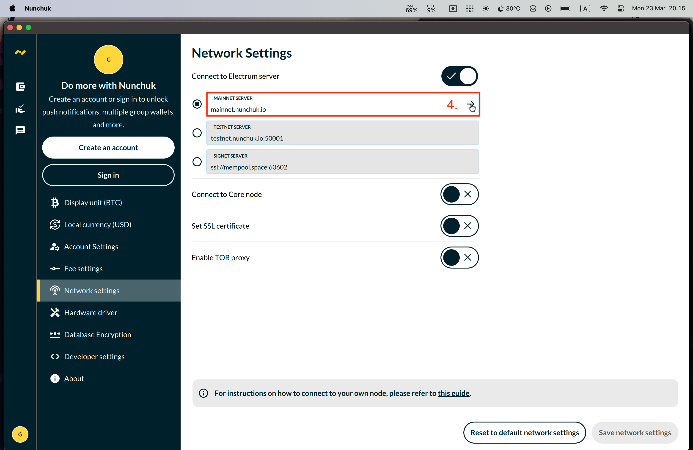

## 5. กด add server

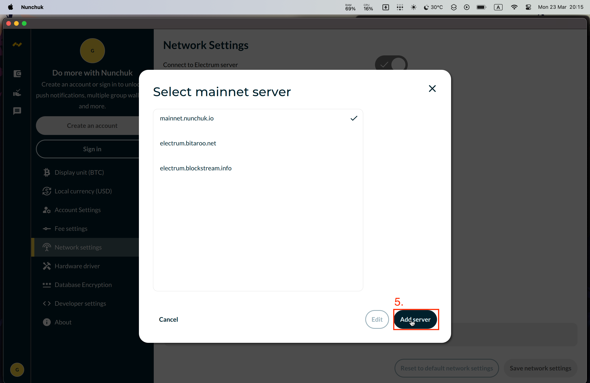

## 6. ใส่ hostname ของ raspberrypi และ port ของ electrs

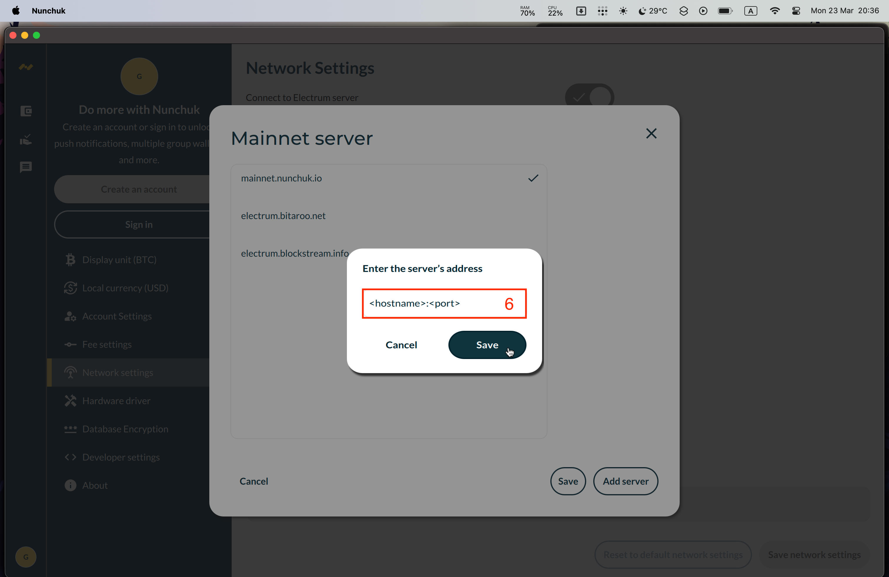

## 7. click save

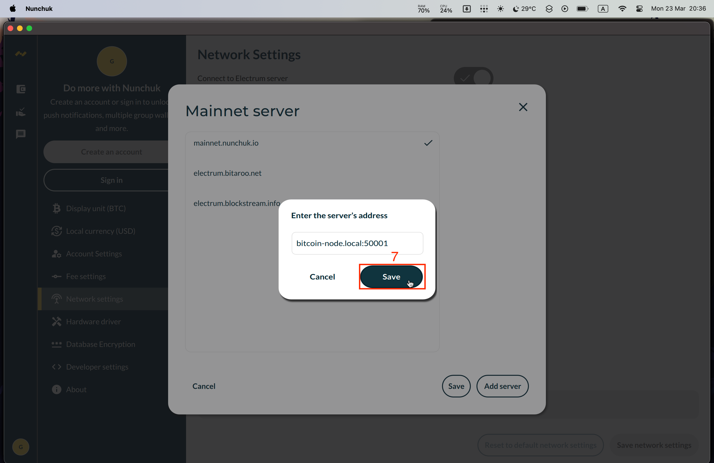

## 8. click Save network setting

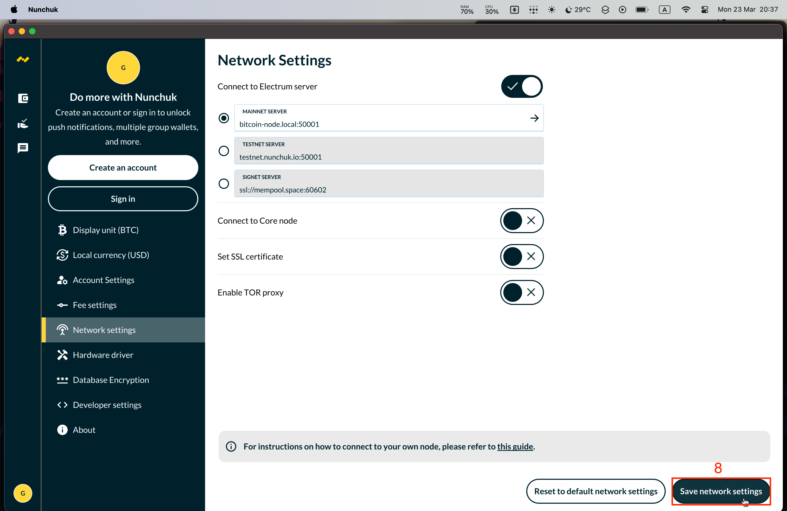

## 9. ถ้า nunchuk wallet สามาถเชื่อมต่อ electrs ของเราได้ตรง Wallets เป็นสีเขียว

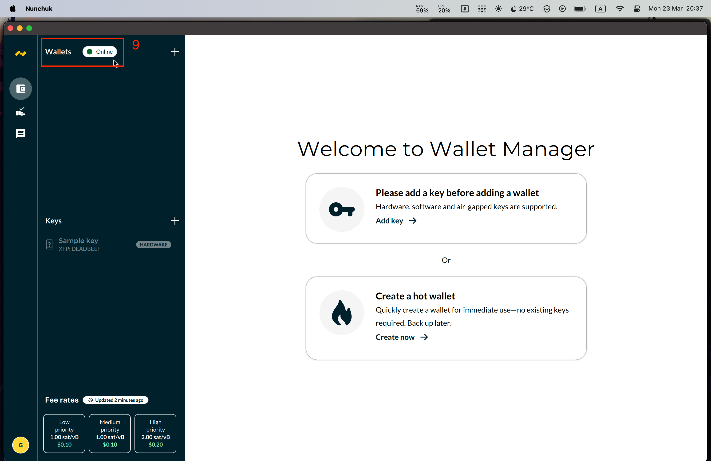

## 10. หรือจะลองใช้ tor_address ก็ได้

### 10.1 ตั้งการ tor

```bash
sudo nano /etc/tor/torrc
```

```
SocksPort 127.0.0.1:9050
SocksPort 192.168.0.103:9050
```

ตัวอย่าง

```

SocksPort 127.0.0.1:9050
SocksPort 192.168.0.103:9050

# ControlPort & Authentication
...

# Bitcoin RPC
...
```

## 10.2 restart tor.service

```bash
sudo systemctl restart tor.service
```

## 10.3 หา tor address

```bash
sudo cat /var/lib/tor/electrs/hostname
```

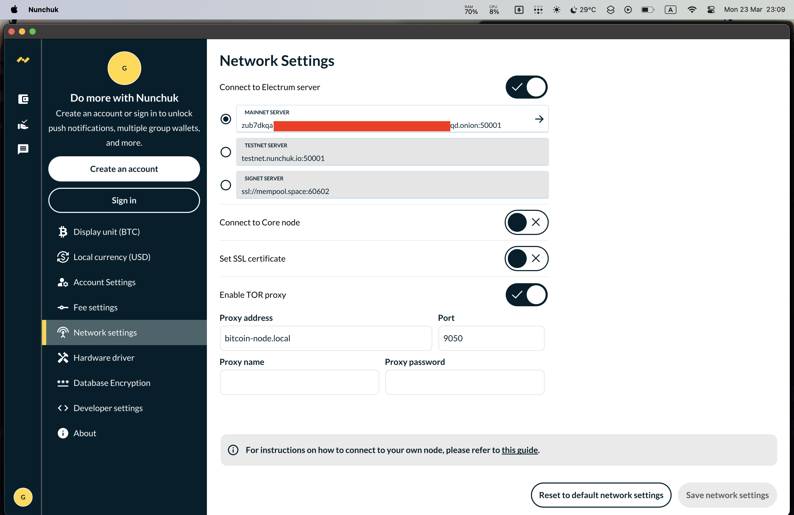

# Nunchuk mobile

## 1. กด Continue as guest

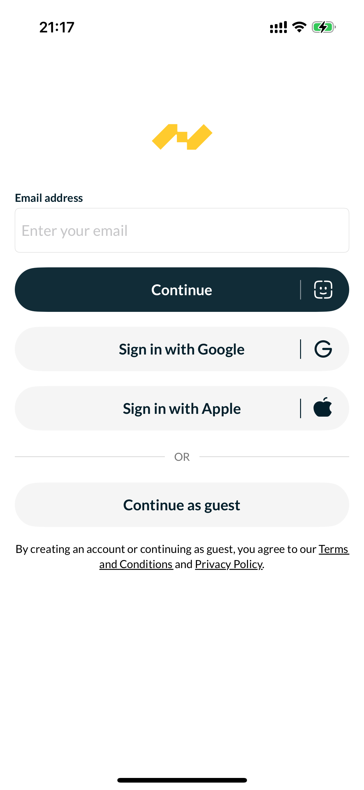

## 2. กด Profile

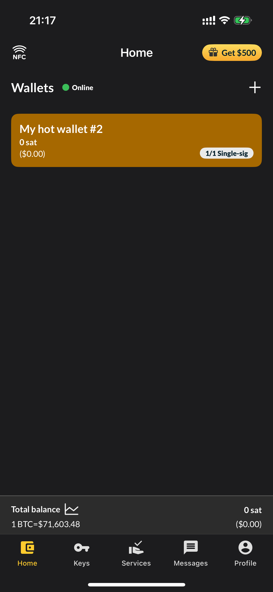

## 3. กด Network settings

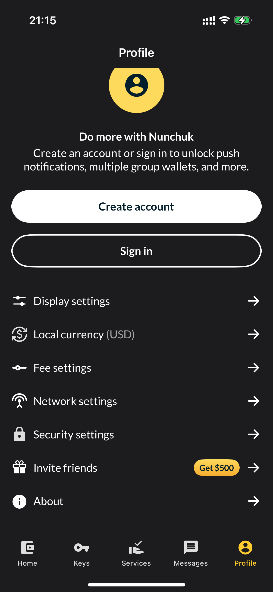

## 4. กด `->` ตรง Mainnet server

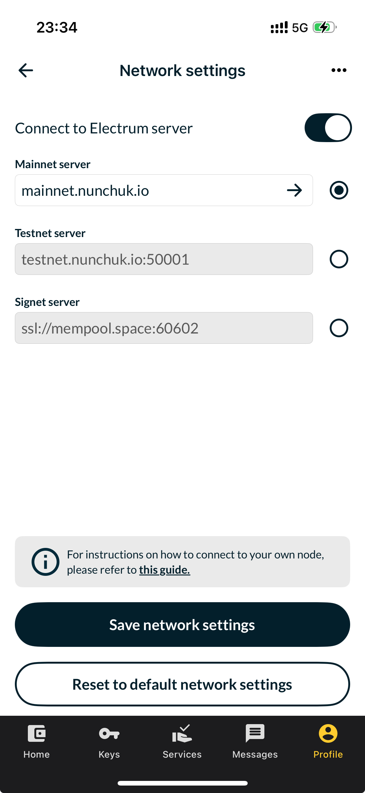

## 5. กด Add server

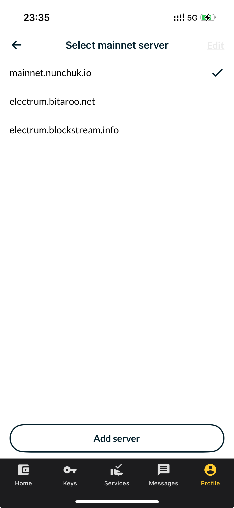

## 6. ใส่ hostname ของ node และ เลข port ของ electrs

### 6.1 หา ip ของ node

```bash
hostname -I
```

ตัวอย่าง

```bash
$ hostname -I
192.168.0.103 100.116.235.99 172.16.57.1 172.17.0.1 fd7a:115c:a1e0::a838:eb63
```

อย่างลืม check ว่า mobile ต่อเน็ตเดี๋ยวกับ node

### 6.2 กด Save

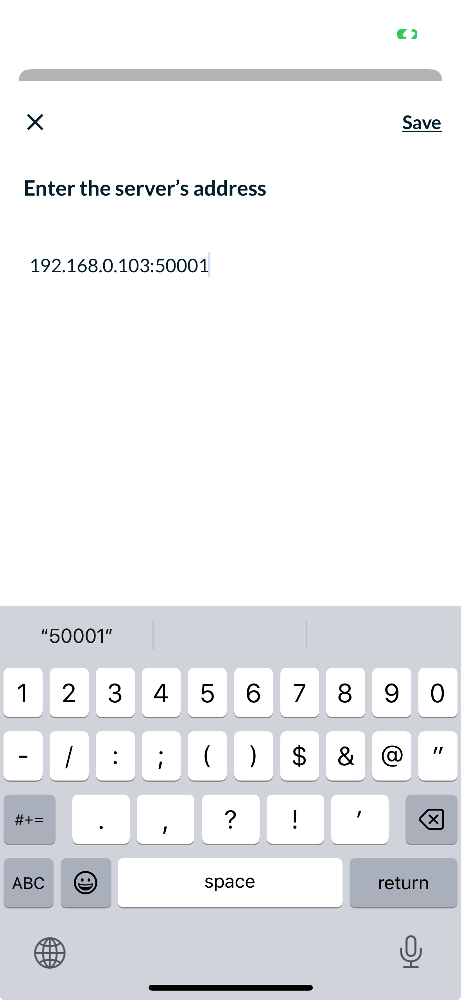

## 7. จะเห็นว่าตรง Wallets เป็น สีเขียว และ ขึ้นว่า Online


