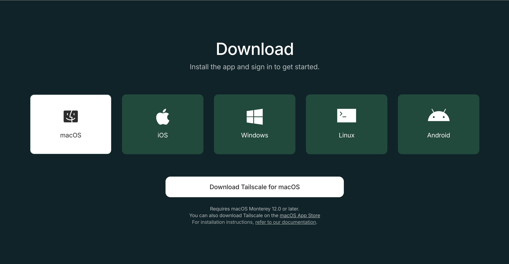
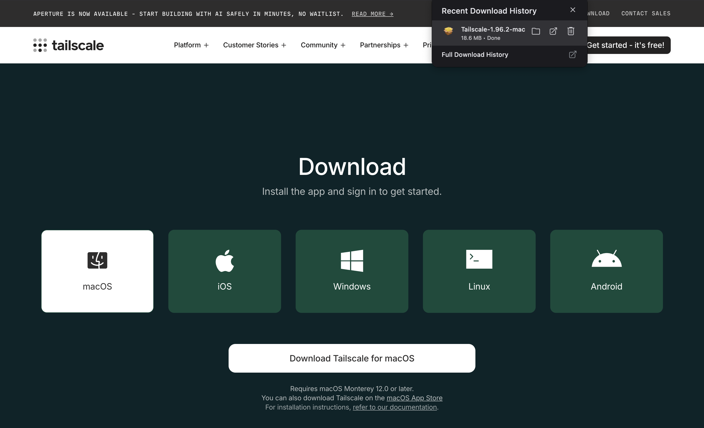
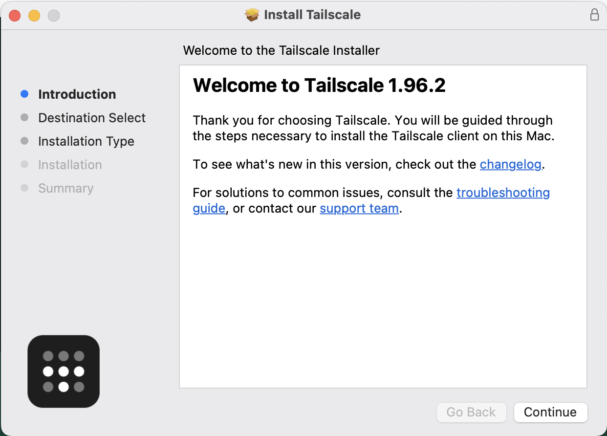
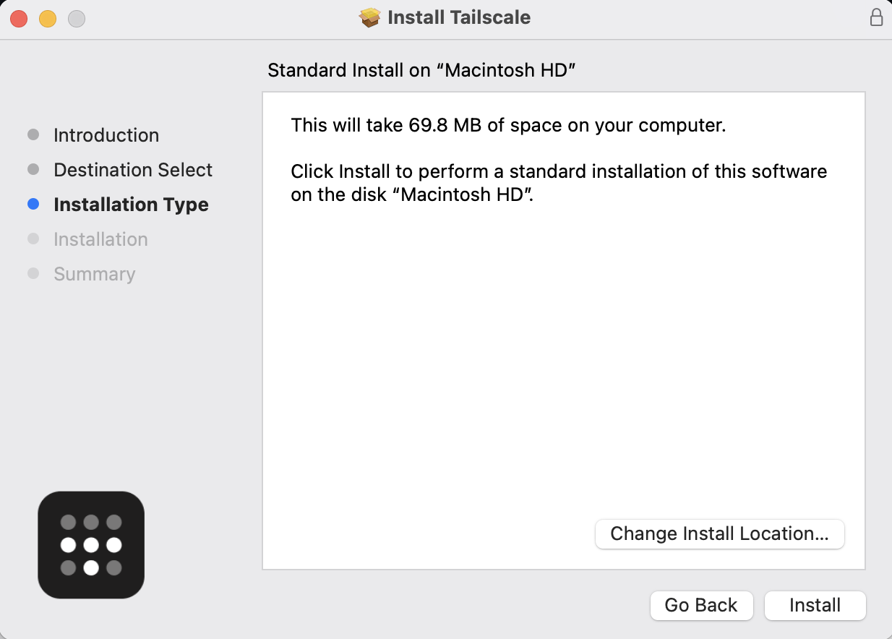
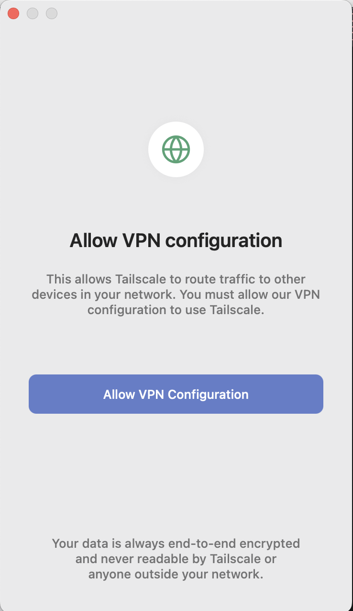
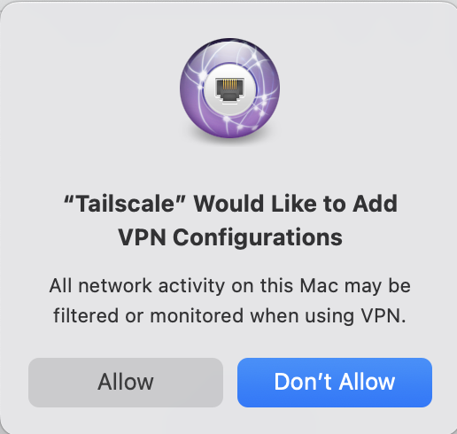
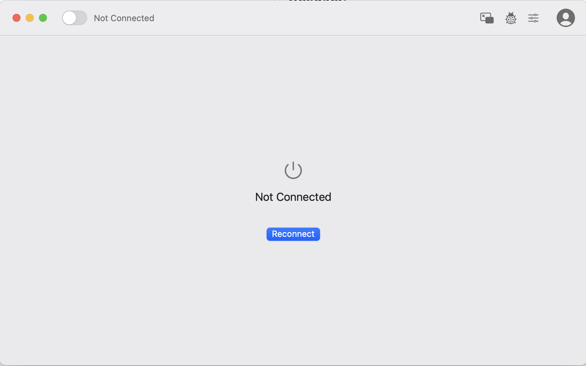
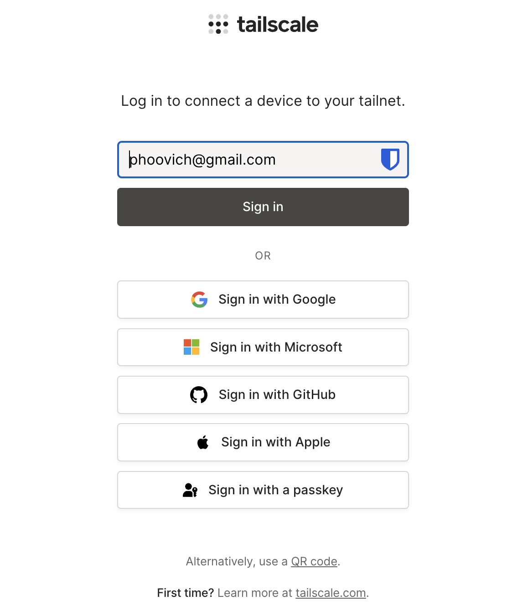
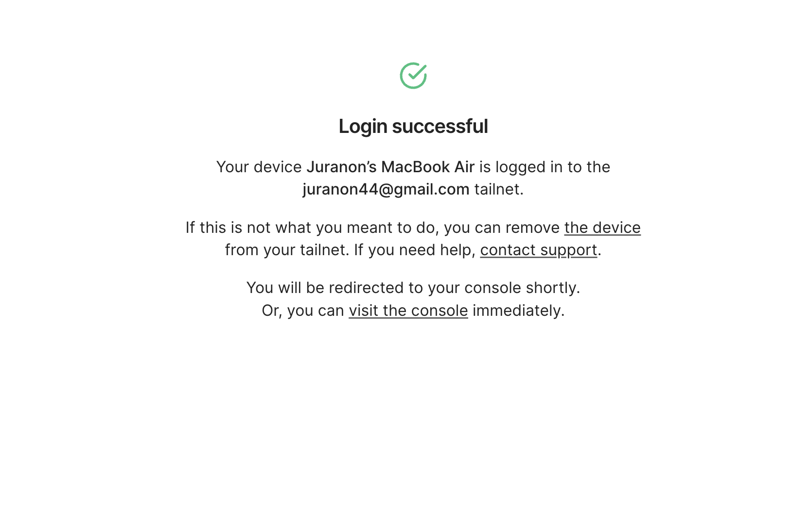

## 1. ติดตั้ง tailscale ในคอมพิวเตอร์ของคุณ

### 1.1 ไปที่ <https://tailscale.com/download> เลือกให้ตรงกับระบบปฏิบัติการของคุณของคุณ

### 1.1 กดแตกไฟล์

### 1.2 กด Continue

### 1.3 กด install

### 1.4 เมื่อกด install แล้วจะเห็นหน้าต่าง Allow VPN Configuration

### 1.5 กด Allow

### 1.6 กด Reconnect

### 1.7 login ด้วย gmail

### 1.8 เมื่อเสร็จแล้วจะเห็นหน้าตาแบบนี้

