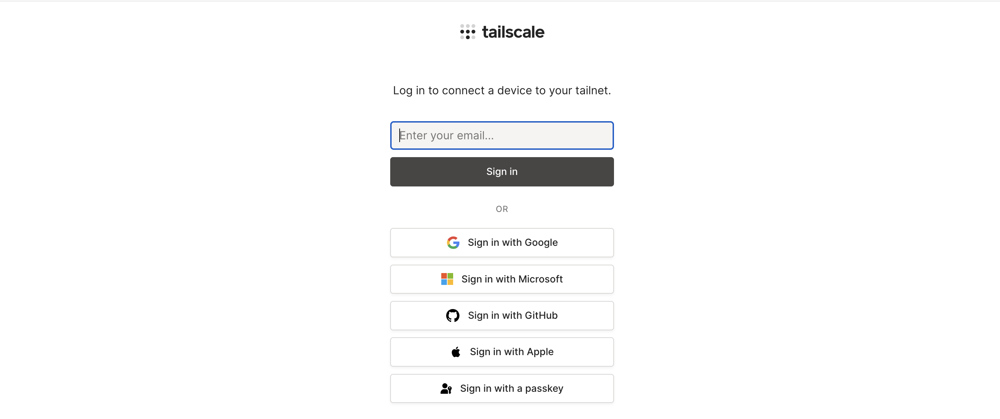

## ติดตั้ง tailscale ใน raspberrypi

### 1 รับคำสั่งนี้ใน raspberrypi

```bash
curl -fsSL https://tailscale.com/install.sh | sh
```

ตัวอย่าง

```
$ curl -fsSL https://tailscale.com/install.sh | sh
Installing Tailscale for ubuntu noble, using method apt
+ sudo mkdir -p --mode=0755 /usr/share/keyrings
0 upgraded, 0 newly installed, 0 to remove and 3 not upgraded.

...

Installation complete! Log in to start using Tailscale by running:

sudo tailscale up
```

### 2 จากนั้นรัน

```bash
sudo tailscale up
```

ตัวอย่าง

```bash
$ sudo tailscale up
To authenticate, visit:

https://login.tailscale.com/a/AbCdEfGhIjKlMnOp
```

### 3 นั้น url ที่ได้มาเปิด brewser ในคอมพิวเตอร์ของคุณ




### 4 เสร็จแล้วจะได้หน้าตาแบบนี้


### 5. กลับไปที่ raspberrypi แล้ว run

```bash
sudo tailscale status
```

จะเห็น ip แบบนี้

```bash
$ sudo tailscale status
100.116.XXX.XX  bitcoin-node    phoovich@  linux  -
100.75.XXX.XX   iphone-15       phoovich@  iOS    -
100.65.XXX.XX   phoovich        phoovich@  macOS  active; direct 101.51.94.211:41641, tx 64692 rx 99060

```
