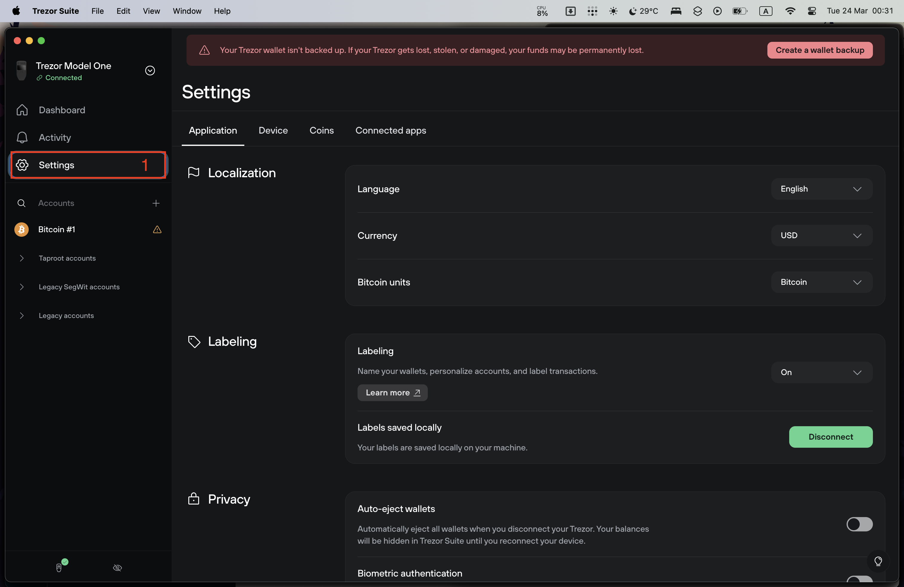
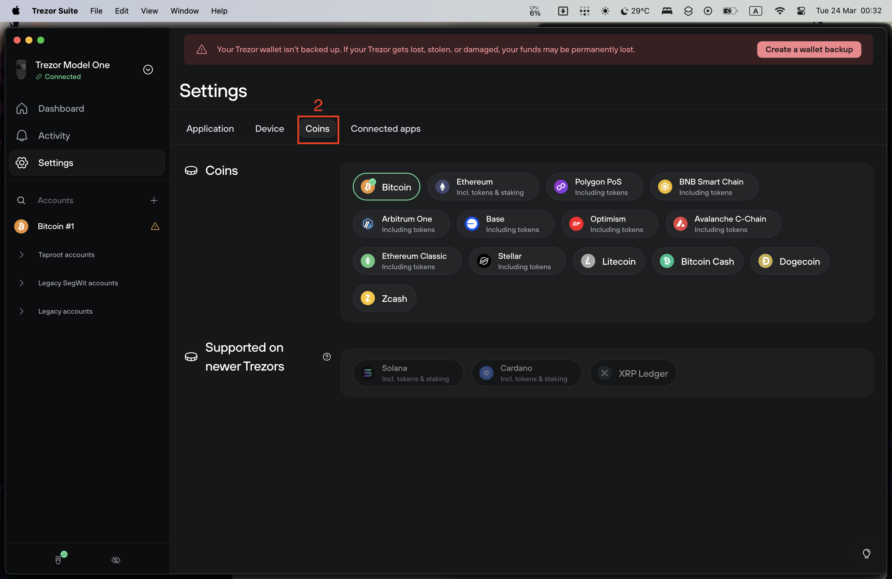
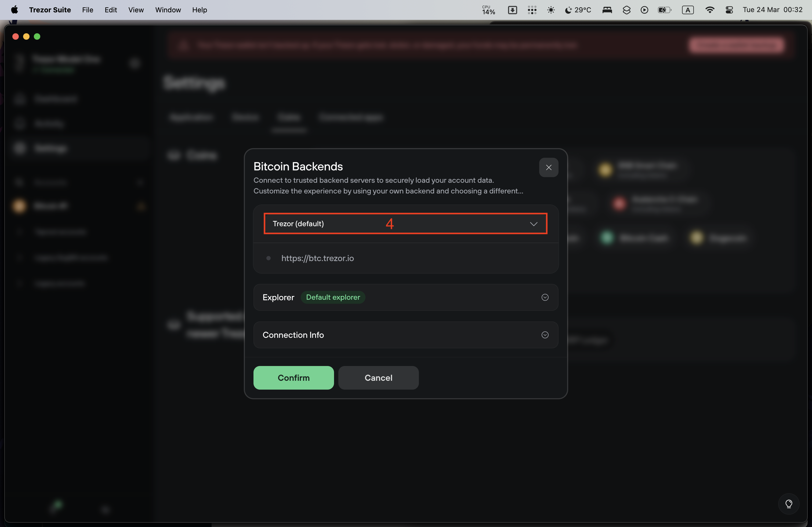
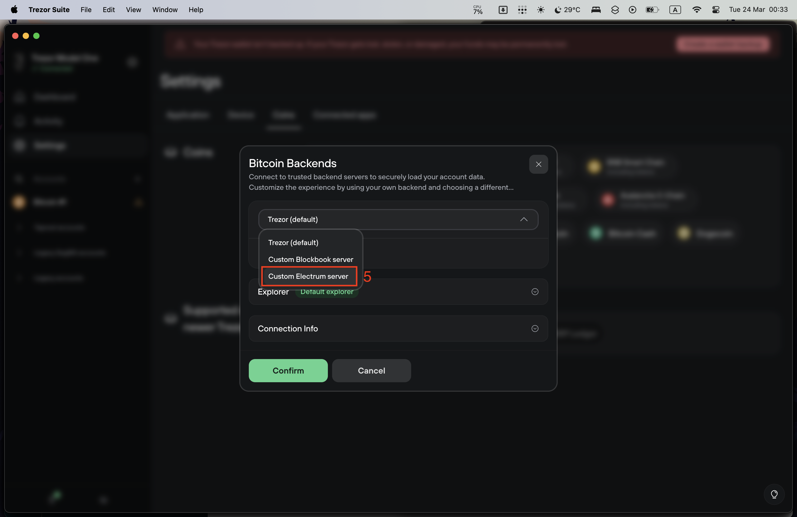
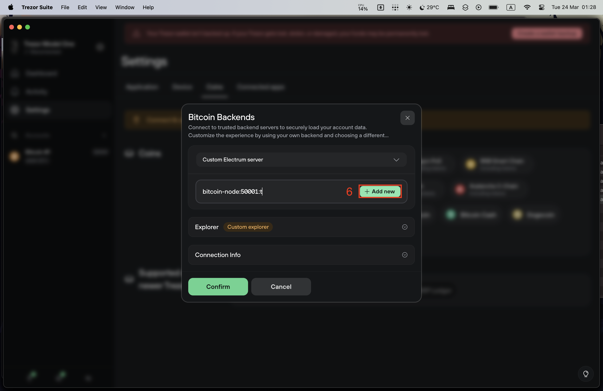
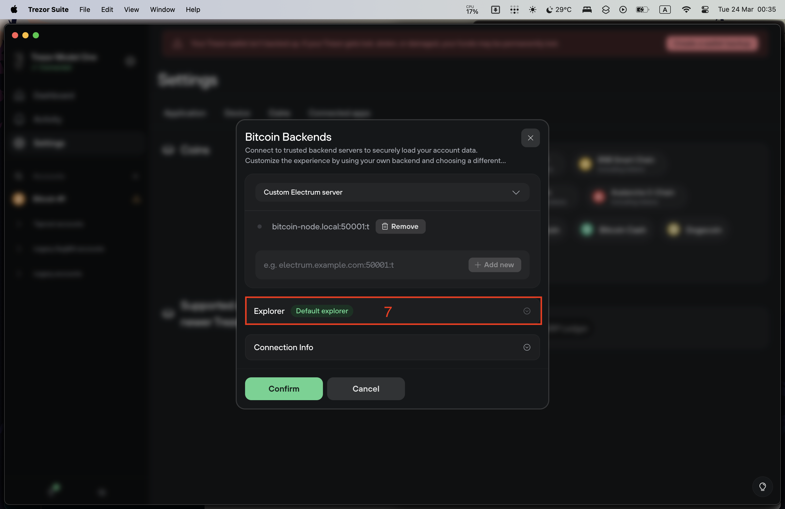
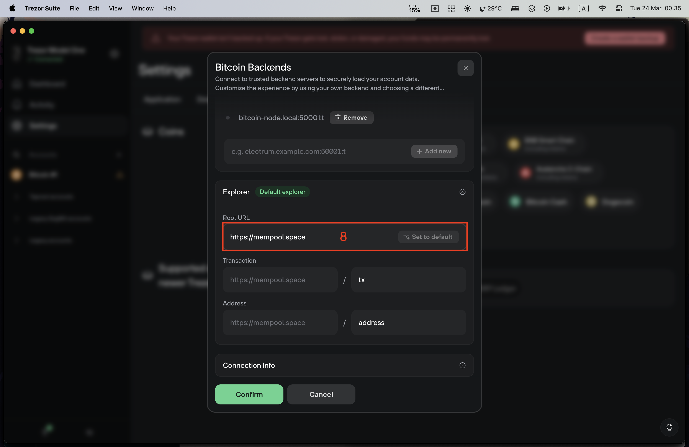
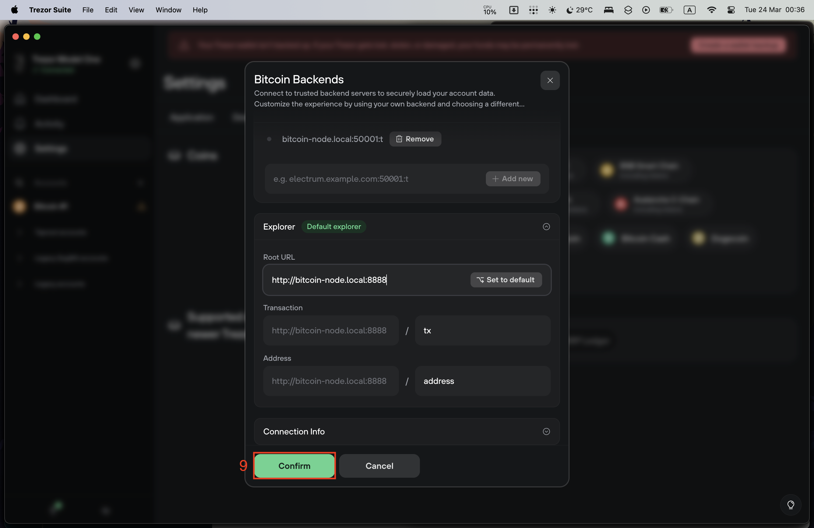
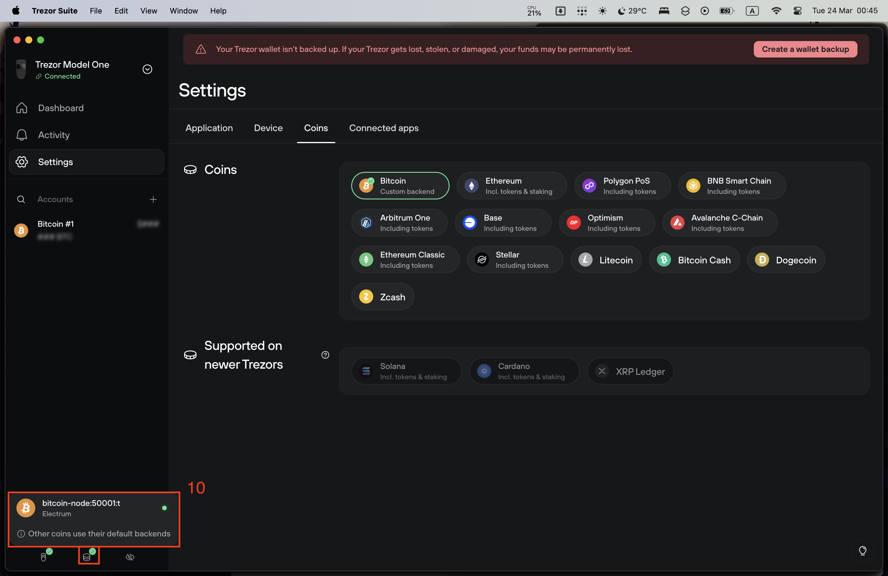

# เชื่อมต่อ electrs และ mempool กับ Trezor suite

## 1. click Settings

## 2. Click Coins

## 3. นำเมาส์ไปวางที่ Bitcoin แล้วจะเห็นไอคอนรูปเฟือง จากนั้นคลิกที่ไอคอนนั้น

## 4. click ที่ คำว่า `Trezor (default)`

## 5. เลือก Custom Electrum server

## 6. ใส่ hostname ของ node และ เลข port ของ electrs และ กด `+ Add new`

## 7. click Explorer

## 8. เปลี่ยน Root URL เป็น hostname และตามด้วยเลข port

## 9. Click Confirm

## 10. ตรวจการเชื่อมต่อกับ electrs

